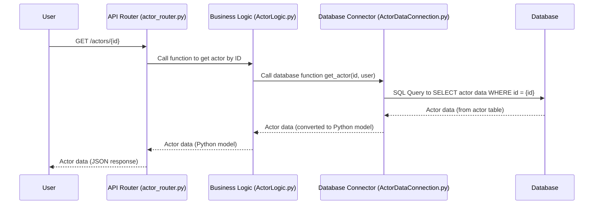

# Chapter 1: Actor Data Model

Welcome to the first chapter of the `actor-api` tutorial! We're going to start by understanding the fundamental building blocks of this system: the **Actor Data Model**.

Imagine you're building a system that needs to keep track of lots of different entities – like people, companies, organizations, and maybe even financial accounts. For each of these, you need to store information: their name, address, date of birth (for a person), registration number (for a company), who they are related to, what activities they've been involved in, and even scores or insights calculated about them.

Storing and managing all this diverse information can get messy quickly! How do you make sure you can find a specific company? How do you know which people are associated with that company? How do you store different types of information for people vs. companies?

This is where the **Actor Data Model** comes in. It's like the blueprint and the filing system for all the core entities ("Actors") that our `actor-api` manages. It defines:

1.  **What kind of information** we store about Actors (their basic details, relationships, scores, etc.).
2.  **How this information is organized** (in database tables).
3.  **How different pieces of information** about an Actor are connected.

Think of it as defining the structure of our data universe for Actors.

Our central use case for this chapter is simple: **How does the system store basic information about an Actor (like a person or company) and how can we retrieve it?**

## What is an "Actor"?

In this system, "Actor" is a general term we use for any core entity we track. This could be:

*   A Person
*   A Company
*   An Organization
*   Maybe even something like a Bank Account or a specific piece of data that acts like a participant.

The key idea is that an Actor is something central that other information relates to.

## The Core Actor Data

The most fundamental part of the data model is the `Actor` itself. This is where we store the main details about a person, company, etc.

In our Python code, we represent this using a Python class that acts like a blueprint for the data. It defines what fields an Actor object should have.

Here's a simplified example of what that Python blueprint might look like:

```python
# Simplified example - the actual model is more complex
from pydantic import BaseModel
from datetime import date

class Actor(BaseModel):
    id: str # A unique identifier for the actor
    name: str # The actor's name
    type: str # Is it a 'Person', 'Company', etc.?
    asOfDate: date # When this version of the data is valid
    # ... lots of other fields for addresses, etc.
    # ... and even a flexible 'json_' field for misc data
```

This `Actor` class is a **data model**. It tells us that every Actor object should have an `id`, a `name`, a `type`, an `asOfDate`, and potentially many other fields defined in the full code. When data comes into the system or is read from the database, it's often converted into one of these `Actor` objects.

## Storing Actor Data in the Database

So, we have this blueprint (`Actor` Python class). How do we actually store this data persistently so it doesn't disappear when the system turns off? We use a database!

The structure defined by our data model in Python needs to be mirrored in the database. For the core `Actor` data, we have a database table specifically for Actors.

Let's look at a simplified piece of the database definition (using SQL, the language databases understand):

```sql
-- From: flyway/sql/V1.0.0__Create_actor_table.sql
CREATE TABLE IF NOT EXISTS actor (
    id varchar(100) NOT NULL,
    json_ jsonb NOT NULL,
    as_of_date date NOT NULL
);
-- ... other database setup details are skipped ...
```

This SQL code creates a table named `actor`.

*   `id`: This column stores the unique identifier for each actor (matching the `id` in our Python model).
*   `as_of_date`: This stores the date this specific record is valid for (matching the `asOfDate` in our Python model). Our system keeps a history of Actor data, so we might have multiple entries for the same `id` but with different `as_of_date` values.
*   `json_`: This is a special column type (`jsonb`) that can store data in a flexible JSON format. This is where much of the detailed information from the Python `Actor` model (name, type, addresses, etc.) is actually stored inside the database. It's like putting all the varied details into a structured text document within a database cell.

So, the Python `Actor` model defines the structure *in our code*, and the `actor` database table defines the structure *in the database*. The system translates between them.

## How Related Data is Stored

Besides the core `Actor` details, an Actor Data Model needs to handle related information. Our system uses separate database tables for different types of related data. This keeps the main `actor` table clean and organized.

Think of a filing cabinet for a person (the Actor). The main `actor` table is like the first folder with their basic ID, name, and a summary page. Then there are other folders for:

*   **Associates:** A folder listing friends, family, or colleagues. (See `actor_associates` table in `V1.0.0__Create_actor_table.sql`).
*   **Derived Info:** A folder for calculated scores or insights about them (like a risk score). (See `derived_info` table in `V1.0.4__Add_derived_info_table.sql`).
*   **Relationships:** A folder detailing specific relationships like "is a manager of", "owns", etc. (See `actor_relationship` table in `V1.1.1__Add_actor_relationship_table.sql`).
*   **Counterparties:** Details about other entities they might transact with. (See `counterparty` table in `V1.8.0__Create_counterparty_table.sql`).
*   **Trading Desks, Other Participants, Submitters:** Other specific types of related entities or information. (See `trading_desk`, `other_participant`, `submitter` SQL files).
*   **Related Actors:** A simplified, flatter table often used for quicker lookups of related entities in certain contexts. (See `related_actors` table in `V2.0.4__Add_related_actors.sql`).
*   **Actor List:** A table optimized for listing and filtering actors with commonly used data fields extracted for faster querying. (See `actor_list` table in `V2.0.9__Create_actor_list.sql`).

All these tables store data that relates *back* to a specific Actor, usually by referencing the Actor's `id`.

## Using the Actor Data Model: Getting an Actor

Let's revisit our use case: retrieving basic information about a specific Actor using their ID.

In our `actor-api`, this is exposed through an API endpoint, like `GET /actors/{id}`.

You might use a tool like `curl` to call this API:

```bash
# Conceptual API call to get an actor by their ID
# Replace 'some-actor-id-123' with a real ID
curl http://localhost:8000/actors/some-actor-id-123
```

What happens when you make this call? Here's a simplified flow:



This diagram shows the path. The `API` endpoint receives the request, it delegates the task to the `Logic` layer (which handles business rules), the `Logic` layer asks the `DBConn` (our helper for talking to the database) to fetch the data, and the `DB` provides it. The data then travels back up the chain.

Let's peek at tiny snippets of the code involved (remembering we're simplifying heavily!):

First, the API endpoint in `src/router/actor_router.py`:

```python
# From: src/router/actor_router.py (Simplified!)
# ... imports and setup ...

@router.get("/actors/{id}")
def get_actor(id: str, user: User = Depends(get_user)):
    # Call the database connector directly to get the actor data
    actor = db.get_actor(id, user)
    # If found, return it as an Actor model, otherwise return not found
    return Actor(**actor) if actor else not_found_response()

# ... other endpoints ...
```

This code defines the `/actors/{id}` endpoint. When it's called, it uses the `db` object (which is our [Database Data Connectors](05_database_data_connectors_.md)) to call its `get_actor` method, passing the requested `id`.

Next, the `get_actor` method in `src/data_connectors/ActorDataConnection.py`:

```python
# From: src/data_connectors/ActorDataConnection.py (Simplified!)
# ... imports and class definition ...

@pooled_cursor
def get_actor(self, id: str, user: User, cursor):
    # This SQL selects data from the 'actor' table
    # It includes logic to get the latest version and handle access control (simplified here)
    cursor.execute(
        """
        SELECT
            (json_ || jsonb_build_object('internalId', internal_id)) AS json_
        FROM actor a
        INNER JOIN (
            SELECT id, max(json_->>'ingestDate') ingest_date
            FROM actor a1
            WHERE id = %(id)s
            -- Access control check is here in reality
            GROUP BY id) a1
        ON a1.id = a.id
        AND a1.ingest_date = a.json_->>'ingestDate'""",
        {"id": id}, # Pass the ID value here
    )
    row = cursor.fetchone() # Get one matching row
    return row["json_"] if row is not None else None # Return the JSON data
```

This function runs a SQL query against the database. It specifically looks for the actor with the given `id` in the `actor` table. The actual query is a bit complex because it needs to find the *latest* version of the actor data (based on `ingestDate`) and apply access control checks (`access_where` which is simplified/commented out here), but the core idea is retrieving data *from the `actor` table* based on the provided `id`. The result from the database is then processed and returned.

Back in the API code, the returned data (which is the content from the `json_` column plus an internal ID) is then used to create an `Actor` Python object (`Actor(**actor)`), which is finally sent back as the response.

This demonstrates how the data model (defining the structure in Python and the database) is used by the system to retrieve information.

## Conclusion

In this chapter, we've introduced the fundamental concept of the **Actor Data Model**. We learned that it defines the structure for core entities (Actors) and their related information. We saw how the `Actor` Python class acts as a blueprint and how the `actor` database table, along with other related tables, stores this data persistently. We also walked through a simple example of how an API request to get an Actor's data utilizes this data model by querying the database table and converting the result into the Python object.

The Actor Data Model is the foundation upon which the rest of the `actor-api` is built. Understanding how the data is structured is key to understanding how the system works.

In the [next chapter](02_business_logic_modules_.md), we'll dive into the [Business Logic Modules](02_business_logic_modules_.md), which are responsible for performing operations *using* this data model, like saving data, applying business rules, and coordinating actions.

---

Generated by [AI Codebase Knowledge Builder](https://github.com/The-Pocket/Tutorial-Codebase-Knowledge)