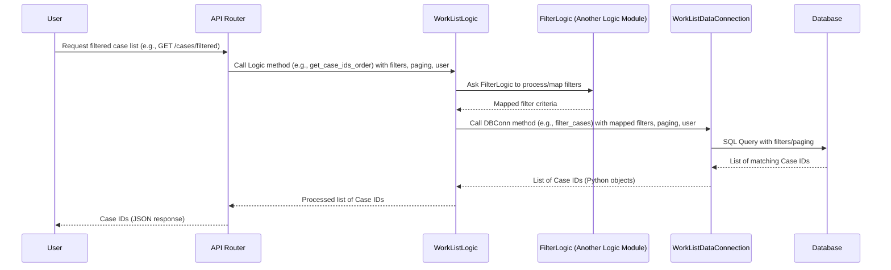

# Chapter 2: Business Logic Modules

Welcome back! In [Chapter 1: Actor Data Model](01_actor_data_model_.md), we learned about the foundational structure of our data – defining what an "Actor" is and how its information, and related data, is organized in Python classes and database tables. We saw how the system can fetch a single actor's basic data using this model.

But what if you need to do something more complex? Like:

*   Get a *list* of Actors based on specific criteria (e.g., all companies in a certain city, all people associated with a particular case).
*   Save a *new* Actor, making sure all necessary information is included and potentially performing validation or data transformation (like hashing an ID).
*   Coordinate fetching data from the database *and* an external service to provide a combined result.
*   Apply complex rules before allowing an action (like checking user permissions or data consistency).

Just asking the database connector directly for data, as we briefly saw in Chapter 1 for a simple fetch, isn't enough for these scenarios. We need a layer that understands *how* to perform these operations step-by-step, applying rules and coordinating different parts of the system.

This is where **Business Logic Modules** come in.

## What are Business Logic Modules?

Think of Business Logic Modules as the "managers" or "brains" of the application. They know *how* to get things done by directing traffic and applying the application's rules.

*   **Location:** These modules are implemented as Python classes located in the `src/logic` package (or sub-packages within `logic`). You can find files like `ActorLogic.py`, `WorkListLogic.py`, `ApisApiLogic.py`, etc., in this directory.
*   **Role:** Their primary job is to encapsulate the application's core business rules and the sequence of operations needed to fulfill a specific request or task. They don't deal directly with the outside world (like handling web requests) or directly with database queries or external API calls themselves (they delegate that).
*   **Coordination:** They act as coordinators. They use the [Data Connectors](05_database_data_connectors_.md) (which we'll cover later) to interact with databases and [External API Clients](06_external_api_clients_.md) (also a future topic) to talk to external services. They might even call other Logic Modules to delegate specific sub-tasks (like processing complex filters).

Essentially, if an action requires more than a single, direct database read or write, it belongs in a Business Logic Module.

## Our Use Case: Getting a Filtered List of Cases

Let's consider a slightly more involved use case than just fetching one Actor: **Imagine we need to build a "Work List" feature that shows a list of cases (which often relate to Actors) and allows users to filter and sort this list based on various criteria.**

This is a common requirement in business applications. It's not just about fetching data; it's about:
1.  Receiving potentially complex filtering rules (e.g., "show me cases for 'Person' actors assigned to 'Team A' that are 'Open'").
2.  Translating those rules into something the database understands.
3.  Handling sorting and pagination so we only get the requested chunk of data.
4.  Ensuring the user has permission to see the data (business rule).

This task is too complex for a simple database connector call. It requires a Business Logic Module to manage the process.

## How Business Logic Handles the Use Case

For our Work List use case, the relevant logic module is `WorkListLogic`.

Let's see a simplified flow of how a request to get a filtered list of cases might work:



As you can see in this simplified diagram:

*   The **API Router** (which we'll cover in [Chapter 3: API Routers](03_api_routers_.md)) receives the initial request.
*   The API Router delegates the task to the **WorkListLogic** module.
*   The `WorkListLogic` module needs help processing the complex filter criteria. It delegates this sub-task to another specialized Logic module, **FilterLogic**.
*   Once the filters are processed, `WorkListLogic` uses the **WorkListDataConnection** ([Database Data Connectors](05_database_data_connectors_.md)) to actually talk to the **Database** and get the list of case IDs.
*   The data comes back up the chain, potentially being processed or transformed by `WorkListLogic` before being returned.

This flow clearly shows the `WorkListLogic` acting as the "manager," coordinating actions between different parts of the system (another Logic module, a Data Connector).

## Peeking at the Code

Let's look at some *very* simplified code snippets to see how this looks in practice.

First, the `WorkListLogic` class definition from `src/logic/WorkListLogic.py`:

```python
# From: src/logic/WorkListLogic.py (Simplified!)
from typing import List
# ... other imports ...

class WorkListLogic:
    def __init__(self, filter_logic, database):
        # Logic modules get their dependencies (like other logic or database connectors)
        # passed to them, often via dependency injection (Chapter 8!)
        self.db = database # This is our WorkListDataConnection instance
        self.filter_logic = filter_logic # This is our FilterLogic instance

    # ... other methods ...
```

This `__init__` method shows that `WorkListLogic` needs a `filter_logic` object and a `database` object (which is actually a data connector instance) to do its job. This is how it gets the tools it needs for coordination.

Now, a simplified version of the `get_case_ids_order` method within `WorkListLogic`:

```python
# From: src/logic/WorkListLogic.py (Simplified!)
# ... imports and class definition ...

    def get_case_ids_order(
        self,
        filters: List[AdvancedFilter],
        ordering: OrderByFieldRequest,
        paging: Paging,
        user: User,
    ) -> List[IdOrder]:
        """
        Gets a list of IdOrder containing case ids and their order...
        """
        # 1. Use another Logic module (FilterLogic) to process the filters
        filters_ = self.map_filters(filters, user)

        # 2. (Simplified) Handle ordering if needed...

        # 3. Use the Data Connector to get the data from the database
        case_ids = self.db.filter_cases(filters_, ordering_, paging, user)

        # 4. Process the result (here, just format it)
        return [IdOrder(id=id, order=i) for i, id in enumerate(case_ids)]

    def map_filters(self, filters, user):
        """
        Delegate filter mapping to FilterLogic
        """
        return self.filter_logic.map_filters(
            filters, user, FilterContext.CASE_WORK_LIST
        )

# ... other methods ...
```

This snippet demonstrates the core responsibilities:

1.  **Delegation:** It calls `self.map_filters`, which in turn calls `self.filter_logic.map_filters`. This shows `WorkListLogic` knows it needs specialized filter help and delegates to `FilterLogic`.
2.  **Data Access:** It calls `self.db.filter_cases`, which is the method on the database connector responsible for running the actual SQL query with the given filters, ordering, and paging.
3.  **Processing:** It takes the list of IDs returned by the database connector and formats it into the expected `List[IdOrder]` structure.

This is a pattern you'll see often in the `logic` package: receive a request, apply business rules (or delegate rule application), coordinate with data connectors or API clients to fetch/save necessary data, and process results before returning.

## Another Example: Interacting with External Services

Business Logic Modules also coordinate interactions with external services via [API Clients](06_external_api_clients_.md).

Look at `src/logic/WorkItemLogic.py`. The `WorkItemLogic` module is responsible for managing "Work Items" (a concept we'll cover in [Chapter 7: Work Item Feature](07_work_item_feature_.md)), which often represent tasks related to cases.

Part of its job involves getting information about cases from *another* internal API service (let's call it the "APIs service"). The `WorkItemLogic` uses an `ApisApiLogic` client for this.

Here's a simplified look:

```python
# From: src/logic/WorkItemLogic.py (Simplified!)
# ... imports and class definition ...

class WorkItemLogic:
    def __init__(self, database, work_list_database, apis_service):
        # ... data connector dependencies ...
        self.apis_service = apis_service # This is our ApisApiLogic instance

    def get_missing_case_work_items(self) -> List[WorkItemEntry]:
        # 1. Use the API Client to get data from an external service
        case_ids = self.apis_service.get_open_case_ids()

        # 2. Use the Data Connector to check against our database
        missing_case_ids = self.db.get_missing_case_ids(case_ids)

        # 3. Process and return the result
        return [
            WorkItemEntry(id=case_id) for case_id in missing_case_ids
        ]

# ... other methods ...
```

And the corresponding `ApisApiLogic` client itself (`src/logic/ApisApiLogic.py`):

```python
# From: src/logic/ApisApiLogic.py (Simplified!)
import requests # A library to make HTTP calls
import json
from typing import List
# ... other imports ...

class ApisApiLogic:
    def __init__(self, config):
        # Configuration for the external service URL
        self.apis_api_url = config["apis_api_url"]

    def get_open_case_ids(self):
        # Make an actual HTTP GET request to the external service URL
        resp = requests.get(
            f"{self.apis_api_url}/cases/ids/open",
            headers=self.get_header(), # Include API key for authentication
        )
        resp.raise_for_status() # Raise an error for bad responses
        return resp.json() # Return the JSON response

    # ... other methods ...
```

This shows how `WorkItemLogic` (a Business Logic Module) orchestrates a task (`get_missing_case_work_items`) that involves both calling an [External API Client](06_external_api_clients_.md) (`self.apis_service`) *and* calling a [Database Data Connector](05_database_data_connectors_.md) (`self.db`) to achieve its goal.

## Summary of Responsibilities

In essence, Business Logic Modules are responsible for:

*   **Implementing Use Cases:** Translating a user request or a system task into a series of steps.
*   **Applying Business Rules:** Performing validations, checks, and transformations based on the application's specific rules (like hashing actor IDs, checking permissions, etc.).
*   **Orchestration:** Coordinating calls to [Database Data Connectors](05_database_data_connectors_.md), [External API Clients](06_external_api_clients_.md), and potentially other Logic Modules.
*   **Data Transformation:** Preparing data fetched from lower layers or external systems for use within the application or for returning to the caller.

They are the central hub where the "how" of the application resides, relying on other layers for the "what" (Data Models) and the "how to connect" (Data Connectors, API Clients).

## Conclusion

In this chapter, we've explored the concept of **Business Logic Modules**. We learned that they live in the `src/logic` package and act as the "brains" or "managers" of the application. They encapsulate the step-by-step processes and business rules needed to perform tasks. We saw how they coordinate actions by using [Data Connectors](05_database_data_connectors_.md) to interact with the database and [External API Clients](06_external_api_clients_.md) to talk to external services, sometimes even delegating tasks to other specialized Logic Modules like `FilterLogic`.

Understanding Business Logic Modules is key because they are the layer that makes things happen in the `actor-api`.

In the [next chapter](03_api_routers_.md), we'll look at [API Routers](03_api_routers_.md), which are the entry points that receive incoming requests and hand them off to these Business Logic Modules.

---

Generated by [AI Codebase Knowledge Builder](https://github.com/The-Pocket/Tutorial-Codebase-Knowledge)