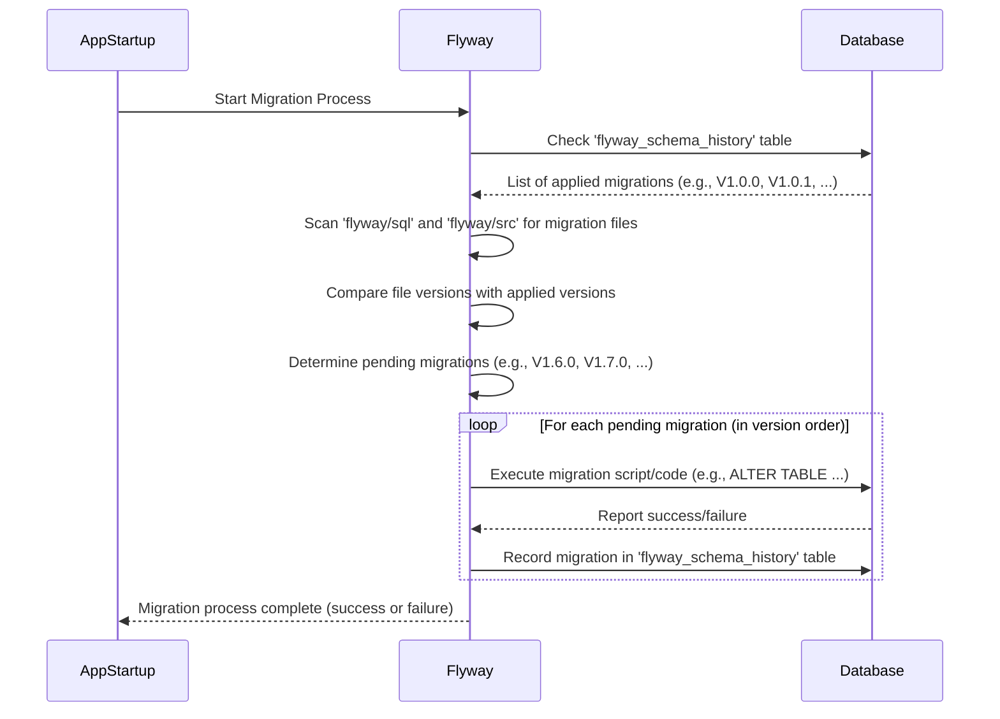

# Chapter 4: Database Schema (Flyway)

Welcome back to the `actor-api` tutorial! In our journey so far, we've looked at:
*   [Chapter 1: Actor Data Model](01_actor_data_model_.md): How we structure the data about Actors and related entities in Python code and conceptually in the database.
*   [Chapter 2: Business Logic Modules](02_business_logic_modules_.md): The "brains" that perform operations using this data, applying rules and coordinating tasks.
*   [Chapter 3: API Routers](03_api_routers_.md): The "receptionists" that receive incoming requests and hand them off to the Business Logic.

All these components rely heavily on one critical piece: the place where the data actually lives persistently – the **database**. But for the application to work correctly, the database needs a specific **structure**. It needs tables named `actor`, `actor_associates`, `derived_info`, etc., with the right columns and relationships, just as our [Actor Data Model](01_actor_data_model_.md) expects.

What happens if we need to change that structure? Maybe we need to add a new piece of information to the `actor` table, or create a completely new table for a new feature? Over time, the database structure (the **schema**) *will* change as the application evolves. How do we manage these changes in a controlled, reliable way?

This is where the **Database Schema** and a tool called **Flyway** come in.

## What is a Database Schema?

Think of a database as a massive collection of filing cabinets (tables). A database **schema** is the overall **blueprint** or **design** for these cabinets. It defines:

*   What tables exist (like `actor`, `work_item`, etc.).
*   What columns are in each table (like `id`, `json_`, `as_of_date` in the `actor` table).
*   What type of data each column holds (like text, numbers, dates, or JSON).
*   How tables are related (though this system often manages relationships within JSON or through logic rather than strict database foreign keys).
*   Rules like which columns must be unique or cannot be empty.

Just like the `Actor` Python class is a blueprint for an Actor object in our code, the database schema is the blueprint for the data storage itself.

## Managing Schema Changes with Flyway

As the `actor-api` grows and changes, the database schema needs to change too. If you're working on a new feature that needs a new table or a new column, you have to tell the database to add it. If multiple developers are working on the project, they might be making different changes to the schema at the same time. How do you make sure everyone's database is set up correctly and that changes are applied in the right order?

Manually running SQL commands every time is messy and error-prone. This is the problem Flyway solves.

**Flyway** is a database migration tool. It helps you manage database schema changes over time using **migrations**.

Think of Flyway as a **version control system for your database structure**.

*   You write plain SQL files (or sometimes Java code) that describe specific changes (e.g., "create the actor table", "add a new column to the actor table").
*   Flyway keeps track of which changes (migrations) have already been applied to a specific database.
*   When you start the application (or run Flyway separately), it checks the database history, finds any migration files it hasn't run yet, and runs them in the correct order.

This ensures that any database the `actor-api` connects to can be automatically brought up to the expected schema version, making development, testing, and deployment much more reliable.

## Where Schema Definitions Live: The `flyway` Directory

In the `actor-api` project, all the database schema management logic is located in the `flyway` directory at the root of the project.

Inside `flyway`, you'll find:

*   `sql/`: This is the most important directory for schema definitions. It contains `.sql` files, each representing a single database migration (a step-by-step change to the schema).
*   `src/main/java/db/migration/`: This directory can contain Java code for more complex migrations that might involve logic beyond simple SQL, like migrating existing data.
*   Configuration files (like `flyway.conf` or similar setup depending on how Flyway is run) tell Flyway how to connect to the database and where to find the migration files.

## Understanding SQL Migrations in `flyway/sql/`

Let's look at the core of the schema definition: the `.sql` files in the `flyway/sql/` directory.

These files have a very specific naming convention that Flyway uses to manage versions and order: `V<Version>__<Description>.sql`

*   `V`: Stands for Version.
*   `<Version>`: A unique version number (like `1_0_0`, `1_0_1`, `2_0_0`). Flyway always applies migrations in version order. The underscores here become periods in the actual version number Flyway tracks (e.g., `V1_0_0` is version 1.0.0).
*   `__`: (Two underscores) Separates the version from the description.
*   `<Description>`: A human-readable description of the change (like `Create_actor_table`, `Add_internal_id_column_to_actor`).
*   `.sql`: The file extension, indicating it's an SQL script.

When Flyway runs, it reads all files matching this pattern in the `sql` directory, sorts them by version number, and executes any that haven't been recorded in the database's history table.

### Example: Creating the `actor` table

Let's revisit the `actor` table we saw in [Chapter 1: Actor Data Model](01_actor_data_model_.md) and see the migration file that created it.

Look at `flyway/sql/V1.0.0__Create_actor_table.sql`:

```sql
-- From: flyway/sql/V1.0.0__Create_actor_table.sql (Simplified)

-- This part sets up a database user and grants permissions (often project-specific)
-- DO $$ ... END $$; -- Check if user exists and create if not
-- GRANT USAGE ON SCHEMA ... TO ...; -- Grant schema permissions
-- GRANT SELECT, UPDATE, INSERT ON ALL TABLES ... TO ...; -- Grant table permissions
-- ALTER DEFAULT PRIVILEGES ... GRANT ... -- Set default permissions for future tables

CREATE TABLE IF NOT EXISTS actor (
    id varchar(100) NOT NULL,
    json_ jsonb NOT NULL,
    as_of_date date NOT NULL
);

CREATE TABLE IF NOT EXISTS actor_associates (
    id varchar(100) NOT NULL,
    json_ jsonb NOT NULL,
    as_of_date date NOT NULL,
    CONSTRAINT actor_associates_pk PRIMARY KEY (id, as_of_date)
);

-- ... other table creation like actor_associates simplified here ...
```

This migration (`V1.0.0`) is the very first one. It's responsible for setting up the initial tables. The `CREATE TABLE IF NOT EXISTS actor (...)` statement tells the database to create the `actor` table if it doesn't already exist, defining its columns: `id` (text up to 100 characters, cannot be empty), `json_` (JSON data, cannot be empty), and `as_of_date` (date, cannot be empty). It also creates the `actor_associates` table.

Flyway runs this script once, and then records in its history table that version 1.0.0 has been applied.

### Example: Altering a Table

Later on, the project needed to store actor IDs that could be longer than 100 characters. This requires changing the existing `actor` table.

Look at `flyway/sql/V1.6.0__Increase_size_of_actor_id.sql`:

```sql
-- From: flyway/sql/V1.6.0__Increase_size_of_actor_id.sql (Simplified)

ALTER TABLE actor ALTER COLUMN id TYPE varchar(250) USING id::varchar;
ALTER TABLE actor_associates ALTER COLUMN id TYPE text USING id::text;
ALTER TABLE actor_relationship ALTER COLUMN actor_id TYPE text USING actor_id::text;
-- ... other ALTER TABLE statements for related tables ...
```

This migration (`V1.6.0`) uses the `ALTER TABLE` command to change the `id` column in the `actor` table from `varchar(100)` to `varchar(250)`. It does similar changes for related tables like `actor_associates`.

When Flyway runs and sees that `V1.6.0` hasn't been applied yet (and all previous versions like `V1.0.0` have), it executes this script, updating the column type in the database.

### Other Schema Changes

You'll find many other types of SQL migration files in the `flyway/sql/` directory:

*   `V1.4.0__Add_internal_id_column_to_actor.sql`: Adds a *new* column (`internal_id`) to the `actor` table.
*   `V1.0.5__Create_indexes.sql`, `V1.3.1__Add_actor_references_index.sql`, `V2.0.8__Composite_index_related_actors.sql`, etc.: Add **indexes**. Indexes are like book indexes; they help the database find data faster when querying.
*   `V1.10.0__Add_trigger_to_actor_and_associates.sql`, `V2.0.3__Stream_from_tables.sql`: Create **triggers** and **functions**. These are pieces of database code that run automatically when certain events happen (like inserting or updating a row), often used here for features like sending notifications.
*   `V1.3.0__Drop_extended_info_and_risk_assesment_tables.sql`, `V2.0.11__Remove_stream_progress.sql`: Remove tables or other database objects that are no longer needed.

Each `.sql` file represents one specific, versioned change to the database schema.

## What about Java Migrations?

Sometimes, simply changing the schema structure isn't enough. You might need to:

*   Perform complex data transformations that are easier to write in a programming language.
*   Migrate existing data from old columns/structures into new ones.
*   Interact with external systems as part of the migration process.

For these scenarios, Flyway supports **Java-based migrations**. You can see an example in `flyway/src/main/java/db/migration/V2_0_2_1__Populate_offsets.java`.

These Java files follow a similar naming convention (`V<Version>__<Description>.java`) and also implement Flyway's `JavaMigration` interface. When Flyway encounters a Java migration, it compiles and runs the `migrate` method defined in that class.

Looking at a simplified version of `V2_0_2_1__Populate_offsets.java`:

```java
// From: flyway/src/main/java/db/migration/V2_0_2_1__Populate_offsets.java (Simplified)
package db.migration;

import org.flywaydb.core.api.migration.BaseJavaMigration;
import org.flywaydb.core.api.migration.Context;
// ... other imports for SQL interaction ...

public class V2_0_2_1__Populate_offsets extends BaseJavaMigration {

  @Override
  public void migrate(Context context) throws Exception {
    // This method contains the logic for this migration.
    // It uses the 'context' object to get a database connection.

    // Example: This migration populates an 'offset' column in several tables
    // It likely reads data from tables, calculates something, and updates rows.
    ActorMigration actor = new ActorMigration(context, BATCH_SIZE);
    ActorAssociatesMigration actorAssociates = new ActorAssociatesMigration(context, BATCH_SIZE);
    DerivedInfoMigration derivedInfo = new DerivedInfoMigration (context, BATCH_SIZE);

    // Call migration logic for each table
    actor.migrate();
    actorAssociates.migrate();
    derivedInfo.migrate();

    // The actual code involves running SQL queries (SELECT, UPDATE) via JDBC
    // Example inside ActorMigration.migrate():
    // sqlCountRemaningRows = this.prepareStatement("SELECT COUNT(*) ... WHERE \"offset\" is NULL");
    // sqlNextIds = this.prepareStatement("SELECT internal_id ... LIMIT ?");
    // sqlUpdate = this.prepareStatement("UPDATE actor SET \"offset\" = ... WHERE internal_id = ?;");
    // ... logic to loop, fetch IDs, and run UPDATE in batches ...
  }

  @Override
  public boolean canExecuteInTransaction() {
      return false; // Often set to false for migrations that handle large data batches
  }

  // ... Helper methods and nested migration classes like ActorMigration, etc. ...
}
```

This Java migration is doing something more complex: it's iterating through rows in tables (`actor`, `actor_associates`, `derived_info`) that don't have an `offset` value set yet (likely added in a previous SQL migration like `V2.0.0__Add_offest_to_tables.sql`) and setting that `offset` using a database sequence. This is a data-migration task combined with schema changes. The `migrate` method uses the provided `Context` object to interact with the database, running SQL queries from within the Java code.

While SQL migrations are for structural changes, Java migrations are for changes that require programmatic data manipulation during the schema evolution process.

## How Flyway Ensures the Database is Ready

When the `actor-api` starts up (or when a separate Flyway command is run), Flyway essentially performs these steps:



This process guarantees that by the time the application code (like the [Database Data Connectors](05_database_data_connectors_.md)) tries to interact with the database, the necessary tables, columns, and indexes are in place according to the expected version of the schema. If a migration fails, Flyway stops, preventing the application from starting with an inconsistent or incomplete database structure.

## Connecting Schema to Data Access

The database schema defined by Flyway migrations is the essential foundation for everything else that interacts with the database:

*   The [Actor Data Model](01_actor_data_model_.md) Python classes (`Actor`, etc.) define the structure of data *in the code*. This structure **must match** the schema defined in the database (the columns, the JSON structure within `json_`).
*   The [Database Data Connectors](05_database_data_connectors_.md) contain the SQL queries (like the `SELECT` query in `ActorDataConnection.py` we saw in Chapter 1) that read from and write to the tables defined by the schema. These queries **depend entirely** on the columns and table names being exactly as defined in the Flyway scripts.

Flyway ensures that the database "building" has the correct architectural plan implemented before the "filing clerks" ([Database Data Connectors](05_database_data_connectors_.md)) and the "managers" ([Business Logic Modules](02_business_logic_modules_.md)) try to use it.

## Conclusion

In this chapter, we've explored the concept of the **Database Schema** and how it's managed in the `actor-api` project using **Flyway**. We learned that the schema is the blueprint for our database structure (tables, columns, etc.) and that Flyway is a crucial tool for managing changes to this schema over time through versioned **migrations** stored in the `flyway/sql` and `flyway/src` directories. We saw examples of simple SQL migrations (creating and altering tables) and briefly touched on Java migrations for more complex tasks. Finally, we understood how Flyway ensures the database is in the correct state before the rest of the application interacts with it, providing the necessary foundation for the [Data Model](01_actor_data_model_.md) and [Data Connectors](05_database_data_connectors_.md).

Understanding the database schema and Flyway's role is vital because it dictates the raw material that our application works with.

In the [next chapter](05_database_data_connectors_.md), we'll move back into the Python code and explore the [Database Data Connectors](05_database_data_connectors_.md), the layer specifically responsible for talking to this structured database and executing the queries needed to fetch and save data.

---

Generated by [AI Codebase Knowledge Builder](https://github.com/The-Pocket/Tutorial-Codebase-Knowledge)