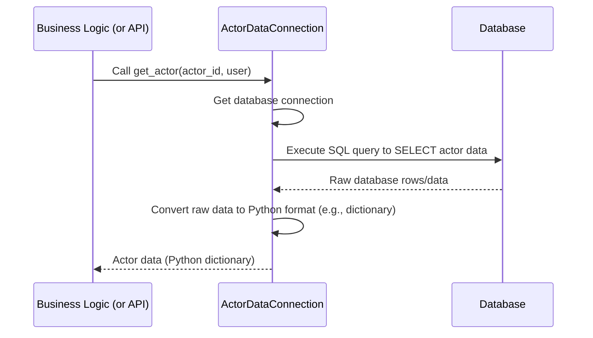
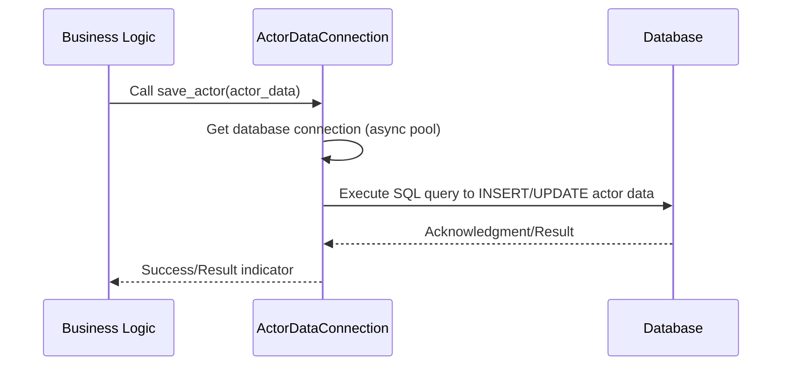

# Chapter 5: Database Data Connectors

Welcome back to the `actor-api` tutorial! In the previous chapters, we've built up our understanding of the system:
*   [Chapter 1: Actor Data Model](01_actor_data_model_.md) showed us how the data about Actors and related entities is structured in our code (Python models) and conceptually in the database.
*   [Chapter 2: Business Logic Modules](02_business_logic_modules_.md) introduced the "brains" of the application, responsible for the steps and rules needed to perform tasks using the data.
*   [Chapter 3: API Routers](03_api_routers_.md) are the "receptionists" that receive requests and hand them off.
*   [Chapter 4: Database Schema (Flyway)](04_database_schema__flyway__.md) explained how the database structure itself (tables, columns) is defined and managed over time using Flyway migrations.

Now we know *what* data we have ([Data Model](01_actor_data_model_.md)), *how* we want to process it ([Business Logic Modules](02_business_logic_modules_.md)), *how* requests come in ([API Routers](03_api_routers_.md)), and *where* the data lives ([Database Schema](04_database_schema__flyway__.md)). But how does the Python application code actually *talk* to the database?

Writing raw SQL queries directly inside our Business Logic or API Routers would get very messy, very fast. Every time we need to fetch, save, update, or delete data, we'd have to worry about database connections, writing the correct SQL syntax for each table, handling errors, and converting database results into Python objects.

This is where **Database Data Connectors** come in.

## What are Database Data Connectors?

Think of Database Data Connectors as specialized **librarians** for our database. Instead of the Business Logic or API Router having to know *exactly* which shelf (table) a piece of information is on and how to retrieve it using complex database commands (SQL), they just ask the appropriate Data Connector librarian.

*   **Role:** Database Data Connectors are Python classes dedicated solely to database interaction. They contain methods that represent specific database operations for different types of entities (like Actors, Work Items, Work Lists, Detection Data).
*   **Abstraction:** They hide the complexities of database connections (like getting a connection from a pool) and the details of the SQL queries themselves.
*   **Specialization:** There isn't just *one* Data Connector. Just like a library might have different librarians specializing in different sections (fiction, non-fiction, periodicals), our `actor-api` has different Data Connector classes for different data domains (Actors, Work Items, etc.). This keeps the code organized and focused.
*   **Location:** You can find these classes in the `src/data_connectors` directory.

Essentially, Data Connectors provide a clean, method-based interface for the rest of the application to interact with the database, without needing to know the underlying SQL or database setup.

## Our Use Case: Getting and Saving Actor Data

Let's use two simple, core tasks involving the database:
1.  **Getting a specific Actor's data by ID.**
2.  **Saving a new Actor's data.**

These tasks directly interact with the `actor` table whose structure we discussed in [Chapter 1](01_actor_data_model_.md) and [Chapter 4](04_database_schema__flyway__.md).

The component responsible for these operations is the `ActorDataConnection` class in `src/data_connectors/ActorDataConnection.py`.

## Using the Data Connector: Getting an Actor

As we saw in [Chapter 1](01_actor_data_model_.md) and [Chapter 3](03_api_routers_.md), when an API request comes in to get an Actor by ID, the API Router (`actor_router.py`) needs to fetch this data. It delegates this task to the `ActorDataConnection`.

Here's a very simplified flow, focusing on the Data Connector:



Let's look at a simplified version of the `get_actor` method in `ActorDataConnection.py`:

```python
# From: src/data_connectors/ActorDataConnection.py (Simplified!)
# ... imports and class definition ...

class ActorDataConnection:
    def __init__(self, config):
        # The connector needs configuration to know how to connect
        self.pool = ConnectionPool(**config) # Manages database connections
        self.async_pool = create_async_pool("Actor API", config) # For async operations

    # This decorator helps manage getting/returning a connection automatically
    @pooled_cursor
    def get_actor(self, id: str, user: User, cursor):
        """
        Fetches an actor's data from the database by ID.
        """
        # This is the simplified SQL query to get data from the 'actor' table
        sql = """
            SELECT json_
            FROM actor
            WHERE id = %s
        """
        # Execute the SQL query, passing the actor ID as a parameter
        cursor.execute(sql, [id])

        # Fetch one matching row from the database result
        row = cursor.fetchone()

        # Return the JSON data (which contains the actor's details) or None if not found
        return row["json_"] if row is not None else None

    # ... other methods like save_actor below ...
```

Explanation:

1.  `__init__`: The constructor takes database connection `config`. It sets up connection pools (`ConnectionPool`, `async_pool`) which are tools that efficiently manage database connections so the application doesn't have to open and close a new connection for every single database operation. The connector uses these pools internally.
2.  `@pooled_cursor`: This is a Python *decorator*. It wraps the `get_actor` function. Its job is to automatically get a connection from the `self.pool`, create a database cursor (which is needed to execute commands), pass that `cursor` to the `get_actor` function, and then automatically close the cursor and return the connection to the pool when `get_actor` finishes (or if an error occurs). This saves us from writing connection management code inside every data access method.
3.  `def get_actor(...)`: This is the method the API Router or Business Logic calls. It takes the `id` of the actor to fetch and the `user` (often used for access control, although the SQL here is simplified). The `cursor` parameter is provided by the `@pooled_cursor` decorator.
4.  `sql = "..."`: This defines the SQL query. We select the `json_` column (where most actor data is stored) from the `actor` table where the `id` matches the one provided.
5.  `cursor.execute(sql, [id])`: This command tells the database to run the `sql` query. Using `%s` and passing `[id]` separately is the standard, safe way to include variable data in SQL queries, preventing security issues like SQL injection.
6.  `row = cursor.fetchone()`: After the query runs, this fetches the first row of results. Since we're looking for a single actor by its unique ID, we expect at most one row.
7.  `return row["json_"] if row is not None else None`: If a row was found (`row` is not `None`), we return the value from the `json_` column. Otherwise, we return `None`. The calling code (API Router or Logic) will then handle this result, perhaps converting the dictionary from `json_` into an [Actor Data Model](01_actor_data_model_.md) object.

This method provides a simple, clear way for other parts of the system to say "get me this actor by ID" without needing to know *how* that's done in the database.

## Using the Data Connector: Saving an Actor

When the Business Logic needs to save a new Actor (or update an existing one), it calls a method on the `ActorDataConnection` like `save_actor`.

Here's a simplified flow for saving data:



Let's look at a simplified version of the `save_actor` method:

```python
# From: src/data_connectors/ActorDataConnection.py (Simplified!)
# ... imports and class definition ...

class ActorDataConnection:
    def __init__(self, config):
        # ... connection pools initialized ...
        self.async_pool = create_async_pool("Actor API", config) # Used for async saves

    async def connect_pool(self):
        # This method is called during startup to ensure async pool is ready
        await self.async_pool

    async def save_actor(self, actor: Actor):
        """
        Saves or updates an actor's data in the database.
        This version uses an async connection pool.
        """
        # This is a simplified SQL query for inserting data into the 'actor' table
        sql = """
            INSERT INTO actor (id, json_, as_of_date)
            VALUES ($1, $2, $3)
            """
        # Execute the SQL query asynchronously
        # The parameters ($1, $2, $3) are matched by order in the execute call
        await self.async_pool.execute(
            sql,
            actor.id,      # $1
            actor.json(),  # $2 (Pydantic model can output JSON string)
            actor.asOfDate # $3
        )
        # In the real code, it might return the inserted/updated row or ID
        # For simplicity, we just show the execution here.

    # ... other methods ...
```

Explanation:

1.  `async def save_actor(...)`: This method is asynchronous (`async def`). This means it can perform its task (talking to the database) without blocking the entire application while waiting for the database response. This is a common pattern in modern web services for performance.
2.  `await self.async_pool.execute(...)`: This line performs the database interaction. It uses the `async_pool` and the `execute` method to run the SQL query. The `await` keyword tells Python to pause here until the database operation is complete and then resume.
3.  `sql = "..."`: The SQL query is a simple `INSERT` statement, putting the actor's `id`, `json_` data, and `as_of_date` into the respective columns of the `actor` table. The `ON CONFLICT` clause seen in some real code examples handles updates if a row with the same primary key already exists (an "upsert").
4.  Parameters (`$1`, `$2`, `$3`): Different database drivers use different parameter styles. `async_pool` might use `$1`, `$2`, etc., while the `@pooled_cursor` example used `%s`. Both are ways to safely pass data to the query.

This `save_actor` method encapsulates the logic for writing an Actor object to the database, hiding the SQL and connection management details from the calling code.

## Other Data Connector Classes

As mentioned, there are different Data Connector classes for different parts of the system, corresponding to different database tables or groups of tables:

*   `ActorDataConnection`: Handles interactions with `actor`, `actor_associates`, `derived_info`, `actor_relationship`, `actor_list`, `submitter`, `counterparty`, `other_participant`, `trading_desk`, and `related_actors` tables. (As seen in the code, it covers a broad "Actor domain").
*   `WorkItemDataConnection`: Handles interactions primarily with the `work_item` and `work_item_config` tables (as seen in the code snippet).
*   `WorkListDataConnection`: Handles complex filtering and querying against tables like `case_work_list` and `case_access_classification` for the work list feature (as seen in the code snippet).
*   `DetectionDataConnection`: Handles interactions with tables related to detection results, like `visualizations` and `peer_group_information`. (This connection is conditional based on configuration, as seen in `containers.py`).

Each of these classes lives in its own file within `src/data_connectors` and has methods tailored to the specific operations needed for its domain. For instance, `WorkItemDataConnection` has methods like `upsert_work_item`, `get_work_items`, `delete_work_item_by_id`, etc., specific to managing work items.

## How Data Connectors are Used (Dependency Injection)

How do the Business Logic Modules or API Routers get access to the right Data Connector? They don't create them directly. Instead, they are provided to the classes that need them, typically when those classes are created. This pattern is called **Dependency Injection**, which we'll cover in detail in [Chapter 8: Dependency Injection Container](08_dependency_injection_container_.md).

You can see this in `src/containers.py`. This file is responsible for setting up and providing instances of classes, including the Data Connectors:

```python
# From: src/containers.py (Simplified!)
from data_connectors.ActorDataConnection import ActorDataConnection
from data_connectors.DetectionDataConnection import DetectionDataConnection
from data_connectors.WorkItemDataConnection import WorkItemDataConnection
from data_connectors.WorkListDataConnection import WorkListDataConnection
from dependency_injector import containers, providers
# ... other imports ...

# Defines how to create instances of Data Connectors
class DatabaseConnections(containers.DeclarativeContainer):
    # Creates a single instance (Singleton) of ActorDataConnection
    # and provides the database config to its constructor
    actor_db_connection = providers.Singleton(
        ActorDataConnection, config=Config.actor_db_config
    )
    # Creates a single instance of WorkListDataConnection
    worklist_db_connection = providers.Singleton(
        WorkListDataConnection, config=Config.worklist_db_config
    )
    # Creates a single instance of WorkItemDataConnection
    work_item_db_connection = providers.Singleton(
        WorkItemDataConnection, config=Config.workitem_db_config
    )
    # Creates a single instance of DetectionDataConnection (if enabled)
    _detection_db_connection = providers.Singleton(
        DetectionDataConnection, config=Config.detection_db_config
    ) if config.INCLUDE_ACTOR_INTELLIGENCE_DB else None

    @classmethod
    def detection_db_connection(cls):
        # Provides access to the detection connection, checking if it's enabled
        if not config.INCLUDE_ACTOR_INTELLIGENCE_DB:
            raise Exception("Detection database connection is unavailable")
        return cls._detection_db_connection()

# Defines how to create instances of Business Logic,
# and shows they receive Data Connectors
class LogicImplementation(containers.DeclarativeContainer):
    actor_logic = providers.Factory(
        ActorLogic,
        # ActorLogic receives these dependencies:
        filter_logic=FilterLogicImplementation.filter_logic,
        apis_service=ApisApiImplementation.service,
        database=DatabaseConnections.actor_db_connection, # It needs ActorDataConnection
        detection_database=DatabaseConnections.detection_db_connection, # It might need DetectionDataConnection
    )

    worklist_logic = providers.Factory(
        WorkListLogic,
        # WorkListLogic receives these dependencies:
        filter_logic=FilterLogicImplementation.filter_logic,
        database=DatabaseConnections.worklist_db_connection, # It needs WorkListDataConnection
    )

    work_item_logic = providers.Factory(
        WorkItemLogic,
        # WorkItemLogic receives these dependencies:
        database=DatabaseConnections.work_item_db_connection, # It needs WorkItemDataConnection
        work_list_database=DatabaseConnections.worklist_db_connection, # It needs WorkListDataConnection too
        apis_service=ApisApiImplementation.service,
    )
```

This snippet shows that the `DatabaseConnections` container is configured to create and provide instances of the Data Connector classes. Then, the `LogicImplementation` container is configured such that when it creates instances of `ActorLogic`, `WorkListLogic`, or `WorkItemLogic`, it passes the relevant Data Connector instances to their constructors (`__init__` methods). This is how the Logic modules get the "librarians" they need to talk to the database.

## Summary of Database Data Connector Responsibilities

In summary, Database Data Connectors are responsible for:

*   **Encapsulating SQL:** Holding the specific SQL queries needed for various database operations (SELECT, INSERT, UPDATE, DELETE).
*   **Managing Connections:** Using connection pools (`ConnectionPool`, `async_pool`) to efficiently handle database connections.
*   **Executing Queries:** Running the SQL queries using a database cursor.
*   **Handling Parameters:** Safely passing data into SQL queries.
*   **Processing Results:** Fetching results from the database and converting them into a format the calling code expects (like a Python dictionary).
*   **Abstracting Database Details:** Providing a Python method interface so that other parts of the application don't need to know the database type, connection details, or specific SQL syntax.

They are the crucial layer that translates the application's need for data into database commands and database results back into application data.

## Conclusion

In this chapter, we've explored **Database Data Connectors**. We learned that they are specialized Python classes in `src/data_connectors` that act as the application's interface to the database, hiding the complexity of SQL and connection management. We saw how they use methods like `get_actor` and `save_actor` to encapsulate database operations, simplifying data access for the rest of the system. We also looked at how different connectors handle different data domains and how they are provided to Business Logic modules via Dependency Injection.

Understanding Data Connectors is key to understanding how the `actor-api` persists and retrieves all the information about Actors and related entities.

In the [next chapter](06_external_api_clients_.md), we'll shift our focus from interacting with our *own* database to interacting with *external* services through [External API Clients](06_external_api_clients_.md).

---

Generated by [AI Codebase Knowledge Builder](https://github.com/The-Pocket/Tutorial-Codebase-Knowledge)