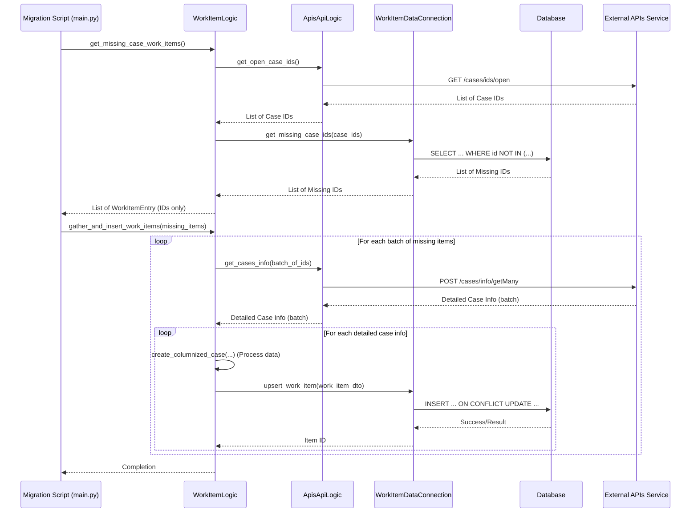

# Chapter 7: Work Item Feature

Welcome back to the `actor-api` tutorial! In our journey so far, we've learned about the core structure and interactions of the `actor-api`:
*   [Chapter 1: Actor Data Model](01_actor_data_model_.md) defined the data structure.
*   [Chapter 2: Business Logic Modules](02_business_logic_modules_.md) showed us the "brains" that process data and apply rules.
*   [Chapter 3: API Routers](03_api_routers_.md) explained how incoming requests are received.
*   [Chapter 4: Database Schema (Flyway)](04_database_schema__flyway__.md) covered how our database structure is managed.
*   [Chapter 5: Database Data Connectors](05_database_data_connectors_.md) detailed how we talk to *our* database.
*   [Chapter 6: External API Clients](06_external_api_clients_.md) showed how we talk to *other* services.

Now, let's put several of these concepts together to understand a specific feature within the `actor-api`: the **Work Item Feature**.

## What Problem Does the Work Item Feature Solve?

Imagine you're building a system that needs to track specific tasks or "cases" that require human attention or further processing. These cases might originate from somewhere else – perhaps another system that identifies suspicious activity, or a system that manages customer requests.

Our `actor-api` might be a central place where different tools or users need to see a unified list of these "things to work on," especially if these "things" relate to the Actors we track. We need a way to:

1.  Find out which cases are currently active or open in that other system.
2.  Keep a local list of these cases in our own database, maybe adding extra information relevant to *our* system (like which user is assigned, or custom statuses).
3.  Provide ways for other parts of the application or other services to view and potentially update these items.

This is precisely what the **Work Item Feature** is designed for. It focuses on handling "work items," which represent cases or tasks needing attention.

## What is a "Work Item"?

In the context of this feature, a **Work Item** is essentially a record in our database that represents a case or task pulled from an external source that needs tracking within the `actor-api`.

The core data for a Work Item is stored in a dedicated database table called `work_item`.

## The Goal: Keeping Our Work Item List Updated

The main goal of the Work Item feature is to ensure that our local `work_item` table contains up-to-date information about the cases that require attention, primarily by synchronizing with an external source of truth.

Let's focus on a central use case for this chapter: **How does the system initially populate the `work_item` table with open cases from an external API and keep it reasonably in sync?**

This initial population process involves several steps:
1.  Ask the external API for a list of currently open case IDs.
2.  Compare this list with the case IDs we *already* have in our local `work_item` table to identify missing ones.
3.  Get more detailed information from the external API for the cases that are missing.
4.  Format and store this detailed information as new Work Items in our `work_item` table.

This task requires coordination between different parts of our system.

## Key Components of the Work Item Feature

Based on our previous chapters, you can probably guess which types of components are involved:

*   **External Source (APIs Service):** The system that knows which cases are open. We'll interact with it using an [External API Client](06_external_api_clients_.md).
*   **Our Database:** Specifically, the `work_item` table, managed via [Database Schema (Flyway)](04_database_schema__flyway__.md). We interact with it using a [Database Data Connector](05_database_data_connectors_.md).
*   **WorkItemLogic:** A [Business Logic Module](02_business_logic_modules_.md) that orchestrates the steps of fetching, comparing, processing, and saving data.
*   **WorkItemDataConnection:** A [Database Data Connector](05_database_data_connectors_.md) specifically for the `work_item` table.
*   **ApisApiLogic:** The [External API Client](06_external_api_clients_.md) used by `WorkItemLogic` to talk to the external case source.
*   **Work Item Router:** An [API Router](03_api_routers_.md) that exposes endpoints to trigger or manage work items.

Let's see how they work together for the initial population/synchronization task.

## The Core Process: Initial Population and Synchronization

The process starts by needing to know which cases are "open" in the external system.

### Step 1: Get Open Case IDs from External API

The `WorkItemLogic` module knows it needs this list. It uses the `ApisApiLogic` client (our "translator" for the external "APIs service").

Look at the `get_missing_case_work_items` method in `src/logic/WorkItemLogic.py`:

```python
# From: src/logic/WorkItemLogic.py (Simplified!)
# ... imports ...

class WorkItemLogic:
    def __init__(self, database, work_list_database, apis_service):
        # apis_service is our ApisApiLogic instance
        self.apis_service = apis_service
        self.db = database # Our WorkItemDataConnection instance

    def get_missing_case_work_items(self) -> List[WorkItemEntry]:
        # Call the external API client to get the list of IDs
        case_ids = self.apis_service.get_open_case_ids()
        # ... proceed to Step 2 ...
        missing_case_ids = self.db.get_missing_case_ids(case_ids)
        return [
            WorkItemEntry(id=case_id) for case_id in missing_case_ids
        ]

    # ... other methods ...
```

The `apis_service.get_open_case_ids()` call (which we saw the implementation of in [Chapter 6](06_external_api_clients_.md)) does the work of talking to the external API and getting the raw list of IDs.

### Step 2: Check Which IDs are Missing Locally

Once `WorkItemLogic` has the list of open case IDs from the external system, it needs to know which of those *aren't* already in our `work_item` table. This check happens against our own database, so it uses the `WorkItemDataConnection`.

Back in the `get_missing_case_work_items` method in `WorkItemLogic`:

```python
# From: src/logic/WorkItemLogic.py (Simplified!)
# ... class definition ...

    def get_missing_case_work_items(self) -> List[WorkItemEntry]:
        case_ids = self.apis_service.get_open_case_ids()
        # Call our database connector to find the IDs NOT in our table
        missing_case_ids = self.db.get_missing_case_ids(case_ids)
        return [
            WorkItemEntry(id=case_id) for case_id in missing_case_ids
        ]

    # ... other methods ...
```

Now, let's peek into `WorkItemDataConnection.py` to see the simplified SQL query that does this check:

```python
# From: src/data_connectors/WorkItemDataConnection.py (Simplified!)
# ... imports and class definition ...

class WorkItemDataConnection:
    # ... __init__ and other methods ...

    @pooled_cursor
    def get_missing_case_ids(self, open_case_ids: List[str], cursor):
        if not open_case_ids:
            return []
        # Construct SQL to select IDs from the input list
        # WHERE those IDs are NOT IN the work_item table
        sql = """
            WITH open_case_ids_temp AS (
                SELECT * FROM (VALUES %s) AS t (case_id)
            )
            SELECT
                case_id
            FROM
                open_case_ids_temp oci
            WHERE
                oci.case_id NOT IN (
                SELECT id FROM work_item);
        """
        # Execute the query, passing the list of external IDs safely
        cursor.execute(sql, [tuple(open_case_ids)]) # Simplified parameter passing
        rows = cursor.fetchall()
        # Return just the list of IDs
        return [row["case_id"] for row in rows]

    # ... other methods ...
```

This `get_missing_case_ids` method takes the list of external `open_case_ids` and runs an SQL query against the `work_item` table to find which ones are present in the input list but *absent* from the database table. It returns just the IDs that are currently missing locally.

### Step 3: Get Detailed Info for Missing Cases

`WorkItemLogic` now has a list of case IDs that are open externally but missing internally. It needs more details about these cases (like their name, description, status, etc.) before it can store them. Again, this detailed info comes from the external "APIs service", so `WorkItemLogic` uses the `ApisApiLogic` client again.

This step is part of the `gather_and_insert_work_items` method in `WorkItemLogic`, which is called after `get_missing_case_work_items` identifies the list of cases to process:

```python
# From: src/logic/WorkItemLogic.py (Simplified!)
# ... imports and class definition ...

    def gather_and_insert_work_items(self, cases: List[WorkItemEntry]):
        # cases is the list of WorkItemEntry objects (just containing the ID for now)
        cases_dict = dict((c.id, c) for c in cases)
        all_case_ids = list(cases_dict.keys())

        # Often processed in batches to avoid huge requests
        case_ids_lists = chunks(all_case_ids, 100) # Helper to split list

        for case_ids_list in case_ids_lists:
            # Call the external API client to get detailed info for a batch of IDs
            finalized_case_infos = self.apis_service.get_cases_info(case_ids_list)
            # ... proceed to Step 4 for each item ...
            for fci in finalized_case_infos:
                finalized_case_info: FinalizedCaseInfo = FinalizedCaseInfo(**fci)
                work_item_entry: WorkItemEntry = cases_dict[finalized_case_info.case["id"]]
                columnized_case = self.create_columnized_case(finalized_case_info, work_item_entry)
                self.insert_work_item(WorkItem(**columnized_case))

    # ... other methods ...
```

The `self.apis_service.get_cases_info(case_ids_list)` call fetches the detailed data for the specified batch of case IDs from the external system.

### Step 4: Process and Save/Update Work Items

For each detailed case information received from the external API, `WorkItemLogic` needs to transform it into the structure expected by our `work_item` table and then save it using `WorkItemDataConnection`.

Still within the loop in `gather_and_insert_work_items` in `WorkItemLogic`:

```python
# From: src/logic/WorkItemLogic.py (Simplified!)
# ... imports and class definition ...

    def gather_and_insert_work_items(self, cases: List[WorkItemEntry]):
        # ... fetching case_ids_lists and finalized_case_infos ...
        for case_ids_list in case_ids_lists:
             finalized_case_infos = self.apis_service.get_cases_info(case_ids_list)
             for fci in finalized_case_infos:
                finalized_case_info: FinalizedCaseInfo = FinalizedCaseInfo(**fci)
                work_item_entry: WorkItemEntry = cases_dict[finalized_case_info.case["id"]]

                # Transform the external data into our WorkItem structure
                columnized_case = self.create_columnized_case(finalized_case_info, work_item_entry)

                # Save the transformed data using the database connector
                self.insert_work_item(WorkItem(**columnized_case))

    def create_columnized_case(self, finalized_case_info: FinalizedCaseInfo, work_item_entry: WorkItemEntry):
        # This method contains logic to map fields from external data
        # (finalized_case_info) into the columns/structure for our work_item table.
        # It uses CaseExtractLogic, which we won't detail here.
        # It produces a dictionary suitable for creating a WorkItem object.
        pass # Simplified for tutorial

    def insert_work_item(self, item: WorkItem):
        # Get config needed to structure the data array
        store_config: WorkItemConfig = self.db.get_store_work_item_config()
        # Transform the columns dictionary into the ordered array for the 'data' column
        columns_as_an_array = self.construct_array(item.columns, store_config)
        # Create the DTO object for saving
        work_item_dto = WorkItemDTO(
            id=item.id,
            config_id=store_config.id,
            # ... map access classification fields ...
            data=columns_as_an_array,
        )
        # Call the database connector's upsert method
        self.db.upsert_work_item(work_item_dto)

    # ... other methods including construct_array ...
```

Here:
- `create_columnized_case` (simplified here) is a key internal step in `WorkItemLogic` that maps the external case data structure to our internal `WorkItem` structure, including extracting relevant fields into a dictionary called `columns` and deriving classification fields (domain, group, etc.).
- `construct_array` (also simplified) takes the `columns` dictionary and orders the values based on a `work_item_config` to create the list of values that will go into the database's `jsonb` `data` column.
- `insert_work_item` creates a `WorkItemDTO` (Data Transfer Object) with all the data ready for the database.
- `self.db.upsert_work_item(work_item_dto)` calls the database connector to perform the save/update.

Let's look at the simplified `upsert_work_item` method in `WorkItemDataConnection.py`:

```python
# From: src/data_connectors/WorkItemDataConnection.py (Simplified!)
# ... imports and class definition ...

class WorkItemDataConnection:
    # ... __init__ and other methods ...

    @pooled_cursor
    def upsert_work_item(self, item: WorkItemDTO, cursor) -> str:
        # SQL query to INSERT a new row OR UPDATE it if a row with the same ID already exists
        sql = """
            INSERT
                INTO
                work_item (id, config_id, "domain", "group", "country", "department", "region", "elevated_privilege", "city", "data")
            VALUES (%(id)s, %(config_id)s, %(domain)s, %(group)s, %(country)s, %(department)s, %(region)s, %(elevated_privilege)s, %(city)s, %(data)s)
            ON CONFLICT ON CONSTRAINT work_item_pk DO UPDATE
                SET config_id = EXCLUDED.config_id,
                    "domain" = EXCLUDED."domain",
                    -- ... other fields updated from EXCLUDED (the new values) ...
                    "data" = EXCLUDED."data";
        """
        # Execute the SQL query with the WorkItemDTO data mapped to parameters
        cursor.execute(sql, item.dict(by_alias=True)) # Simplified dict conversion
        return item.id # Return the ID of the saved item

    # ... other methods ...
```

This `upsert_work_item` method handles the final step of writing the data to the `work_item` table. The `INSERT ... ON CONFLICT DO UPDATE` syntax is a powerful SQL feature that attempts to insert a new row; if a row with the same primary key (defined by `work_item_pk`) already exists, it instead *updates* the existing row with the new values. This is why it's called an "upsert" (UPdate or inSERT). This ensures that running the synchronization process multiple times will update existing work items rather than creating duplicates.

### Initial Population Script

The process described above (`get_missing` -> `gather_and_insert`) is specifically triggered for initial population and periodic synchronization by a separate script, `work-item-migration/src/main.py`.

This script essentially does the following (simplified):

```python
# From: work-item-migration/src/main.py (Simplified!)
# ... imports and setup ...

if __name__ == "__main__":
    # Get the WorkItemLogic instance (using Dependency Injection - Chapter 8!)
    work_item_logic = LogicImplementation.work_item_logic()

    # Optional: Truncate (empty) the table for a clean re-sync
    # work_item_logic.db._truncate_work_item_table()

    # Step 1 & 2: Get list of missing items
    all_missing_case_work_items = work_item_logic.get_missing_case_work_items()

    # Step 3 & 4: Process and insert/update missing items in batches
    missing_work_items_batches = chunks(all_missing_case_work_items, 100)
    for batch in missing_work_items_batches:
        # This method orchestrates fetching details and saving
        work_item_logic.gather_and_insert_work_items(batch)

    # ... error handling and logging ...
    logging.info("Migration completed.")
```

This script demonstrates how `WorkItemLogic`'s methods are used externally to perform the sync task.

### Sequence Diagram for Initial Sync

Here's a sequence diagram summarizing the core flow for the initial population process:



This diagram shows how the `WorkItemLogic` coordinates calls to both the [External API Client](06_external_api_clients_.md) (`ApisApiLogic`) and the [Database Data Connector](05_database_data_connectors_.md) (`WorkItemDataConnection`) to perform the synchronization task.

## The `work_item` Table Structure

The `work_item` table that stores these items is defined in the database schema managed by [Flyway](04_database_schema__flyway__.md). You would find its creation and any subsequent alteration scripts in the `flyway/sql` directory.

A simplified view of its structure:

```sql
-- Conceptual structure based on code
CREATE TABLE IF NOT EXISTS work_item (
    id varchar(250) NOT NULL PRIMARY KEY, -- Unique ID for the work item (e.g., case ID)
    config_id varchar(100) NOT NULL,      -- ID linking to a configuration entry
    "domain" varchar(100),               -- Access classification field
    "group" varchar(100),                -- Access classification field
    "country" varchar(100),              -- Access classification field
    "department" varchar(100),           -- Access classification field
    "region" varchar(100),               -- Access classification field
    "elevated_privilege" boolean,        -- Access classification field
    "city" varchar(100),                 -- Access classification field
    "data" jsonb NOT NULL                -- Flexible JSONB column for main item details
);
-- This table also needs indexes for lookup efficiency.
-- Access control logic is applied when querying (seen in Data Connector).
```

As you can see, it has a unique `id`, several columns for access control classification (domain, group, etc.), and a `jsonb` column (`data`) which holds the processed details of the work item. The `config_id` links to a `work_item_config` table (also managed by Flyway) that defines how the data within the `jsonb` column is structured and displayed – this provides flexibility.

## API Endpoints for Ongoing Management

Besides the initial synchronization, the `actor-api` provides API endpoints to interact with the `work_item` table for ongoing use by other services or applications. These are defined in the `src/router/work_item_router.py` [API Router](03_api_routers_.md).

Here are some key endpoints (simplified):

*   `POST /workitems/missing`: Triggers the initial population/synchronization process described above. This is typically protected (e.g., with a master API key) as it's an administrative task. It calls `work_item_logic.create_missing_work_items()`.

    ```python
    # From: src/router/work_item_router.py (Simplified!)
    @router.post("/workitems/missing", tags=["WorkItem"])
    def create_missing_work_items(x_api_key=Header(None)):
        # Validate the special master key
        validate_master_api_key(x_api_key)
        # Delegate to Business Logic
        return work_item_logic.create_missing_work_items()
    ```

*   `POST /workitems`: A flexible endpoint to handle various actions on work items (inserting, creating, deleting, updating). The desired action is specified in the request body's `event` field. It calls different methods on `work_item_logic` based on the event.

    ```python
    # From: src/router/work_item_router.py (Simplified!)
    @router.post("/workitems", tags=["WorkItem"])
    def handle_work_item(req: WorkItemRequest, user: User = Depends(get_user)):
        # Check the event type in the request
        if req.event == WorkItemEvent.INSERT:
             # Delegate to logic to insert one item
             return work_item_logic.insert_work_item(WorkItem(**req.data))
        if req.event == WorkItemEvent.DELETE:
             # Delegate to logic to delete items
             work_item_logic.delete_work_items(req.data, user)
             return {"status": "success"}
        # ... handle CREATE and UPDATE events similarly ...
    ```

*   `GET /workitems`: Retrieves a list of work items from the database, allowing for pagination (`first`, `fromCaseId`). It delegates the data fetching directly to the `WorkItemDataConnection`, which handles the database query and access control based on the `user`.

    ```python
    # From: src/router/work_item_router.py (Simplified!)
    @router.get("/workitems", tags=["WorkItem"], response_class=Response)
    def get_work_items(
        first: int = Query(MAX_WORKITEMS_RETURNED, gt=0, le=MAX_WORKITEMS_RETURNED),
        from_case_id: str = Query(None, alias="fromCaseId"),
        user: User = Depends(get_user),
    ):
        # Delegate directly to the database connector
        content = db.get_work_items(user, from_case_id, first)
        # Return the content efficiently
        return ORJSONResponse.render(None, content)
    ```

*   `POST /workitems/getMany`: Retrieves specific work items by a list of their IDs. Similar to `GET /workitems`, it delegates directly to the `WorkItemDataConnection`.

    ```python
    # From: src/router/work_item_router.py (Simplified!)
    @router.post("/workitems/getMany", tags=["WorkItem"])
    def get_work_items_by_case_ids(
        case_ids: List[str],
        user: User = Depends(get_user),
    ):
        # Delegate directly to the database connector
        return db.get_work_items_by_case_ids(user, case_ids)
    ```

*   `/workitems/config/display` and `/workitems/config/store`: Endpoints to retrieve the work item configuration, which defines how the data in the `jsonb` column is structured and intended for display vs. storage. These also delegate to `WorkItemDataConnection`.

These API endpoints demonstrate how the Work Item feature is exposed to users and other systems, allowing them to not only trigger synchronization but also retrieve and manage the work items stored in our database.

## Conclusion

In this chapter, we've explored the **Work Item Feature**, seeing how it acts as a centralized tracker for cases or tasks by synchronizing data from an external API into our own database. We saw how this feature utilizes several key concepts from previous chapters: it uses [External API Clients](06_external_api_clients_.md) (`ApisApiLogic`) to get data from external systems, a dedicated [Database Data Connector](05_database_data_connectors_.md) (`WorkItemDataConnection`) to interact with its specific table (`work_item`) which is defined by [Database Schema (Flyway)](04_database_schema__flyway__.md), and orchestrates these interactions within a [Business Logic Module](02_business_logic_modules_.md) (`WorkItemLogic`). Finally, we looked at how [API Routers](03_api_routers_.md) (`work_item_router.py`) expose functionality to trigger synchronization and manage work items.

This feature is a great example of how the different layers and components of the `actor-api` work together to achieve a specific functional goal.

Throughout the code examples, you might have noticed that the various components (Logic, Data Connectors, API Clients) don't create their dependencies themselves; they receive them (e.g., `WorkItemLogic` receives `database`, `work_list_database`, and `apis_service` in its `__init__`). This is managed by a central system called the Dependency Injection Container, which will be the focus of our [next chapter](08_dependency_injection_container_.md).

---

Generated by [AI Codebase Knowledge Builder](https://github.com/The-Pocket/Tutorial-Codebase-Knowledge)