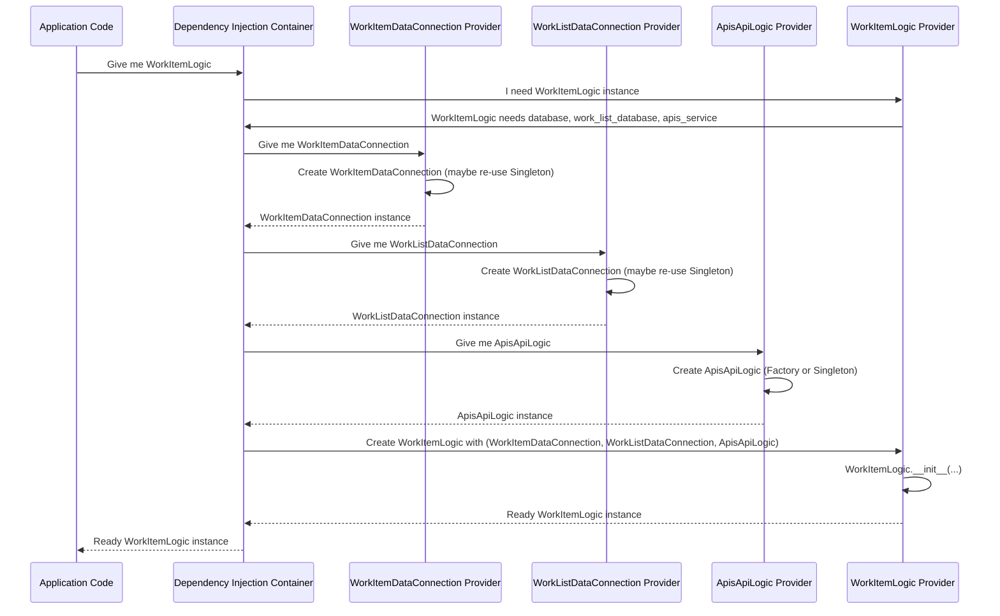

# Chapter 8: Dependency Injection Container

Welcome back for the final chapter of the `actor-api` tutorial! We've covered a lot of ground, exploring the different components that make up the system:
*   [Chapter 1: Actor Data Model](01_actor_data_model_.md): How we structure our data.
*   [Chapter 2: Business Logic Modules](02_business_logic_modules_.md): The "brains" that perform operations.
*   [Chapter 3: API Routers](03_api_routers_.md): Handling incoming requests.
*   [Chapter 4: Database Schema (Flyway)](04_database_schema__flyway__.md): Managing our database structure.
*   [Chapter 5: Database Data Connectors](05_database_data_connectors_.md): How we talk to our database.
*   [Chapter 6: External API Clients](06_external_api_clients_.md): How we talk to other services.
*   [Chapter 7: Work Item Feature](07_work_item_feature_.md): A specific feature demonstrating component interaction.

Throughout these chapters, especially when looking at the `__init__` methods of classes like `WorkItemLogic` or `ActorLogic`, you might have noticed something: these classes didn't *create* the objects they needed (like `WorkItemDataConnection` or `ApisApiLogic`) themselves. Instead, they expected these objects to be *given* to them as arguments in their constructor (`__init__`).

```python
# From: src/logic/WorkItemLogic.py (Simplified again!)
class WorkItemLogic:
    def __init__(self, database, work_list_database, apis_service):
        # These objects (dependencies) are PROVIDED from the outside!
        self.db = database # WorkItemDataConnection
        self.work_list_db = work_list_database # WorkListDataConnection
        self.apis_service = apis_service # ApisApiLogic
```

This is a pattern called **Dependency Injection**. The object (**WorkItemLogic**) doesn't create its **dependencies** (`database`, `apis_service`); they are *injected* into it.

But who is doing the injecting? Who is responsible for creating all these objects (`ActorLogic`, `ApisApiLogic`, `ActorDataConnection`, etc.) and making sure they get wired together correctly?

Trying to manually create every object and its dependencies throughout the application would be incredibly complex and error-prone. Imagine creating `ActorLogic` manually: you'd first have to create `ActorDataConnection` and maybe `ApisApiLogic`, making sure you give *them* their configurations, and *then* pass them to `ActorLogic`'s `__init__`. This quickly becomes a tangled mess.

This is the problem solved by a **Dependency Injection Container**.

## What is a Dependency Injection Container?

Think of a Dependency Injection Container as the **central factory** or **supply room manager** for your application's objects.

*   It knows about all the different types of components in your system (your [Business Logic Modules](02_business_logic_modules_.md), [Database Data Connectors](05_database_data_connectors_.md), [External API Clients](06_external_api_clients_.md), etc.).
*   It knows *how* to create each of these components, including what configuration they need and which other components (dependencies) they rely on.
*   When a part of your application needs an instance of a component (say, `ActorLogic`), it asks the Container.
*   The Container then looks up `ActorLogic`, identifies its dependencies (`ActorDataConnection`, `ApisApiLogic`, etc.), creates or retrieves those dependencies, and finally creates the `ActorLogic` instance by passing the dependencies into its `__init__` method.

The `actor-api` uses the popular Python library `dependency_injector` to implement this. The configuration for this container lives primarily in the `src/containers.py` file.

## Our Use Case: How `ActorLogic` Gets Its Dependencies

Let's revisit the `ActorLogic` module from [Chapter 2](02_business_logic_modules_.md). Its job is to handle business operations related to Actors. To do its job, it needs to:
*   Talk to the Actor database tables (via `ActorDataConnection`).
*   Potentially interact with other services, like the APIs service (via `ApisApiLogic`).
*   Coordinate with other logic, like the `FilterLogic` for complex filtering.

```python
# From: src/logic/ActorLogic.py (Simplified!)
class ActorLogic:
    def __init__(
        self,
        filter_logic,         # Needs FilterLogic
        apis_service,         # Needs ApisApiLogic
        database,             # Needs ActorDataConnection
        detection_database    # Needs DetectionDataConnection (optional)
    ):
        self.filter_logic = filter_logic
        self.apis_service = apis_service
        self.db = database
        self.detection_db = detection_database
```

Our use case for this chapter is: **How does the Dependency Injection Container ensure that when something needs an `ActorLogic` instance, it gets one that is correctly set up with instances of `FilterLogic`, `ApisApiLogic`, `ActorDataConnection`, and `DetectionDataConnection`?**

## The Solution: Defining Dependencies in `containers.py`

The magic happens in `src/containers.py`. This file defines "containers" which are classes that group related dependency definitions. Inside these containers, we use "providers" to tell the `dependency_injector` library how to create specific objects.

Let's look at simplified snippets from `src/containers.py`:

First, we define how to get database connections ([Database Data Connectors](05_database_data_connectors_.md)). These often need configuration and should usually be single instances shared throughout the application (since managing connection pools is resource-intensive).

```python
# From: src/containers.py (Simplified!)
from dependency_injector import containers, providers
from data_connectors.ActorDataConnection import ActorDataConnection
# ... other imports ...

class Config(containers.DeclarativeContainer):
    # This container holds configuration values
    actor_db_config = providers.Configuration("config")
    # ... other config providers ...

class DatabaseConnections(containers.DeclarativeContainer):
    # Define a provider for ActorDataConnection
    # providers.Singleton means create only ONE instance and reuse it
    # The config=Config.actor_db_config part tells the container
    # to pass the actor_db_config value to ActorDataConnection's __init__
    actor_db_connection = providers.Singleton(
        ActorDataConnection, config=Config.actor_db_config
    )
    # Define providers for other database connections similarly
    worklist_db_connection = providers.Singleton(
        WorkListDataConnection, config=Config.worklist_db_config
    )
    # ... etc ...
```

Here, `DatabaseConnections` is a container. `actor_db_connection` is a `Singleton` provider. It says: "When someone asks for `DatabaseConnections.actor_db_connection`, create an instance of `ActorDataConnection`. Pass the value provided by `Config.actor_db_config` as the `config` argument to its `__init__`. Once created, keep this same instance and give it out every time it's requested."

Next, we define how to get instances of our [External API Clients](06_external_api_clients_.md):

```python
# From: src/containers.py (Simplified!)
# ... imports ...
from logic.ApisApiLogic import ApisApiLogic
from common.logic import FilterApi
# ... other imports ...

class ApisApiImplementation(containers.DeclarativeContainer):
    # Defines a provider for ApisApiLogic. Could be Singleton or Factory.
    # Assuming Factory here for demonstration (creates new instance each time)
    # The config=Config.api_urls tells the container to pass API URLs config.
    service = providers.Factory(ApisApiLogic, config=Config.api_urls)

class FilterApiImplementation(containers.DeclarativeContainer):
    # Defines a provider for FilterApi
    service = providers.Factory(FilterApi, config=Config.api_urls)
    # ... etc ...
```

Similar to database connections, these define providers for the API client classes, giving them their necessary configuration.

Now, the core part for our use case: defining the [Business Logic Modules](02_business_logic_modules_.md), specifically `ActorLogic`. This is where we tell the container *which* dependencies `ActorLogic` needs and *where* to get them (from the providers we defined earlier).

```python
# From: src/containers.py (Simplified!)
# ... imports ...
from logic.ActorLogic import ActorLogic
from common.logic import FilterLogic # Import the Logic class itself
# ... other imports ...

class FilterLogicImplementation(containers.DeclarativeContainer):
    # Defines how to create FilterLogic. It needs the FilterApi service.
    filter_logic = providers.Factory(
        FilterLogic, filter_api=FilterApiImplementation.service # <-- Dependency!
    )

class LogicImplementation(containers.DeclarativeContainer):
    # Define a provider for ActorLogic
    # providers.Factory means create a NEW instance each time requested.
    # These arguments match the __init__ signature of ActorLogic
    # We point them to the providers for the dependencies
    actor_logic = providers.Factory(
        ActorLogic,
        # The container will provide the instance from this provider:
        filter_logic=FilterLogicImplementation.filter_logic, # From FilterLogic container
        apis_service=ApisApiImplementation.service, # From ApisApi container
        database=DatabaseConnections.actor_db_connection, # From DBConnections container
        detection_database=DatabaseConnections.detection_db_connection, # From DBConnections (conditional)
    )

    # Define providers for other Logic modules similarly
    worklist_logic = providers.Factory(
        WorkListLogic,
        # ... lists its dependencies here ...
        database=DatabaseConnections.worklist_db_connection, # Needs WorkList DB
        filter_logic=FilterLogicImplementation.filter_logic, # Needs FilterLogic
    )

    work_item_logic = providers.Factory(
        WorkItemLogic,
        # ... lists its dependencies here ...
        database=DatabaseConnections.work_item_db_connection, # Needs Work Item DB
        work_list_database=DatabaseConnections.worklist_db_connection, # Needs Work List DB (different one!)
        apis_service=ApisApiImplementation.service, # Needs ApisApiLogic
    )
```

This `LogicImplementation` container is key. The `actor_logic` provider explicitly lists that `ActorLogic` needs `filter_logic`, `apis_service`, `database`, and `detection_database`. It then points to the specific *providers* (`FilterLogicImplementation.filter_logic`, `ApisApiImplementation.service`, etc.) that the container should use to obtain instances of those dependencies.

## How the Container Wires Everything Together

When the application starts or when a specific service is needed, the application code asks the container for an instance. For example, the work item migration script (`work-item-migration/src/main.py`) needs the `WorkItemLogic`:

```python
# From: work-item-migration/src/main.py (Simplified!)
# ... setup and imports ...
from containers import LogicImplementation # Import the container

if __name__ == "__main__":
    # Ask the container for a WorkItemLogic instance
    work_item_logic = LogicImplementation.work_item_logic()
    # Now work_item_logic is ready to use with all its dependencies
    # ... call methods on work_item_logic ...
```

When `LogicImplementation.work_item_logic()` is called, the container performs the following steps (conceptually):



This diagram shows how the container resolves the dependencies recursively. It asks for `WorkItemLogic`, sees its dependencies, asks for each of *those* dependencies, potentially triggering the creation of *their* dependencies, until everything needed is created and injected into the final object requested by the application.

The `set_container_config()` function called early in `src/main.py` and the migration script is crucial because it loads the actual configuration values (like database URLs, API keys) into the `Config` container providers, making them available when the other providers (`Singleton`, `Factory`) need them to instantiate classes.

```python
# From: src/containers.py (Simplified!)
import config # Import the actual config module

def set_container_config():
    # Override default configuration providers with actual values
    Config.actor_db_config.override(config.actor_db_config)
    # ... override other config providers ...
    Config.api_urls.override(config.api_urls)
```

## Benefits of Dependency Injection

Why go through this trouble instead of just having objects create their own dependencies?

1.  **Loose Coupling:** Components don't depend directly on *how* their dependencies are created. `WorkItemLogic` doesn't have `WorkItemDataConnection(...)` inside it. It just expects a `database` object. This makes `WorkItemLogic` less tied to the specific implementation details of `WorkItemDataConnection`.
2.  **Improved Testability:** Because dependencies are passed in, it's easy to replace them with "mock" or "fake" objects during testing. You can test `WorkItemLogic` in isolation by giving it fake database connections and API clients that return predefined data, without actually needing a database or a running external service. This makes tests faster and more reliable.
3.  **Easier Maintenance and Evolution:** If you need to change how a dependency is created (e.g., add logging to `ActorDataConnection` or switch to a different connection pool), you only change its definition in `containers.py` and potentially the `ActorDataConnection` class itself. You don't need to find every place where `ActorDataConnection` was manually created throughout the codebase.
4.  **Centralized Configuration:** The logic for creating and configuring core services is in one place (`containers.py`), making it easier to understand the system's structure and manage configurations.

Dependency Injection, managed by the Container, is a fundamental pattern in well-structured applications like `actor-api` because it dramatically improves code organization, testability, and maintainability.

## Conclusion

In this final chapter, we explored the concept of the **Dependency Injection Container**. We learned that it's a central component, implemented using the `dependency_injector` library in `src/containers.py`, responsible for creating instances of our application's classes ([Business Logic Modules](02_business_logic_modules_.md), [Database Data Connectors](05_database_data_connectors_.md), [External API Clients](06_external_api_clients_.md)) and providing them to other components that need them. We saw how `containers.py` defines "providers" (`Singleton`, `Factory`) that specify *how* to create these objects and *which* dependencies to inject into their constructors. We illustrated how the container resolves these dependencies recursively and how the application code simply requests the top-level service it needs from the container.

Understanding the Dependency Injection Container ties together how all the different components we've discussed throughout this tutorial are assembled and wired together, enabling a more modular, testable, and maintainable codebase.

Thank you for joining this tutorial journey through the `actor-api` project!

---

Generated by [AI Codebase Knowledge Builder](https://github.com/The-Pocket/Tutorial-Codebase-Knowledge)