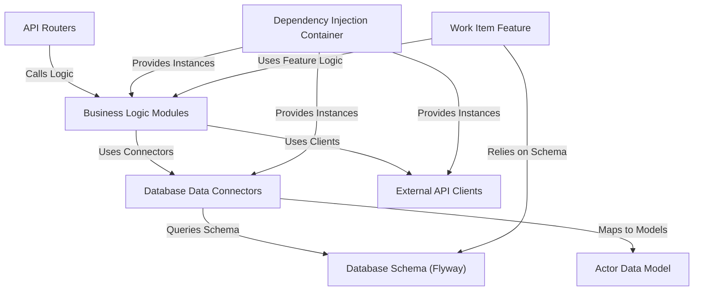

# Tutorial: actor-api

The `actor-api` is a microservice designed to **manage and expose structured data** about core entities called 'actors' (like people and companies). It provides a **public API** for clients to query and modify this actor data and includes a feature for managing **work items** related to cases needing review. The service relies on a **database** to store all information and communicates with **external APIs** for additional data, with its internal structure managed through **dependency injection**.

**Source Repository:** [None](None)

## Chapters

1. [Actor Data Model
](01_actor_data_model_.md)
2. [Business Logic Modules
](02_business_logic_modules_.md)
3. [API Routers
](03_api_routers_.md)
4. [Database Schema (Flyway)
](04_database_schema__flyway__.md)
5. [Database Data Connectors
](05_database_data_connectors_.md)
6. [External API Clients
](06_external_api_clients_.md)
7. [Work Item Feature
](07_work_item_feature_.md)
8. [Dependency Injection Container
](08_dependency_injection_container_.md)

---

Generated by [AI Codebase Knowledge Builder](https://github.com/The-Pocket/Tutorial-Codebase-Knowledge)