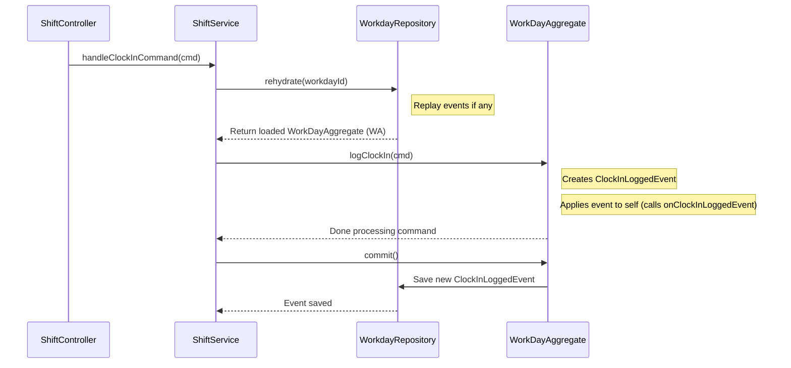

# Chapter 3: Workday/Shift Aggregate

In the last chapter, we learned about the [Assignment Aggregate](02_assignment_aggregate_.md), which acts like a detailed folder for a single delivery assignment. But what about tracking the driver's overall workday? When did they start their shift? When did they take breaks? When did they finish for the day? The Assignment Aggregate doesn't track this; it only cares about one specific job.

That's where the **Workday/Shift Aggregate** comes in!

## What's the Goal? A Digital Timecard for Drivers

Imagine a driver, Sarah, starting her day. She needs to tell the system, "I'm starting work now!" Later, she might take a lunch break, report a flat tire (a breakdown), add a note about a stop she made, and finally, clock out.

We need a way to record all these actions for *Sarah's entire shift* on a specific day. Think of the **Workday/Shift Aggregate** as a smart, digital timecard for a single driver's workday or shift.

## Key Concepts: Workday Aggregate & Event Sourcing (Again!)

Just like the [Assignment Aggregate](02_assignment_aggregate_.md), the Workday/Shift Aggregate (often called `WorkDayAggregate` in the code) uses some familiar concepts:

1.  **Workday/Shift Aggregate (`WorkDayAggregate`):**
    *   This is the main object representing *one* specific workday for *one* specific driver.
    *   It holds information like:
        *   Who the driver is (implicitly, via the Aggregate's ID or an associated ID).
        *   When they clocked in.
        *   When they clocked out.
        *   Any breaks they took (start and end times).
        *   Any breakdowns they reported (start, end, reason).
        *   Any stops they manually logged.
        *   The current status (e.g., `ON_DUTY`, `ON_BREAK`, `OFF_DUTY`).
    *   **Analogy:** If the Assignment Aggregate is a folder for one specific *project*, the Workday/Shift Aggregate is the driver's daily *timesheet*.

2.  **Event Sourcing:**
    *   Just like the Assignment Aggregate, the Workday Aggregate doesn't just store the *final* times. It stores a list of *events* that happened during the shift.
    *   **Events:** These are facts about things that occurred. Examples: `ClockInLoggedEvent`, `BreakStartedEvent`, `BreakEndedEvent`, `BreakdownStartedEvent`, `StopAddedEvent`, `ClockOutLoggedEvent`.
    *   To figure out the driver's current status or how long their break was, the system "replays" these events in order.
    *   **Benefit:** We get a complete history of the driver's shift, event by event.

3.  **Business Rules:**
    *   The Workday Aggregate is also responsible for enforcing rules related to the shift. For example:
        *   A driver probably can't clock out if they are currently marked as being on a break.
        *   A driver can't start a break if they haven't clocked in yet.
    *   These rules live inside the Aggregate's methods.

So, the `WorkDayAggregate` is a digital timecard built from a sequence of events, and it makes sure the timesheet follows the company rules.

## How It Works: Clocking In

Let's follow what happens when a driver clocks in, using the concepts from [Chapter 1: Command Handling (Controllers & Commands)](01_command_handling__controllers___commands__.md):

1.  **Command Arrives:** A `ClockInCommand` message arrives via Kafka.
2.  **Controller Receives:** The `ShiftController` catches this message.
3.  **Controller Delegates:** The `ShiftController` calls the `handleClockInCommand` method in the `ShiftService`.
4.  **Service Loads Aggregate:** The `ShiftService` knows this involves a driver's shift. It uses the `WorkdayRepository` (part of [Event Sourcing & Repositories](05_event_sourcing___repositories_.md)) to load or create the specific `WorkDayAggregate` for this driver's shift. The repository might replay past events for this shift if it already exists.
5.  **Service Tells Aggregate to Act:** The `ShiftService` calls a method on the `WorkDayAggregate` object, like `workDay.logClockIn(commandData)`.
6.  **Aggregate Creates Event:** Inside the `logClockIn` method, the `WorkDayAggregate` checks rules (e.g., are they already clocked in?). If okay, it creates a *new* event: `ClockInLoggedEvent`.
7.  **Aggregate Updates Itself:** The Aggregate immediately uses this new event to update its own state (e.g., records the `clockIn` time, sets status to `ON_DUTY`). This happens via an internal `onClockInLoggedEvent` method.
8.  **Service Saves Changes:** The `ShiftService` tells the Aggregate to `commit()` its changes. The `WorkdayRepository` saves the new `ClockInLoggedEvent` to the event store database.

## Under the Hood: The Flow and the Code

Let's visualize that flow and look at simplified code snippets.

**Step-by-Step Flow:**

1.  `ShiftService` receives the `ClockInCommand`.
2.  `ShiftService` asks `WorkdayRepository` to get the `WorkDayAggregate` (creating a new one if needed).
3.  `WorkdayRepository` replays any existing events for this shift to build the current state of the `WorkDayAggregate`.
4.  `ShiftService` calls `workDay.logClockIn(command)`.
5.  `WorkDayAggregate` validates the command and creates a `ClockInLoggedEvent`.
6.  `WorkDayAggregate` calls its own `apply(event)` method.
7.  `apply(event)` stores the event temporarily and calls `onClockInLoggedEvent(event)`.
8.  `onClockInLoggedEvent(event)` updates the aggregate's properties (like `this.clockIn` and `this.status`).
9.  `ShiftService` calls `workDay.commit()`.
10. `WorkdayRepository` takes the temporarily stored event (`ClockInLoggedEvent`) and saves it permanently.

**Sequence Diagram:**



**Code Snippets:**

Let's see simplified versions of the code involved.

**1. Service Handling the Command (`src/shift/shift.service.ts`)**

```typescript
// src/shift/shift.service.ts
import { Injectable } from '@nestjs/common';
import { ClockInCommand } from '@...'; // Shortened import
import { WorkdayRepository } from './repositories';
import { v4 as uuidv4 } from 'uuid'; // For generating IDs

@Injectable()
export class ShiftService {
  constructor(private readonly workDayRepository: WorkdayRepository) {}

  async handleClockInCommand(command: ClockInCommand) {
    // Maybe generate a unique ID for this new workday
    const id = uuidv4(); // Or get from command if editing

    // Load or create the WorkDayAggregate
    // 'true' might mean 'create if not found'
    const workDay = await this.workDayRepository.rehydrate(id, true);

    // Tell the aggregate to log the clock-in
    workDay.logClockIn(command);

    // Save the new event(s) generated
    workDay.commit();
  }
  // ... other handlers like handleClockOutCommand ...
}
```

*   **Explanation:** The service gets the command, loads the correct `WorkDayAggregate` using its repository, tells the aggregate to perform the action (`logClockIn`), and then saves the result (`commit`).

**2. Aggregate Logging the Action (`src/shift/models/work-day.model.ts`)**

```typescript
// src/shift/models/work-day.model.ts
import { StorableAggregateRoot } from '@haulapp/event-sourcing';
import { ClockInCommand, ClockInLoggedEvent } from '@...'; // Imports

export class WorkDayAggregate extends StorableAggregateRoot /* ... */ {
  // ... properties like id, clockIn, status ...

  logClockIn(command: ClockInCommand): WorkDayAggregate {
    // RULE CHECK: Maybe check if already clocked in?
    // if (this.clockIn) { throw new Error("Already clocked in!"); }

    // 1. Create the Event
    const event = new ClockInLoggedEvent(
      this.id,
      command.assignmentId, // Which assignment is related?
      command.checkPoint,   // Time and location of clock-in
      command.createdBy,
      command.createdAt,
      command.overrideId,   // Was this an override?
      command.odometerStart // Starting mileage?
    );

    // 2. Apply the event (stores it & calls the 'on' handler)
    this.apply(event);

    return this;
  }
  // ... other action methods like startBreak(), logClockOut() ...
}
```

*   **Explanation:** The `logClockIn` method receives the command details. It creates a `ClockInLoggedEvent` capturing *what happened*. The `this.apply(event)` call is key – it triggers the internal state update based on this event.

**3. Aggregate Updating State from Event (`src/shift/models/work-day.model.ts`)**

```typescript
// src/shift/models/work-day.model.ts (continued)

export class WorkDayAggregate extends StorableAggregateRoot /* ... */ {
  // ... properties defined earlier ...
  id: string;
  assignmentId: string;
  clockIn: CheckPoint = null; // Will store time/location object
  status: WorkDayStatusEnum = WorkDayStatusEnum.INITIAL;
  createdBy: string;
  createdAt: Date;
  odometerStart?: number;
  overrides: string[] = [];

  // ... logClockIn method from above ...

  // This method is called INTERNALLY by 'apply()'
  onClockInLoggedEvent(event: ClockInLoggedEvent): void {
    // Update the aggregate's state based *only* on the event data
    this.assignmentId = event.assignmentId;
    this.clockIn = event.clockIn; // Store the clock-in details
    this.status = WorkDayStatusEnum.ON_DUTY; // Or similar status
    this.createdBy = event.createdBy;
    this.createdAt = event.createdAt;
    if (event.odometerStart) {
      this.odometerStart = event.odometerStart;
    }
    if (event.overrideId) {
      this.overrides.push(event.overrideId);
    }
  }
  // ... other 'on' handlers like onBreakStartedEvent(), onClockOutLoggedEvent() ...
}
```

*   **Explanation:** The `onClockInLoggedEvent` method takes the `event` data and uses it to set the internal properties of the `WorkDayAggregate`. This is how the aggregate's current state is built up from its history.

**Enforcing Rules:**

How does the aggregate enforce a rule like "cannot clock out during a break"?

Inside the `logClockOut` method (not shown above, but similar to `logClockIn`), there would be a check *before* creating the `ClockOutLoggedEvent`:

```typescript
// Inside WorkDayAggregate's logClockOut method (conceptual)
logClockOut(command: ClockOutCommand): WorkDayAggregate {
  // RULE CHECK: Are we currently on an active break?
  if (this.activeBreak) { // 'activeBreak' is another property updated by onBreakStarted/EndedEvent
      throw new Error("Cannot clock out while on break!");
  }

  // RULE CHECK: Have we even clocked in?
  if (!this.clockIn) {
      throw new Error("Cannot clock out before clocking in!");
  }

  // If checks pass, create and apply the ClockOutLoggedEvent...
  const event = new ClockOutLoggedEvent(/* ... data ... */);
  this.apply(event);

  return this;
}
```

*   **Explanation:** The aggregate checks its *current state* (derived from past events) before allowing a new action (and creating a new event).

## Conclusion

You've now met the **Workday/Shift Aggregate (`WorkDayAggregate`)**!

*   It acts as a **digital timecard** for a single driver's shift.
*   It uses **Event Sourcing**, recording events like `ClockInLoggedEvent`, `BreakStartedEvent`, and `ClockOutLoggedEvent`.
*   Its current state (like status, break times) is calculated by **replaying** these events.
*   It enforces **business rules** for shifts (e.g., can't clock out on break).
*   The `ShiftService` uses it to handle commands like `ClockInCommand` and `StartBreakCommand`.

We've seen how Commands lead to Aggregates creating Events. But what happens to those events *after* they are saved? How do other parts of the system find out that a driver clocked in or an assignment was accepted?

In the next chapter, we'll explore [Event Handling (Events & Handlers)](04_event_handling__events___handlers__.md) to see how the system reacts to these saved events.

---

Generated by [AI Codebase Knowledge Builder](https://github.com/The-Pocket/Tutorial-Codebase-Knowledge)