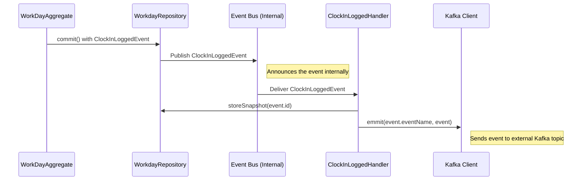

# Chapter 4: Event Handling (Events & Handlers)

Welcome back! In the previous chapters, we saw how [Commands](01_command_handling__controllers___commands__.md) tell our [Assignment Aggregate](02_assignment_aggregate_.md) or [Workday/Shift Aggregate](03_workday_shift_aggregate_.md) to do something, and how the Aggregate records what happened by creating **Events** (like `ClockInLoggedEvent` or `AssignmentAcceptedEvent`).

But what happens *after* an Event is created and saved? Saving an event is like writing down "Driver Sarah clocked in at 9:05 AM" in a logbook. That's great for history, but how do other parts of the system *know* this happened so they can react?

That's where **Event Handling** comes in.

## What's the Goal? Reacting to Things That Happened

Imagine our logbook entry: "Driver Sarah clocked in at 9:05 AM" (`ClockInLoggedEvent`). What might need to happen next?

1.  Maybe another system (like a dashboard for dispatchers) needs to be notified immediately that Sarah is now working.
2.  Maybe we want to take a quick "photocopy" (a snapshot) of Sarah's entire shift details *at that moment* to make loading her shift information faster next time.

Event Handling allows us to set up automatic reactions to specific events. It's like an internal notification system.

## Key Concepts: Events and Handlers

Let's look at the two main parts:

1.  **Events:**
    *   As we learned, Events are records of things that *have already happened* successfully. They are facts.
    *   Examples: `AssignmentAcceptedEvent`, `ClockInLoggedEvent`, `BreakStartedEvent`.
    *   They are created by Aggregates after processing a Command.

2.  **Event Handlers:**
    *   Think of an Event Handler as a specialized listener waiting for a *specific type* of event.
    *   When an event it's interested in occurs (like `ClockInLoggedEvent`), the handler wakes up and performs a predefined task.
    *   **Analogy:** It's like subscribing to a specific notification on your phone. You might set up a rule: "IF I receive a 'New Email' notification (the Event), THEN play a sound (the Handler's action)." You can have multiple subscriptions (Handlers) for the same event.
    *   Tasks Handlers perform include:
        *   Sending the event to other systems (e.g., via Kafka).
        *   Updating optimized data views (read models - not covered here).
        *   Creating snapshots of Aggregates for performance.
        *   Triggering more complex workflows (sometimes called Sagas).

## How It Works: Reacting to a Clock-In

Let's trace the journey of a `ClockInLoggedEvent` *after* it's been created and saved by the [Workday/Shift Aggregate](03_workday_shift_aggregate_.md):

1.  **Event Saved:** The `WorkDayAggregate` successfully processes `logClockIn` and saves the `ClockInLoggedEvent` using its Repository (details in [Event Sourcing & Repositories](05_event_sourcing___repositories_.md)).
2.  **Event Published:** The system (often part of the framework we use, like NestJS CQRS) takes this newly saved event and "publishes" it internally, like announcing it on a loudspeaker: "Hey everyone, a `ClockInLoggedEvent` just happened!"
3.  **Handlers Listen:** Different Event Handlers are listening to these announcements. One handler might be specifically waiting for `ClockInLoggedEvent`.
4.  **Handler Acts:** The `ClockInLoggedHandler` hears the announcement. It gets the details of the `ClockInLoggedEvent` and performs its actions:
    *   **Action 1: Store Snapshot:** It tells the `WorkdayRepository` to save a snapshot of the `WorkDayAggregate`'s current state. This helps load the Aggregate faster next time.
    *   **Action 2: Emit to Kafka:** It uses the [Kafka Client (MicroservicesClient)](06_kafka_client__microservicesclient__.md) to send the `ClockInLoggedEvent` out onto a Kafka topic. Other microservices listening to that topic can now react to the driver clocking in.

Here's a simplified view of this notification flow:



## Looking at the Code

Let's see how an Event Handler looks.

**1. The Event Handler (`src/shift/events/clock-In-logged.handler.ts`)**

This handler reacts specifically to `ClockInLoggedEvent`.

```typescript
// src/shift/events/clock-In-logged.handler.ts
import { EventsHandler, IEventHandler } from '@nestjs/cqrs';
import { ClockInLoggedEvent } from '@haulapp/microservice.core/dist/assignment';
import { MicroservicesClient } from '../../kafka-clients'; // Our Kafka client
import { WorkdayRepository } from '../repositories'; // To store snapshots

// Tell the framework this handles ClockInLoggedEvent
@EventsHandler(ClockInLoggedEvent)
export class ClockInLoggedHandler implements IEventHandler<ClockInLoggedEvent> {
  constructor(
    // Get necessary tools via dependency injection
    private readonly microservicesClient: MicroservicesClient,
    private readonly workdayRepository: WorkdayRepository,
  ) {}

  // This method runs when a ClockInLoggedEvent occurs
  async handle(event: ClockInLoggedEvent) {
    // Action 1: Store a snapshot for performance
    await this.workdayRepository.storeSnapshot(event.id);

    // Action 2: Emit the event to Kafka for others
    this.microservicesClient.emmit(event.eventName, event);
  }
}
```

*   **Explanation:**
    *   `@EventsHandler(ClockInLoggedEvent)`: This decorator tells the system, "This class is interested in `ClockInLoggedEvent`."
    *   `implements IEventHandler<ClockInLoggedEvent>`: This ensures our class has the correct `handle` method structure.
    *   `constructor(...)`: The handler gets access to the tools it needs, like the `MicroservicesClient` to talk to Kafka and the `WorkdayRepository` to save snapshots.
    *   `async handle(event: ClockInLoggedEvent)`: This is the core function. It receives the actual `event` object that occurred.
    *   `workdayRepository.storeSnapshot(event.id)`: Tells the repository to save a current copy of the aggregate associated with this event's ID (`event.id`).
    *   `microservicesClient.emmit(...)`: Sends the event object out onto a Kafka topic (using the event's name as the topic name).

**2. Registering Handlers (`src/shift/events/index.ts`)**

How does the system know *which* handlers exist? We usually list them in a central place for the module.

```typescript
// src/shift/events/index.ts
// ... imports for all handlers ...
import { ClockInLoggedHandler } from './clock-In-logged.handler';
// ... other handlers ...

// A list of all Event Handlers for the 'shift' module
export const EventHandlers = [
  // ... other handlers ...
  ClockInLoggedHandler,
  // ... other handlers ...
];
```

*   **Explanation:** This is simply a list that the application framework uses to find and register all the event handlers related to shifts. The `ClockInLoggedHandler` is included here.

**3. A More Complex Handler (Saga - Simplified View) (`src/shift/sagas/shift-lifecycle.saga.ts`)**

Sometimes, reacting to an event requires more complex logic or triggering new *Commands*. These are often called Sagas. Here's a simplified look at one reacting to `ClockOutLoggedEvent`.

```typescript
// src/shift/sagas/shift-lifecycle.saga.ts
import { ofType, Saga } from '@nestjs/cqrs';
import { Observable } from 'rxjs';
import { ClockOutLoggedEvent, /* ... other imports */ } from '@...';
import { map } from 'rxjs/operators';
import { Injectable } from '@nestjs/common';
import { MicroservicesClient } from '../../kafka-clients';
// Import commands for invoicing
import { IssueHourlyInvoiceCommand, /* ... */ } from '@...';

@Injectable()
export class ShiftLifecycleSaga {
  constructor(
    private readonly microservicesClient: MicroservicesClient,
    // ... other dependencies like repositories ...
  ) {}

  @Saga() // Marks this as a Saga method
  clockOutBeenLogged = ($events: Observable<any>): Observable<any> => {
    return $events.pipe(
      ofType(ClockOutLoggedEvent), // Only react to ClockOutLoggedEvent
      map(async (event) => {
        // ... might load related data (workday, assignment) ...
        const workDay = /* ... load workday using event.id ... */;
        const assignment = /* ... load assignment using workday ... */;

        // Decide which *new Command* to send based on payment type
        if (assignment.paymentType === 'hourly') {
          const command = new IssueHourlyInvoiceCommand(/* args */);
          this.microservicesClient.emmit(command.commandName, command);
        }
        // ... handle other payment types (flat, mileage) ...
      }),
    );
  };
}
```

*   **Explanation:**
    *   `@Saga()`: Marks this method as a more complex event handler.
    *   `ofType(ClockOutLoggedEvent)`: Filters the incoming stream of events to only react to `ClockOutLoggedEvent`.
    *   `map(async (event) => { ... })`: When a `ClockOutLoggedEvent` occurs, this logic runs.
    *   It might load extra data related to the event.
    *   Crucially, it decides based on the data (like payment type) to **emit a new Command** (e.g., `IssueHourlyInvoiceCommand`) back onto Kafka using `microservicesClient.emmit`. This triggers a *new* workflow (invoicing). Sagas coordinate processes based on events.

## Conclusion

You've now learned about **Event Handling**!

*   **Events** (`ClockInLoggedEvent`, etc.) are facts about past occurrences saved by Aggregates.
*   **Event Handlers** are listeners that subscribe to specific event types.
*   When an event is published internally, the corresponding Handlers execute their logic.
*   Handlers perform follow-up actions like:
    *   Sending events to **Kafka** for other systems ([Kafka Client (MicroservicesClient)](06_kafka_client__microservicesclient_.md)).
    *   Storing **snapshots** for Aggregate performance.
    *   Triggering **new Commands** via Sagas.

This mechanism allows our system to react dynamically to changes and integrate different parts loosely. We've mentioned saving events and snapshots quite a bit. How does that actually work?

In the next chapter, we'll dive into [Event Sourcing & Repositories](05_event_sourcing___repositories_.md) to understand how Aggregates are saved (by storing events) and loaded (by replaying events).

---

Generated by [AI Codebase Knowledge Builder](https://github.com/The-Pocket/Tutorial-Codebase-Knowledge)