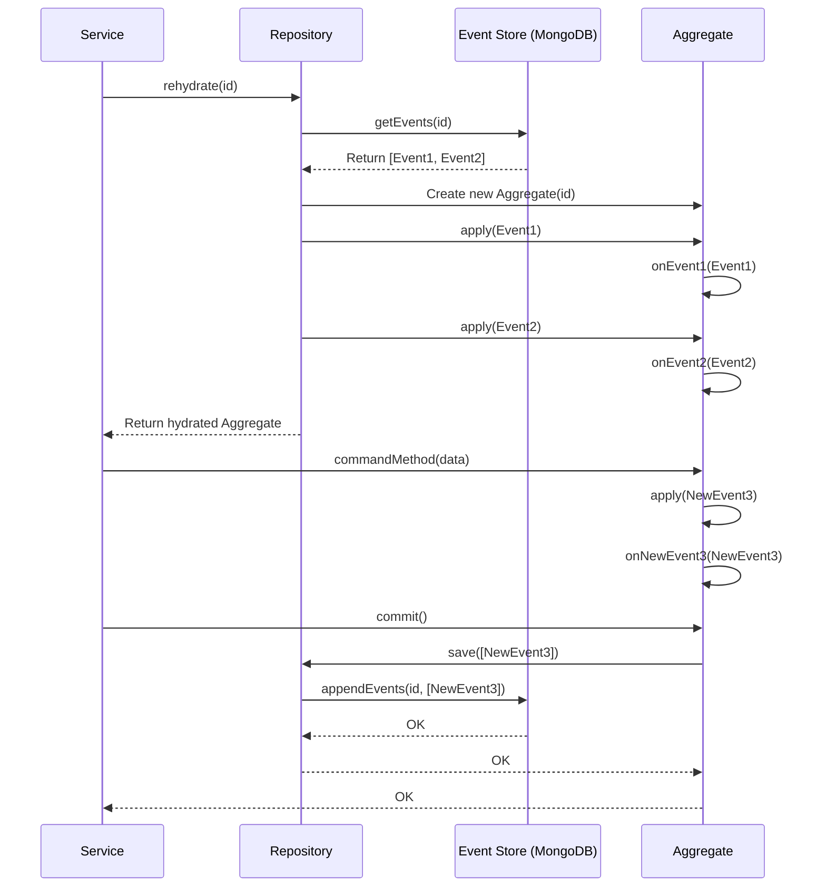

# Chapter 5: Event Sourcing & Repositories

Welcome back! In [Chapter 4: Event Handling (Events & Handlers)](04_event_handling__events___handlers__.md), we saw how the system reacts *after* an event like `ClockInLoggedEvent` is saved. But how exactly are these events saved in the first place? And when a command comes in, how does the service get the current state of an [Assignment Aggregate](02_assignment_aggregate_.md) or a [Workday/Shift Aggregate](03_workday_shift_aggregate_.md) to work with?

This chapter dives into the heart of how our application remembers things: **Event Sourcing** and the **Repositories** that manage it.

## What's the Goal? Remembering the Story, Not Just the Ending

Imagine you're tracking a delivery assignment. Lots of things can happen: it gets requested, accepted, maybe the payment details change, it gets approved, and finally completed.

How should our application store the information about this assignment?

*   **Option 1 (State-Oriented):** We could just save the *current* status. Like a record saying: `Assignment #123: Status=COMPLETED, Payment=$50`. This is simple, but we lose all the history of *how* it got completed. If there's a problem, it's hard to trace back what happened.

*   **Option 2 (Event Sourcing):** Instead, we save *every single change* that happened as a separate event. Like a detailed diary or logbook:
    1.  `AssignmentRequestedEvent (ID: 123, details...)`
    2.  `AssignmentAcceptedEvent (ID: 123, driver: Bob, time: ...)`
    3.  `AssignmentPaymentUpdatedEvent (ID: 123, amount: $50)`
    4.  `AssignmentApprovedEvent (ID: 123, approver: Alice)`
    5.  `AssignmentCompletedEvent (ID: 123, time: ...)`

This is **Event Sourcing**. We store the full sequence of events. To figure out the current status (like "COMPLETED"), we just read the whole story (replay the events) from beginning to end.

This chapter explains how our project uses Event Sourcing and special objects called **Repositories** to save and load our Aggregates.

## Key Concepts

1.  **Event Sourcing:**
    *   **What it is:** The core idea of storing the *history* of an object (like an Assignment or Workday) as a sequence of immutable (unchangeable) events, rather than just storing its final state.
    *   **Analogy:** It's like keeping a detailed diary of everything that happened in a project, instead of just a final summary report. To know the current state, you read the diary.
    *   **Benefit:** Perfect audit trail! You know exactly how an Aggregate got into its current state.

2.  **Event Store:**
    *   **What it is:** The database where all these historical events are permanently stored. In our project, we use MongoDB as the Event Store.
    *   **Analogy:** The physical diary book or the computer file where all the diary entries are saved.

3.  **Repositories (`AssignmentRepository`, `WorkdayRepository`):**
    *   **What they are:** Special manager objects that act as the gateway to the Event Store for specific Aggregates. The `AssignmentRepository` knows how to load and save `AssignmentAggregates`, while the `WorkdayRepository` does the same for `WorkDayAggregates`.
    *   **Analogy:** Think of the Repository as a helpful librarian. You ask the librarian for the "Assignment #123 diary" (loading). The librarian finds all the entries in the store and reads them to you in order, building up the story. When you have a new entry to add (saving), you give it to the librarian, who carefully adds it to the end of the diary.
    *   **Two Main Jobs:**
        *   **Loading (Rehydrating):** Fetching the event history for a specific Aggregate ID from the Event Store and replaying those events on a new, blank Aggregate object to bring it to its current state.
        *   **Saving (Committing):** Taking new, uncommitted events from an Aggregate (that were generated by processing a command) and saving them to the Event Store.

## How It Works: Loading and Saving an Aggregate

Let's revisit the flow from [Chapter 2: Assignment Aggregate](02_assignment_aggregate_.md) when an `AcceptAssignmentCommand` comes in:

**1. Loading (Rehydrating) the Aggregate:**

The `AssignmentService` needs the `AssignmentAggregate` for the specific assignment ID mentioned in the command.

```typescript
// Inside AssignmentService's handleAcceptAssignmentCommand method
async handleAcceptAssignmentCommand(command: AcceptAssignmentCommand) {
  // Ask the repository to 'rehydrate' the aggregate
  const assignment = await this.assignmentRepository.rehydrate(
    command.id // The ID of the assignment we need
  );
  // ... (rest of the method)
}
```

*   **Explanation:** The service calls `assignmentRepository.rehydrate(id)`. This tells the repository: "Go find the history for assignment `id` in the Event Store, replay it, and give me the `AssignmentAggregate` object representing its current state."

**2. Processing the Command (Inside the Aggregate):**

As we saw in Chapter 2, the service calls a method on the loaded aggregate (`assignment.accept(command)`). Inside this method, the Aggregate creates a new event (e.g., `AssignmentAcceptedEvent`) and applies it to itself using `this.apply(event)`. This `apply` method temporarily holds the new event, ready to be saved.

**3. Saving (Committing) the New Event(s):**

After the Aggregate method finishes, the service tells the Aggregate to save any new events.

```typescript
// Inside AssignmentService's handleAcceptAssignmentCommand method (continued)
  // ...
  assignment.accept(command); // Aggregate creates new event internally

  // Tell the aggregate to commit (save) the new event(s)
  assignment.commit();
}
```

*   **Explanation:** The `assignment.commit()` call signals the underlying Event Sourcing mechanism (managed by the Repository and the `StorableAggregateRoot` base class) to take any new events that were generated (like `AssignmentAcceptedEvent`) and hand them over to the `AssignmentRepository` to be permanently stored in the Event Store (MongoDB).

## Under the Hood: What Repositories Do

How do `rehydrate` and `commit` actually work?

**Rehydrating (Loading):**

1.  **Service Calls `rehydrate(id)`:** The `AssignmentService` needs Assignment #123.
2.  **Repository Asks Event Store:** The `AssignmentRepository` asks the Event Store (MongoDB): "Give me all events for aggregate ID 123, sorted by time/version."
3.  **Event Store Returns Events:** MongoDB finds and returns the list: `[AssignmentRequestedEvent, AssignmentAcceptedEvent, ...]`.
4.  **Repository Creates Blank Aggregate:** The `AssignmentRepository` creates a new, empty `AssignmentAggregate` object: `new AssignmentAggregate('123')`.
5.  **Repository Replays Events:** It loops through the events received from the store. For each event, it calls the aggregate's internal `apply(event)` method (which in turn calls the specific `on...Event` handler like `onAssignmentAcceptedEvent`). This builds up the state of the aggregate object step-by-step.
6.  **Repository Returns Aggregate:** Once all historical events are replayed, the `AssignmentAggregate` object holds the correct current state. The Repository returns this fully "rehydrated" object to the Service.

**Committing (Saving):**

1.  **Service Calls `commit()`:** The `AssignmentService` calls `assignment.commit()`.
2.  **Aggregate Provides New Events:** The `AssignmentAggregate` (which extends `StorableAggregateRoot`) has internally tracked the new events generated since it was loaded (e.g., the `AssignmentAcceptedEvent`). The `commit()` method gathers these new events.
3.  **Repository Saves to Event Store:** The `commit()` mechanism passes these new events to the `AssignmentRepository`. The Repository tells the Event Store (MongoDB): "Append these new events to the history for aggregate ID 123."
4.  **Event Store Confirms:** MongoDB saves the events. (It might also do checks, like ensuring the version number is correct to prevent conflicting updates).
5.  **(Publishing):** After successfully saving, the `StoreEventPublisher` (part of the repository's setup) usually publishes these events internally for [Event Handling (Events & Handlers)](04_event_handling__events___handlers__.md) to pick up, as we saw in Chapter 4.

**Simplified Sequence Diagram:**



**Looking at the Repository Code:**

Our repositories leverage a base library (`@haulapp/event-sourcing`) which handles most of the heavy lifting. The specific repository code is often quite simple:

```typescript
// src/assignment/repositories/assignment.repository.ts
import { Injectable } from '@nestjs/common';
import { EventStore, StoreEventPublisher } from '@haulapp/event-sourcing';
import { AssignmentAggregate } from '../models';
// ... other imports

@Injectable() // Standard NestJS decorator
export class AssignmentRepository 
  extends AbstractAggregateRepository<AssignmentAggregate> { // Inherits base logic!
  constructor(store: EventStore, publisher: StoreEventPublisher) {
    super(
      store,        // The Event Store connection (MongoDB)
      publisher,    // Used to publish events after saving
      EventAggregateEnum.FLEET_ORDER_ASSIGNMENT, // Type of Aggregate
      (id) => new AssignmentAggregate(id), // How to create a blank Aggregate
      domainsEnum.ASSIGNMENT // Domain context
    );
  }
}
```

*   **Explanation:**
    *   It inherits from `AbstractAggregateRepository`, which provides the standard `rehydrate` and `commit` logic.
    *   The `constructor` receives the `EventStore` (our connection to MongoDB) and the `StoreEventPublisher` (to announce saved events internally).
    *   It tells the base class *which* aggregate type it handles (`FLEET_ORDER_ASSIGNMENT`), *how* to create a new instance (`new AssignmentAggregate(id)`), and provides some domain context.
    *   Most of the complex logic for talking to MongoDB, replaying events, and handling versions is hidden within the `EventStore` and the `AbstractAggregateRepository` base class.

The `WorkdayRepository` (`src/shift/repositories/workday.repository.ts`) looks almost identical, just configured for the `WorkDayAggregate`.

## Conclusion

You've now unlocked the core persistence mechanism of our application!

*   We use **Event Sourcing**: storing the *sequence of events* (the story) instead of just the final state.
*   Events are stored in the **Event Store** (MongoDB).
*   **Repositories** (`AssignmentRepository`, `WorkdayRepository`) act as gatekeepers to the Event Store.
*   `repository.rehydrate(id)` **loads** an Aggregate by reading its event history and replaying it.
*   `aggregate.commit()` **saves** new events generated by the Aggregate back to the Event Store.

This approach gives us a full audit log and a robust way to manage the state of our core objects (Aggregates). The events saved here are the same ones picked up by the [Event Handling (Events & Handlers)](04_event_handling__events___handlers__.md) system and potentially sent out to other services.

Speaking of other services, how does our `assignment.cmd.api` communicate with them, often by sending these events or receiving commands over Kafka?

In the next chapter, we'll look at the component responsible for this external communication: the [Kafka Client (MicroservicesClient)](06_kafka_client__microservicesclient__.md).

---

Generated by [AI Codebase Knowledge Builder](https://github.com/The-Pocket/Tutorial-Codebase-Knowledge)