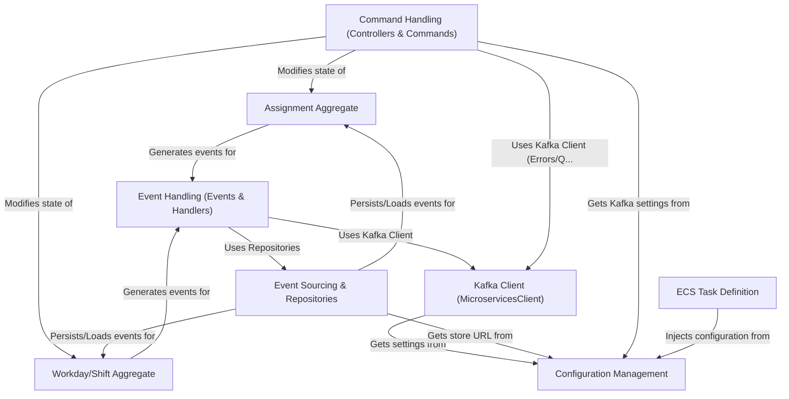

# Tutorial: assignment.cmd.api

This project acts as the **command processing** part of a larger system for managing driver **assignments** and **workdays/shifts**.
It receives instructions (*commands*) via *Kafka* (like `AcceptAssignmentCommand` or `ClockInCommand`).
It uses *Event Sourcing*, meaning it records every change as an *event* (e.g., `AssignmentAcceptedEvent`, `ClockInLoggedEvent`) instead of just saving the final state.
This allows reconstructing the history of any assignment or workday. It processes commands, updates the relevant *Assignment* or *Workday* state by adding new events, and then often publishes these events back to *Kafka* for other parts of the system.

**Source Repository:** [None](None)

## Chapters

1. [Command Handling (Controllers & Commands)
](01_command_handling__controllers___commands__.md)
2. [Assignment Aggregate
](02_assignment_aggregate_.md)
3. [Workday/Shift Aggregate
](03_workday_shift_aggregate_.md)
4. [Event Handling (Events & Handlers)
](04_event_handling__events___handlers__.md)
5. [Event Sourcing & Repositories
](05_event_sourcing___repositories_.md)
6. [Kafka Client (MicroservicesClient)
](06_kafka_client__microservicesclient__.md)
7. [Configuration Management
](07_configuration_management_.md)
8. [ECS Task Definition
](08_ecs_task_definition_.md)

---

Generated by [AI Codebase Knowledge Builder](https://github.com/The-Pocket/Tutorial-Codebase-Knowledge)