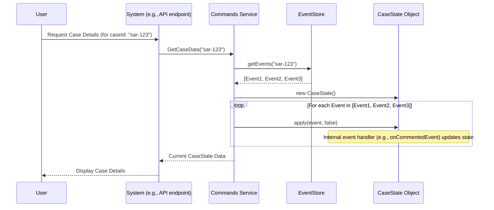

# Chapter 1: Case State Aggregate (`CaseState`)

Welcome to the `sar-service-commands` project! This tutorial will guide you through its core concepts. In this first chapter, we'll explore a fundamental building block: the **`CaseState` Aggregate**.

## What's the Big Deal with `CaseState`?

Imagine you're an investigator working on a Suspicious Activity Report (SAR). When you open a case, you need a complete, up-to-the-minute picture of everything related to it:
*   Who are the people (actors) involved?
*   What suspicious activities (observations) triggered this case?
*   Are there any other cases linked to this one?
*   What comments or notes have been made?
*   What's the latest summary (narrative)?
*   What's the current stage of the investigation (active processes)?

Trying to piece this together by looking at raw logs or database tables would be slow and complicated. This is where `CaseState` comes in!

**`CaseState` solves the problem of needing a comprehensive, live view of a single SAR case.** It acts like an intelligent, dynamically generated dossier or summary report for that specific case.

## What Exactly IS a `CaseState`?

The `CaseState` is an **in-memory object** in our application. This means it's a temporary data structure that lives in the computer's memory while the application is working with a specific case.

Think of it like this:
*   **A live dossier:** It holds all current information about a case – actors, observations, linked cases, comments, narratives, and active investigation processes.
*   **Dynamically generated:** It's not stored permanently in its complete form. Instead, it's built "on-the-fly" when needed.
*   **Based on history:** It's constructed by processing (or "replaying") the sequence of all historical [Events & Event Sourcing](04_events___event_sourcing_.md) that have ever occurred for that particular case ID. The `EventStore` (which we'll cover in the [Events & Event Sourcing](04_events___event_sourcing_.md) chapter) is like the case's official logbook.

So, if a case was created, then a comment was added, then an actor was linked, the `CaseState` is built by taking an empty "dossier" and applying these events one by one until it reflects the current situation.

Here are some key pieces of information a `CaseState` object might hold:

*   `caseId`: The unique identifier for the case.
*   `actors`: A list of all individuals or entities involved.
*   `observations`: Details about the suspicious activities.
*   `comments`: A collection of notes and discussions.
*   `narratives`: Written summaries (e.g., detection, disposition).
*   `processInstances`: Information about ongoing workflows or tasks related to the case (covered in [Process Instances & Workflows](06_process_instances___workflows___iprocessinstance____processinstances____iprocessdao___.md)).
*   `currentVersion`: Tracks the "age" or number of events applied to this case.

Let's look at a tiny snippet from its definition:
```typescript
// File: src/commands/CaseState.ts
export class CaseState {
  public currentVersion = 0; // Tracks how many events have built this state
  public actors: string[] = []; // Stores a list of actor IDs
  public comments: Array<CommentedEvent["data"]> = []; // Stores comment data
  public narratives: Map<NarrativeType, string> = new Map(); // Stores different types of narratives
  // ... many other properties
}
```
This shows how `CaseState` is designed to hold various pieces of information about a case. Each property is updated as historical events are replayed.

## Building the `CaseState`: The "Replay" Process

The magic of `CaseState` lies in how it's built. It doesn't just pop into existence with all the data. Instead, it achieves its "current state" by replaying history.

Imagine you have a case with ID `case-123`. Here's how its `CaseState` would be built:

1.  **Start Empty:** A brand new, empty `CaseState` object is created in memory.
    ```typescript
    // Conceptual: Creating an empty CaseState
    // (The actual constructor takes a 'processDAO' argument,
    //  which helps manage workflow information)
    const myCaseState = new CaseState(/* processDAO */);
    // At this point, myCaseState.actors is [], myCaseState.comments is [], etc.
    ```
2.  **Fetch History:** The system retrieves all [Events & Event Sourcing](04_events___event_sourcing_.md) associated with `case-123` from the `EventStore`. These events are ordered chronologically.
    *   Event 1: `CaseCreatedEvent` (details about when and how the case started)
    *   Event 2: `ActorAddedEvent` (an actor was linked to the case)
    *   Event 3: `CommentedEvent` (a user left a comment)
    *   ...and so on.
3.  **Apply Events One-by-One:** The `CaseState` object then processes each event in order. For each event, it updates its internal properties.
    *   After `CaseCreatedEvent`: `myCaseState` now knows its `caseId`, `creationDate`, initial `observations`, etc.
    *   After `ActorAddedEvent`: `myCaseState.actors` now includes the newly added actor.
    *   After `CommentedEvent`: `myCaseState.comments` now includes the new comment.

This "replay" ensures that the `CaseState` object accurately reflects the sum of all things that have ever happened to the case.

```typescript
// File: src/commands/CaseState.ts
// Simplified 'replay' method
public async replay(events: IEvent[], client: PgQueryable /* a database connection */): Promise<void> {
  for (const event of events) {
    // The 'apply' method processes a single event and updates the CaseState
    await this.apply(client, event, false); // 'false' means this is a historical event
  }
}
```
The `replay` method iterates through each historical event and calls `apply` for each one. The `false` argument tells `apply` that this is an old event from the logbook, not a brand new one happening right now.

## How is `CaseState` Used?

Once built, the `CaseState` object is incredibly useful:

1.  **Displaying Case Information:** When an investigator opens a case in the user interface, the system first builds the `CaseState`. The UI then reads information from this `CaseState` object to show the case details.
2.  **Validating Actions:** Before the system performs any action on a case (like adding a comment or linking another case), it first loads the `CaseState`. It then uses the information in `CaseState` to check if the action is allowed. For example, can the current user comment on this case in its current status? The `CaseState` knows! This is often handled by functions in `validations.ts`, which we'll see in [Command Validations (`validations.ts`)](03_command_validations___validations_ts___.md).
3.  **Applying New Changes:** When a valid action is performed (e.g., a user successfully adds a comment), a new [Event & Event Sourcing](04_events___event_sourcing_.md) (like `CommentedEvent`) is created. This new event is *also* applied to the current `CaseState` object in memory. This keeps the `CaseState` perfectly up-to-date with even the very latest (uncommitted) changes.

Here's a simplified look at how the [Commands Interface (ISarCommands & Commands)](02_commands_interface__isarcommands___commands__.md) (which handles user actions) uses `CaseState`:

```typescript
// Simplified from src/commands/index.ts in the 'Commands' class

// Method to get the CaseState for a specific caseId
private async getCaseState(caseId: string): Promise<CaseState> {
  const caseState = new CaseState(this.processDAO); // 1. Create an empty CaseState
  // 2. Fetch all historical events for this case from the EventStore
  const events = await this.eventStore.getEvents(caseId);
  // 3. Replay these events to build the current state
  // (client is a database connection, simplified here)
  await this.db.work(async (client) => {
    await caseState.replay(events, client);
  });
  return caseState;
}

// Example: Adding a comment
public async addComment(args: IAddCommentArguments): Promise<void> {
  // First, load the current state of the case
  const caseState = await this.getCaseState(args.caseId);

  // Next, use the caseState to check if adding a comment is allowed
  // e.g., validateCanComment(caseState, ...); (from validations.ts)

  // If validation passes, create a new 'CommentedEvent'
  const newCommentEvent = commentedEvent(/* metadata */, args.data);

  // Apply this new event to our in-memory CaseState
  // (client is a database connection, simplified here)
  await this.db.work(async (client) => {
    await caseState.apply(client, newCommentEvent, true); // 'true' means this is a new event
  });


  // Finally, save the new event(s) from CaseState to the EventStore
  await this.eventStore.save(caseState.getUncommittedEvents());
}
```
In `addComment`, you see the flow: get state, validate, apply new change to state, save new event. The `true` in `caseState.apply(..., true)` signifies that this is a new event happening now.

## Under the Hood: A Closer Look

Let's peek at how `CaseState` internally handles events.

**The `apply` and `callEventHandler` methods:**

The `apply` method is the main entry point for processing an event.
```typescript
// File: src/commands/CaseState.ts
// Simplified 'apply' method
public async apply(client: PgQueryable, event: IEvent, newEvent = true) {
  this.bumpVersion(event, newEvent); // Updates version & checks order for old events

  if (newEvent) {
    // If it's a new event, add it to a temporary list of "uncommitted" events
    this.events.push(event);
  }

  // This is the crucial part: figure out what to do based on the event type
  await this.callEventHandler(event, client);
}
```
*   `bumpVersion`: This method manages the `currentVersion` of the case. For new events, it increments the version. For old events (during replay), it ensures they are processed in the correct order.
*   `this.events.push(event)`: If `newEvent` is `true`, the event is considered "uncommitted" – it has updated the in-memory `CaseState` but hasn't been permanently saved to the `EventStore` yet. `CaseState` keeps a list of these, retrievable by `getUncommittedEvents()`.
*   `callEventHandler`: This method acts like a switchboard, directing the event to the correct specialized handler function based on its type.

The `callEventHandler` looks something like this:
```typescript
// File: src/commands/CaseState.ts
// Simplified 'callEventHandler'
private async callEventHandler(event: IEvent, client: PgQueryable): Promise<void> {
  switch (event.name) {
    case EventName.CASE_CREATED:
      await this.onCaseCreatedEvent(event as CaseCreatedEvent);
      break;
    case EventName.COMMENTED:
      await this.onCommentedEvent(event as CommentedEvent);
      break;
    case EventName.ACTOR_ADDED: // Example, not in provided snippet but conceptually exists
      await this.onActorAdded(event as ActorAddedEvent);
      break;
    // ... handlers for all other event types (e.g., NARRATIVE_UPDATED, FILE_ATTACHED)
    default:
      throw new Error(`No event handler found for event ${event.name}`);
  }
}
```

**Specific Event Handlers:**

Each `on...Event` method knows exactly how to update the `CaseState` for that specific type of event. For example:

```typescript
// File: src/commands/CaseState.ts
// Example: Handler for when a 'CommentedEvent' is processed
// eslint-disable-next-line @typescript-eslint/require-await
private async onCommentedEvent(event: CommentedEvent): Promise<void> {
  // It simply takes the comment data from the event
  // and adds it to the 'comments' list within this CaseState object.
  this.comments.push(event.data);
}
```
When an `onCommentedEvent` is processed (either during replay or when a new comment is added), this function adds the comment's data to the `this.comments` array.

Similarly, `onCaseCreatedEvent` would populate `this.caseId`, `this.createdByUserId`, `this.observations`, etc., based on the data in the `CaseCreatedEvent`.

**Visualizing the Flow:**

Here's a simplified sequence of how `CaseState` is typically loaded and used when a user requests case details:



This diagram shows the replay process. If a *new* command were to modify the case (like adding a new comment), the `Commands Service` would call `CaseState.apply(newEvent, true)`, and then the `Commands Service` would save the uncommitted event from `CaseState` back to the `EventStore`.

## Conclusion

The **`CaseState` Aggregate** is a cornerstone of the `sar-service-commands` project. It provides a complete, in-memory representation of a single SAR case by replaying its historical [Events & Event Sourcing](04_events___event_sourcing_.md). This "live dossier" is essential for displaying case information to users and for validating and applying new changes to a case. It ensures that all parts of the system operate on a consistent and up-to-date understanding of the case.

You've now learned:
*   What `CaseState` is and why it's important.
*   How it's built by replaying events.
*   How it's used to read case data and apply changes.
*   A glimpse into its internal event handling mechanism.

Now that we understand how a case's current state is represented, let's look at how we can *change* that state. In the next chapter, we'll explore the [Commands Interface (ISarCommands & Commands)](02_commands_interface__isarcommands___commands__.md), which are responsible for initiating actions and, as a result, generating new events that will eventually update a `CaseState`.

---

Generated by [AI Codebase Knowledge Builder](https://github.com/The-Pocket/Tutorial-Codebase-Knowledge)