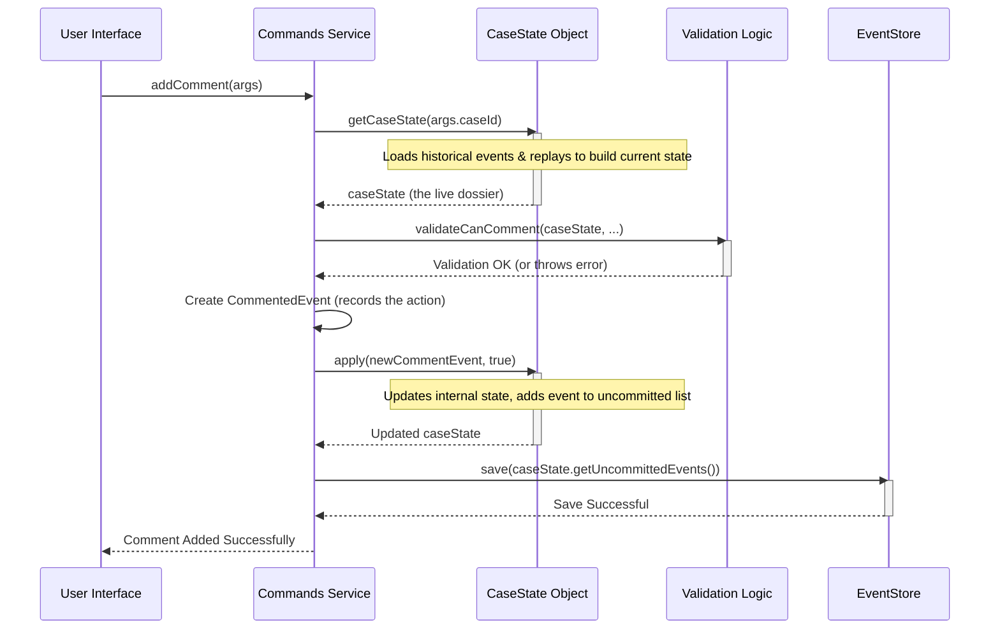

# Chapter 2: Commands Interface (`ISarCommands` & `Commands`)

In our [previous chapter](01_case_state_aggregate___casestate___.md), we learned about the `CaseState` Aggregate – the "live dossier" that gives us a complete picture of a single SAR case. That's great for *viewing* a case, but what if we want to *change* something? For example, what if an investigator wants to add a new comment, link a new actor, or create an entirely new case?

This is where the **Commands Interface** comes into play. It's the system's main control panel for making things happen.

## What's the Big Idea? The Control Panel for SAR Cases

Imagine you're using a complex piece of software, like a video editor. There's a panel with buttons and menus for all the actions you can perform: "New Project," "Add Clip," "Apply Effect," "Export Video." The Commands Interface in `sar-service-commands` serves a similar purpose for SAR cases.

It solves the problem of **how to safely and consistently initiate actions or changes within the system.**

*   **Defines Actions:** It clearly lists all the operations users can perform (e.g., `createCase`, `addComment`, `updateNarrative`).
*   **Entry Point:** It's the primary way external requests (like a user clicking a button in the UI, or an automated system call) tell our `sar-service-commands` project, "Hey, I want to do this!"

Think of it as:
*   A **restaurant menu (`ISarCommands`)**: It lists all the "dishes" (actions) you can order.
*   The **kitchen staff (`Commands` class)**: They take your order, gather ingredients (like the current [Case State Aggregate (`CaseState`)](01_case_state_aggregate___casestate___.md)), check if they can make it ([Command Validations (`validations.ts`)](03_command_validations___validations_ts___.md)), prepare the dish (create an [Event & Event Sourcing](04_events___event_sourcing_.md)), and then record that the dish was made (saving to the `EventStore`).

## The Menu: `ISarCommands` Interface

The `ISarCommands` interface is like the menu. It's a **contract** or a blueprint that specifies *what* actions are available, what information (arguments) they need, and what they promise to return. It doesn't say *how* these actions are done, just that they *can* be done.

You'll find this defined in `src/interfaces/ICommands.ts`. Here's a small taste:

```typescript
// Simplified from: src/interfaces/ICommands.ts
export interface ISarCommands {
  createCase(
    args: ICreateCaseArguments
  ): Promise<{ caseId: string | null; processInstanceId: string | null }>;

  addComment(args: IAddCommentArguments): Promise<void>;

  updateNarrative(args: IUpdateNarrativeArguments): Promise<void>;
  // ... and many other action definitions
}
```
This tells us:
*   There's an action called `createCase`. It needs `ICreateCaseArguments` (details about the new case) and will eventually give back a `caseId` and `processInstanceId`.
*   There's an `addComment` action. It needs `IAddCommentArguments` (details about the comment) and doesn't return any specific value (just `Promise<void>`).

Having an interface is great because it allows for different implementations. For example, `src/NotImplimentedSarCommands.ts` is another class that *implements* `ISarCommands`, but its methods mostly throw errors. This can be useful for testing or when some features aren't ready yet.

## The Kitchen: `Commands` Class

The `Commands` class, found in `src/commands/index.ts`, is the main "kitchen staff." It **implements** the `ISarCommands` interface, meaning it provides the actual "how-to" for each action listed on the menu.

When you want to make a change to a SAR case, you'll typically be interacting with an instance of this `Commands` class. It's responsible for:

1.  Orchestrating the entire process for a command.
2.  Loading the necessary [Case State Aggregate (`CaseState`)](01_case_state_aggregate___casestate___.md).
3.  Performing [Command Validations (`validations.ts`)](03_command_validations___validations_ts___.md) to ensure the action is allowed.
4.  Creating new [Events & Event Sourcing](04_events___event_sourcing_.md) to represent the change.
5.  Applying these events to the in-memory `CaseState`.
6.  Interacting with other components like the `EventStore` to save these events.

Let's see this in action with our favorite example: adding a comment.

## Use Case: Adding a Comment "This looks suspicious."

Imagine an investigator is looking at a SAR case in the user interface (UI) and types "This looks suspicious." into a comment box, then clicks "Add Comment."

Here's a simplified journey of that request through the `Commands` class:

1.  **UI Calls `Commands.addComment()`:**
    The UI, upon the button click, would call the `addComment` method on an instance of the `Commands` class. It would pass along arguments like the `caseId`, the comment text, who the `currentUser` is, and their `ipAddress`.

    ```typescript
    // Conceptual call from UI or another service
    // const commands = new Commands(/* dependencies */);
    // await commands.addComment({
    //   caseId: "sar-123",
    //   currentUser: { id: "user-jane", /* ...other user details */ },
    //   ipAddress: "192.168.1.100",
    //   data: {
    //     comment: "This looks suspicious.",
    //     reference: "PROCESS_INSTANCE", // Commenting on the main case review
    //     referenceId: "proc-abc",       // ID of the case review process
    //     referenceInternalId: "proc-abc"
    //   }
    // });
    ```
    The `IAddCommentArguments` interface (defined in `src/interfaces/ICommands.ts`) structures these details.

2.  **Inside `Commands.addComment()` - Getting the Case Picture:**
    The `addComment` method first needs to understand the current situation of `case-123`. It does this by fetching its [Case State Aggregate (`CaseState`)](01_case_state_aggregate___casestate___.md).

    ```typescript
    // Simplified from: src/commands/index.ts (inside addComment)
    public async addComment(args: IAddCommentArguments): Promise<void> {
      const caseState = await this.getCaseState(args.caseId);
      // ... more steps to follow
    }
    ```
    We saw `getCaseState` in Chapter 1 – it builds the `CaseState` by replaying events from the `EventStore`.

3.  **Is this Action Allowed? (Validations):**
    Next, the system checks if Jane is actually allowed to comment on this case right now. This involves [Command Validations (`validations.ts`)](03_command_validations___validations_ts___.md).

    ```typescript
    // Simplified from: src/commands/index.ts (inside addComment)
    // (Assumes caseState is already fetched)
    validateCanComment(caseState, args.data.reference, args.data.referenceId);
    // Other validations, e.g., validateUserIsNotReferenced(...)
    // If validation fails, an error is thrown, and the process stops.
    ```
    We'll dive deep into validations in the next chapter!

4.  **Recording What Happened (Creating an Event):**
    If all validations pass, the system creates a new event to formally record that a comment was added. This is a crucial step in [Events & Event Sourcing](04_events___event_sourcing_.md).

    ```typescript
    // Simplified from: src/commands/index.ts (inside addComment)
    // (Metadata like userId, ipAddress, etc., is prepared using a helper)
    const meta = this.unpack(args.caseId); // Creates event metadata
    const newCommentEvent = commentedEvent(meta, args.data);
    ```
    The `commentedEvent` is a factory function that creates a `CommentedEvent` object, filling it with the details of the comment and who made it.

5.  **Updating the Live Dossier (Applying Event to `CaseState`):**
    This new `CommentedEvent` is immediately applied to the in-memory `caseState` object. This ensures our live dossier reflects the very latest change, even before it's saved permanently.

    ```typescript
    // Simplified from: src/commands/index.ts (inside addComment)
    // This usually happens inside a 'this.db.work(async (client) => { ... })' block
    // to ensure it's part of a database transaction.
    // await this.db.work(async (client) => {
      await caseState.apply(client, newCommentEvent, true); // 'true' means it's a new event
    // });
    ```
    The `true` in `caseState.apply(...)` tells the `CaseState` this is a brand-new event, not one being replayed from history.

6.  **Making it Permanent (Saving Event to `EventStore`):**
    Finally, the new event (or events, if an action causes multiple) that `CaseState` has collected (via `caseState.getUncommittedEvents()`) is saved to the `EventStore`. This is the official, permanent record.

    ```typescript
    // Simplified from: src/commands/index.ts (inside addComment)
    await this.eventStore.save(caseState.getUncommittedEvents());
    // Now the comment is permanently recorded!
    ```

And that's it! Jane's comment is now part of the case history.

## Visualizing the `addComment` Flow

Here’s a diagram showing the interaction between the main components when `addComment` is called:



## A Peek Inside the `Commands` Class Structure

The `Commands` class in `src/commands/index.ts` is the heart of command processing.

*   **Constructor:** When a `Commands` object is created, it's given a set of "tools" it needs to do its job. These are dependencies like the `eventStore`, various DAOs (Data Access Objects like `caseDAO`, `processDAO` for talking to the database), configuration, and user information.

    ```typescript
    // Simplified from src/commands/index.ts
    export class Commands implements ISarCommands {
      private readonly eventStore: IEventStore;
      private readonly processDAO: IProcessDAO;
      // ... other dependencies like caseDAO, user, ipAddress, etc.

      public constructor({
        eventStore,
        processDAO,
        // ... other dependencies passed in
      }: { /* constructor arguments type */ }) {
        this.eventStore = eventStore;
        this.processDAO = processDAO;
        // ... assign other dependencies to this.propertyName
      }

      // ... command methods like addComment, createCase follow ...
    }
    ```

*   **Command Methods:** Each public method like `createCase`, `addComment`, `updateNarrative`, `performAction`, etc., corresponds to an operation defined in the `ISarCommands` interface. These methods contain the logic described in our "Adding a Comment" example. Some complex commands like `createCase` (in `src/commands/createCase/index.ts`) or `performAction` (in `src/commands/performAction/index.ts`) have their core logic in separate files for better organization, but the `Commands` class method is still the entry point.

*   **Helper `unpack(caseId)`:** This is a small private utility method to create the standard metadata (like `aggregateId`, `causationId`, `userId`, `ipAddress`) that goes into every event.

    ```typescript
    // Simplified from src/commands/index.ts
    private unpack(caseId: string) { // A helper for event metadata
      return {
        aggregateId: caseId,        // The ID of the case being changed
        causationId: uuid(),        // A unique ID for this specific operation
        ipAddress: this.ipAddress,  // User's IP address
        userId: this.user.id,       // ID of the user performing the action
      };
    }
    ```

*   **Helper `processCommand(...)`:** You might notice a pattern for many commands: get case state, do something, save events. The `processCommand` private method encapsulates this common workflow, making the individual command methods cleaner.

    ```typescript
    // Simplified from src/commands/index.ts
    private async processCommand(
      caseId: string,
      // 'callback' is the specific logic for THIS command
      callback: (client: PgQueryable, caseState: CaseState) => Promise<void>
    ): Promise<void> {
      await this.db.work(async (client) => { // Ensures database transaction
        const caseState = await this.getCaseState(caseId); // 1. Get current state
        await callback(client, caseState);                // 2. Execute command's unique logic
        await this.eventStore.save(caseState.getUncommittedEvents()); // 3. Save resulting events
      });
    }
    ```
    For example, `updateFilingInformation` uses this helper:
    ```typescript
    // Simplified from: src/commands/index.ts
    public async updateFilingInformation(
      args: IUpdateFilingInformationArguments
    ): Promise<void> {
      // The 'updateFilingInformation' function (from another file)
      // contains the specific logic for this command.
      await this.processCommand(args.caseId, async (client, caseState) => {
        await updateFilingInformation(client, caseState, args);
      });
    }
    ```

## Conclusion

You've now seen how the **Commands Interface (`ISarCommands`)** acts as the "menu" of available operations, and how the **`Commands` class** is the "kitchen staff" that brings these operations to life. It's the central point for initiating any change to a SAR case.

The `Commands` class meticulously:
1.  Understands the request.
2.  Gets the current [Case State Aggregate (`CaseState`)](01_case_state_aggregate___casestate___.md).
3.  Validates the action.
4.  Creates one or more [Events & Event Sourcing](04_events___event_sourcing_.md) to describe the change.
5.  Updates the in-memory `CaseState`.
6.  Persists these events to the `EventStore`.

This structured approach ensures that all changes are handled consistently and safely.

We briefly mentioned that the `Commands` class performs validations. What exactly does that involve? Let's find out in our next chapter: [Command Validations (`validations.ts`)](03_command_validations___validations_ts___.md).

---

Generated by [AI Codebase Knowledge Builder](https://github.com/The-Pocket/Tutorial-Codebase-Knowledge)