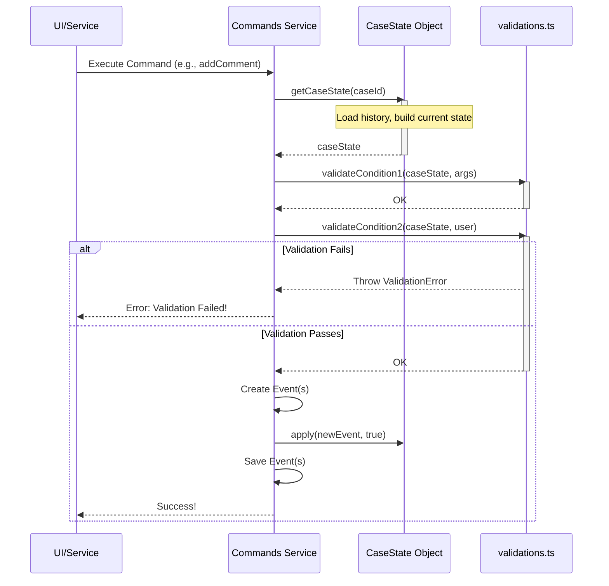

# Chapter 3: Command Validations (`validations.ts`)

In the [previous chapter](02_commands_interface__isarcommands___commands__.md), we saw how the `Commands` class acts like the kitchen staff, receiving orders (commands like `addComment`) and orchestrating the steps to fulfill them. But before the kitchen starts cooking, someone needs to check if the order is valid, right? Can the requested dish actually be made? Does the customer have permission to order it?

That's exactly what **Command Validations** are for!

## What's the Problem? Stopping Bad Actions Before They Happen

Imagine trying to add a comment to a case that doesn't even exist yet. Or trying to link an actor who isn't in our system. Or maybe a junior investigator tries to approve a SAR filing when they don't have the necessary permissions for that specific country. These actions shouldn't be allowed! If we just let them happen, we could end up with corrupted data, security issues, or broken processes.

**Command Validations solve the problem of ensuring that an action (a command) is safe, allowed, and makes sense *before* we actually try to execute it.**

Think of them like:
*   **Security Checkpoints:** Do you have the right badge (permissions) to enter this area (perform this action)?
*   **Quality Control Stations:** Does this input (command arguments) meet the required standards? Are all the necessary parts (like related actors or files) actually present?
*   **Rule Books:** Does the current situation (the [Case State Aggregate (`CaseState`)](01_case_state_aggregate___casestate___.md)) allow this action according to our business rules (workflow state)?

## What IS `validations.ts`?

The file `src/commands/validations.ts` contains a collection of **reusable helper functions**. Each function is designed to check one specific condition or rule (a precondition).

Here are the kinds of things these functions check:

*   **Does the data exist?** (`validateCaseExists`, `validateActorExists`, `validateFilesExists`) - Makes sure we're not trying to work with things that aren't there.
*   **Does the user have permission?** (`validateUserCanPerformSarAction`) - Checks if the user's role and specific SAR entitlements (based on region/country) allow them to do this.
*   **Is the case in the right state?** (`validateCanEdit`, `validateCanComment`, `validateIssuesCanBeEdited`) - Checks the current [Case State Aggregate (`CaseState`)](01_case_state_aggregate___casestate___.md) to see if the workflow allows the action at this moment.
*   **Is the input data sensible?** (`validateUrl`, `validateIssueType`) - Performs basic checks on the arguments provided with the command.

## How are Validations Used? The "Guard Check" Step

Remember the `addComment` example from [Chapter 2](02_commands_interface__isarcommands___commands__.md)? Validations happen right after we load the current [Case State Aggregate (`CaseState`)](01_case_state_aggregate___casestate___.md) and *before* we create any new [Events & Event Sourcing](04_events___event_sourcing_.md).

Let's revisit that flow, highlighting the validation step:

```typescript
// Simplified from: src/commands/index.ts (inside addComment)

public async addComment(args: IAddCommentArguments): Promise<void> {
  // 1. Get the current picture of the case
  const caseState = await this.getCaseState(args.caseId);

  // ===> 2. Perform Validation Checks! <===
  validateCanComment(caseState, args.data.reference, args.data.referenceId);
  // Maybe check if the user is allowed to comment on this case type
  // validateUserPermission(...);
  // Maybe check if the user being commented on exists
  // await validateUserIsNotReferenced(caseState, this.user, this.actorApi);
  // If any validation fails, it throws an error and stops here!

  // 3. If all checks pass, create the event
  const meta = this.unpack(args.caseId);
  const newCommentEvent = commentedEvent(meta, args.data);

  // 4. Apply the event to the in-memory CaseState
  // await caseState.apply(client, newCommentEvent, true); // Simplified

  // 5. Save the event permanently
  // await this.eventStore.save(caseState.getUncommittedEvents());
}
```
See that step 2? The `Commands` class calls specific functions from `validations.ts` (like `validateCanComment` and `validateUserIsNotReferenced`). Each function checks its specific rule.

**What happens if a validation fails?**

It throws a special `ValidationError`. This immediately stops the command's execution. No event is created, nothing is saved, and an error message is usually sent back to the user interface explaining what went wrong (e.g., "Commenting is forbidden by current workflow step").

## A Peek Inside `validations.ts`

Let's look at some simple validation functions to see how they work.

**The Basic Building Block: `validate`**

Many validation functions use this tiny helper:

```typescript
// File: src/commands/validations.ts
export const validate = (condition: boolean, message: string): void => {
  if (!condition) { // If the condition is false...
    throw new ValidationError(message); // ...stop everything and report the error!
  }
  // If the condition is true, do nothing and let the command continue.
};
```
This function takes a `condition` (something that should be true) and an error `message`. If the condition isn't met, it throws the error.

**Checking Case State: `validateCanEdit`**

This checks if the `CaseState` currently allows editing:

```typescript
// File: src/commands/validations.ts
export const validateCanEdit = (caseState: CaseState) => {
  // CaseState has a property 'canEdit' that is true/false
  // based on the current workflow step.
  if (!caseState.canEdit) {
    throw new ValidationError("Case state does not allow editing");
  }
};
```
It directly checks a property on the [Case State Aggregate (`CaseState`)](01_case_state_aggregate___casestate___.md) object.

**Checking Existence: `validateActorExistsOnCase`**

This checks if a specific actor is already part of the case:

```typescript
// File: src/commands/validations.ts
export const validateActorExistsOnCase = (
  caseState: CaseState,
  actorInternalId: string
) => {
  // CaseState has a helper method 'hasActor'
  if (!caseState.hasActor(actorInternalId)) {
    throw new ValidationError(
      `No actor found on the case with id: "${actorInternalId}"`
    );
  }
};
```
It uses a method provided by the `CaseState` itself to see if the actor is listed in the case's current state.

**Checking Permissions: `validateUserCanPerformSarAction`**

Some validations are more complex, like checking user permissions for specific SAR actions based on their entitlements (which might depend on region and country):

```typescript
// File: src/commands/validations.ts
// Simplified concept
export const validateUserCanPerformSarAction = (
  action: UserSarActions,       // e.g., 'CREATE_EDIT_SAR_RECORD'
  roleType: UserSarRoleType,    // e.g., 'READ_WRITE'
  sarRegionCountry: ISarRegionCountrySelected, // { sarRegion: 'EMEA', sarCountry: 'UK' }
  sarEntitlements: ISarUserEntitlements[] // User's specific permissions list
): void => {
  // The 'hasSarAction' function (also in validations.ts) does the complex check:
  // Does the user's entitlement list grant this 'action' for this 'roleType'
  // in this specific 'sarRegion' and 'sarCountry'?
  if (!hasSarAction(action, roleType, sarRegionCountry, sarEntitlements)) {
    throw new ValidationError(
      `User can't perform action ${action} on SAR region/country.` // Simplified message
    );
  }
};
```
This function takes the required action, the user's role, the specific SAR region/country involved, and the user's list of granted permissions (`sarEntitlements`). It uses another helper (`hasSarAction`) to determine if the user has the necessary rights. This ensures fine-grained control over who can do what, where.

**Reusability is Key!**

Notice how these functions are small and focused. A single command (like `createCase`) might call *multiple* validation functions one after another to check various preconditions before proceeding. And the same validation function (like `validateActorExistsOnCase`) might be used by several different commands (`addComment`, `createIssue`, `updateIssue`).

## Visualizing the Validation Flow

Here's a diagram showing how validations fit into the command process:


The diagram shows that the `Commands Service` first gets the `CaseState`. Then, it calls one or more validation functions from `validations.ts`. If *any* validation throws an error, the process stops. Only if *all* validations pass does the command proceed to create and save events.

## Conclusion

Command validations, primarily housed in `validations.ts`, are the essential **guards** and **checkpoints** for our system. They ensure that commands are only executed when:

*   The necessary data exists.
*   The user has the required permissions (including specific SAR entitlements).
*   The case is in an appropriate state according to the workflow.
*   The input data makes sense.

By running these checks *before* making changes, we maintain data integrity, enforce business rules, and prevent errors. They act like bouncers at a club, checking IDs and dress codes before letting anyone in.

Now that we understand how we represent the state ([Case State Aggregate (`CaseState`)](01_case_state_aggregate___casestate___.md)), how we initiate changes ([Commands Interface (ISarCommands & Commands)](02_commands_interface__isarcommands___commands__.md)), and how we validate those changes (Command Validations), what happens *after* a validated command is executed? This leads us to the core concept of how changes are recorded: [Events & Event Sourcing](04_events___event_sourcing_.md).

---

Generated by [AI Codebase Knowledge Builder](https://github.com/The-Pocket/Tutorial-Codebase-Knowledge)