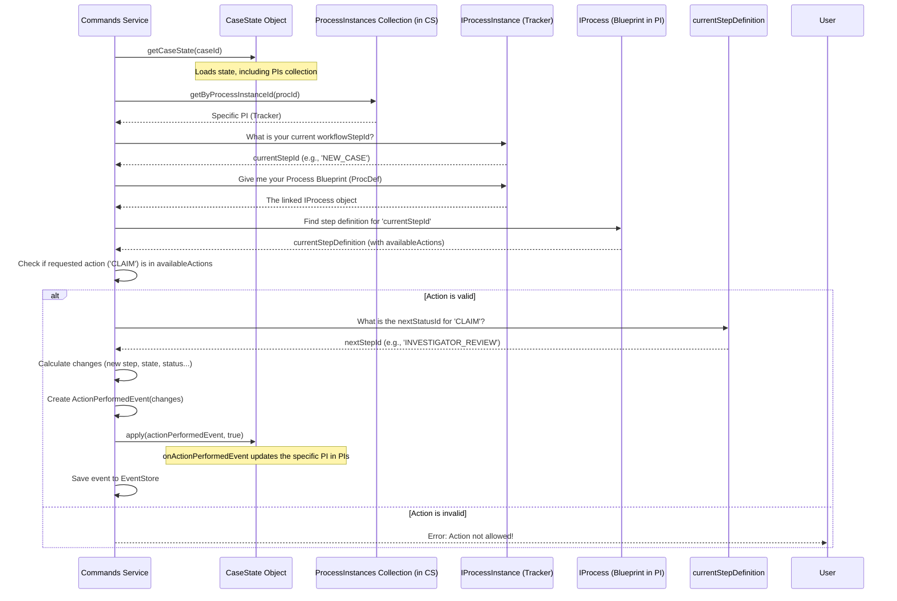

# Chapter 6: Process Instances & Workflows (`IProcessInstance`, `ProcessInstances`, `IProcessDAO`)

In the [previous chapter](05_workflow_actions___performaction____actionperformedevent___.md), we saw how the `performAction` command and the `ActionPerformedEvent` manage the *act* of moving a case forward in its lifecycle, like claiming it or submitting it for review. But what defines *which* actions are allowed at any given time? And what determines the *next* step after an action is performed? Where is the map or blueprint for the case's journey?

This chapter explores how the system defines and tracks these investigation pathways using **Processes** and **Process Instances**.

## What's the Problem? Defining the Road Map

Imagine you have a SAR case. It starts as 'New', needs to be 'Reviewed', maybe goes through 'Quality Assurance (QA)', and finally ends up 'Closed' or 'Filed'.
*   How does the system know that when a case is 'New', the only valid action might be 'Claim'?
*   How does it know that after 'Claim', the case should move to a 'Review' step and be assigned to the user who claimed it?
*   How does it track *which* specific step a particular case is currently in?

We need a way to define these rules – the different stages, the available actions at each stage, and the resulting transitions. We also need a way to track where each individual case is on this defined path.

**Processes and Process Instances solve the problem of defining the standard operating procedures (workflows) for case investigations and tracking the progress of each specific case against that procedure.**

Think of it like this:
*   **The Factory Blueprint (`Process`):** This is the master plan for how a product (a SAR case) should move through the assembly line. It defines each station (workflow step), what tools/actions are available at each station, and where the product goes next.
*   **The Assembly Line Tracker (`ProcessInstance`):** For *each specific product* currently being built, there's a tracker attached. This tracker knows which blueprint the product is following and which station it's currently at. It also notes who's working on it right now.

## Key Concepts: Blueprints and Trackers

Let's break down the main components:

1.  **The Process Definition (The Blueprint):**
    *   This isn't a single class in our command-side code but rather the *definition* or *data* describing a workflow. It's like the factory blueprint document.
    *   It defines:
        *   **Workflow Steps:** The different stages a case can be in (e.g., `NEW_CASE`, `INVESTIGATOR_REVIEW`, `QA_REVIEW`, `CLOSED`). Each step has properties like its `id`, `name`, `state` (e.g., 'OPEN', 'CLOSED'), `status` (e.g., 'PENDING_ASSIGNMENT', 'UNDER_REVIEW'), and rules like `canEdit` or `canComment`.
        *   **Available Actions:** For each step, a list of actions that can be performed (e.g., in `NEW_CASE`, the action might be `CLAIM`).
        *   **Transitions:** For each action, what the *next* `workflowStepId` will be, and potentially what the new `state`, `status`, or assignment rule is.
    *   **`IProcessDAO` (Process Data Access Object):** How does the system get these blueprints? The `IProcessDAO` interface defines how we fetch these process definitions, usually from a database or configuration store. The `CaseState` uses an implementation of `IProcessDAO` to load the correct blueprint when needed.

    ```typescript
    // Simplified interface for fetching Process Blueprints
    // File: src/interfaces/IProcessDAO.ts
    export interface IProcessDAO {
      // Gets the definition for a specific process ID
      getProcessById(client: PgQueryable, id: string): Promise<IProcess>;
      // Gets the latest definition for a case type, process type, and observation type
      getLatestVersionOf(
        client: PgQueryable,
        caseType: CaseType, // e.g., SAR
        processType: ProcessType, // e.g., CASE_REVIEW
        observationType: string // e.g., 'suspicious_login'
      ): Promise<IProcess>; // IProcess contains the workflow steps, actions etc.
    }
    ```
    This DAO is responsible for retrieving the structure of the assembly line.

2.  **The Process Instance (`IProcessInstance`) (The Tracker):**
    *   This represents a *live, running instance* of a specific `Process` blueprint attached to a single SAR case. It's the tracker following one product on the assembly line.
    *   Each `CaseState` holds one or more `ProcessInstance` objects. For example, a case might have a main `CASE_REVIEW` process instance and later a separate `QA_REVIEW` process instance.
    *   It tracks the *current* position within the workflow for that specific case.
    *   Key properties defined by the `IProcessInstance` interface include:
        *   `id`: Unique ID for this specific tracker instance (e.g., `proc-abc`).
        *   `process`: A reference to the actual `Process` blueprint it's following.
        *   `workflowStepId`: The ID of the *current* step (station) the case is in (e.g., `INVESTIGATOR_REVIEW`).
        *   `state`: The current state derived from the step (e.g., `OPEN`).
        *   `status`: The current status derived from the step (e.g., `UNDER_REVIEW`).
        *   `assignedToUserId`: Who is currently responsible for this process instance.
        *   `type`: What kind of process this is (e.g., `ProcessType.CASE_REVIEW`).

    ```typescript
    // Simplified interface for a Process Instance (Tracker)
    // File: src/interfaces/IProcessInstance.ts
    export interface IProcessInstance {
      id: string; // Unique ID for this tracker instance
      process: IProcess; // The blueprint being followed
      workflowStepId: string; // Current station ID
      state: string; // Current state (e.g., 'OPEN')
      status: string; // Current status (e.g., 'UNDER_REVIEW')
      assignedToUserId?: string; // Who is assigned?
      type: ProcessInstanceType; // e.g., CASE_REVIEW, QA_REVIEW
      issues: IIssue[]; // Issues related to this process
    }
    ```
    This interface defines what information our tracker holds.

3.  **`ProcessInstances` Collection (The Dossier Section):**
    *   Inside the [Case State Aggregate (`CaseState`)](01_case_state_aggregate___casestate___.md), the `processInstances` property holds a collection of all active trackers (`IProcessInstance` objects) for that case.
    *   The `ProcessInstances` class (from `src/commands/ProcessInstances.ts`) is a specialized helper class (extending Array) that provides convenient methods for accessing these trackers within the `CaseState`.

    ```typescript
    // Simplified helper class to manage multiple Process Instances
    // File: src/commands/ProcessInstances.ts
    export class ProcessInstances extends Array<IProcessInstance> {
      // Adds a new tracker to the collection
      public add(processInstance: IProcessInstance) { /* ... */ }

      // Finds a tracker by its unique ID
      public getByProcessInstanceId(id: string): IProcessInstance { /* ... */ }

      // Finds a tracker by its type (e.g., find the QA Review instance)
      public getByType(type: ProcessType): IProcessInstance { /* ... */ }

      // Gets the current step definition for a specific tracker
      public getStep(processInstanceId: string): IWorkflowStep { /* ... */ }
    }
    ```
    This helps `CaseState` manage its list of active workflow trackers.

## How It All Fits Together: From Creation to Action

Let's see how these concepts work together:

1.  **Case Creation:**
    *   When a new case is created ([`createCase` command](02_commands_interface__isarcommands___commands__.md)), the system uses the `IProcessDAO` to fetch the appropriate `Process` blueprint (e.g., the standard `CASE_REVIEW` process for a SAR case).
    *   It then creates a `ProcessInstanceCreatedEvent`. This event contains the details needed to create the *initial* `ProcessInstance` tracker, including its unique `id`, the `processId` of the blueprint, the starting `workflowStepId`, `state`, `status`, and `type` (`CASE_REVIEW`).
    *   When the [Case State Aggregate (`CaseState`)](01_case_state_aggregate___casestate___.md) replays this event (using its `onProcessInstanceCreatedEvent` handler), it creates the `IProcessInstance` object (using the blueprint fetched via `IProcessDAO`) and adds it to its internal `ProcessInstances` collection.

    ```typescript
    // Simplified CaseState handler for the creation event
    // File: src/commands/CaseState.ts
    private async onProcessInstanceCreatedEvent(
      event: ProcessInstanceCreatedEvent,
      client: PgQueryable
    ): Promise<void> {
      const { processId, processInstanceId, workflowStepId, /*...*/ } = event.data;
      // 1. Fetch the Process blueprint using the DAO
      const processBlueprint = await this.processDAO.getProcessById(client, processId);
      // 2. Add the new tracker to the collection
      this.processInstances.add({
        id: processInstanceId,
        process: processBlueprint, // Link to the blueprint
        workflowStepId: workflowStepId, // Set initial step
        // ... other properties like state, status, type ...
        issues: [],
      });
    }
    ```

2.  **Performing an Action:**
    *   When the [`performAction` command](05_workflow_actions___performaction____actionperformedevent___.md) is called (e.g., with `action: 'CLAIM'`), it first loads the `CaseState`.
    *   It uses the `processInstanceId` from the command arguments to find the correct `IProcessInstance` tracker within `CaseState.processInstances` (using `getByProcessInstanceId`).
    *   It looks at the tracker's *current* `workflowStepId`.
    *   It then consults the linked `process` blueprint (stored within the `IProcessInstance`) to find the definition of the current step.
    *   It checks if the requested `action` ('CLAIM') is listed in the `availableActions` for that current step definition.
    *   If the action is valid, it looks up the `nextStatusId` (the ID of the next workflow step) defined for that action in the blueprint.
    *   It calculates the changes (new `workflowStepId`, `state`, `status`, `assignedToUserId`).
    *   It creates the `ActionPerformedEvent` containing these changes.

3.  **Updating the Tracker:**
    *   When the `CaseState` replays the `ActionPerformedEvent` (using its `onActionPerformedEvent` handler), it finds the relevant `IProcessInstance` tracker in its `ProcessInstances` collection.
    *   It updates the tracker's properties (`workflowStepId`, `state`, `status`, `assignedToUserId`) based on the data in the event.

    ```typescript
    // Simplified CaseState handler for the action event
    // File: src/commands/CaseState.ts
    private async onActionPerformedEvent(event: ActionPerformedEvent): Promise<void> {
      const { processInstanceId, workflowStepId, state, status, assignedToUserId } = event.data;
      // 1. Find the specific tracker being updated
      const pi = this.processInstances.getByProcessInstanceId(processInstanceId);
      // 2. Update the tracker's properties if they changed
      if (workflowStepId) {
        pi.workflowStepId = workflowStepId;
        // Update state/status based on the *new* step definition
        const newStepDef = pi.process.workflow.find(s => s.id === workflowStepId);
        if (newStepDef) {
          pi.state = newStepDef.state;
          pi.status = newStepDef.status;
        }
      }
      // Update assignment based on action type (CLAIM/ASSIGN)
      if (event.data?.action === "CLAIM") pi.assignedToUserId = event.userId;
      if (event.data?.action === "ASSIGN") pi.assignedToUserId = event.data.assignedToUserId;
    }
    ```

4.  **Checking Permissions/State:**
    *   Other parts of the system (like [Command Validations (`validations.ts`)](03_command_validations___validations_ts___.md) or the UI) can query the `CaseState`'s `ProcessInstances`.
    *   For example, `validateCanComment` might call `CaseState.processInstances.getStep(processInstanceId)` to get the current step definition and check its `canComment` property.

    ```typescript
    // Example check within CaseState using ProcessInstances
    // File: src/commands/CaseState.ts
    public get canEdit(): boolean {
      // Find the main review process tracker
      const processInstance = this.processInstances.getByType(ProcessType.CASE_REVIEW);
      // Get the definition of its current step and check the 'canEdit' flag
      return this.getStep(processInstance.id).canEdit;
    }
    ```

## Visualizing the `performAction` Flow

Here’s how `performAction` uses the Process Instance and its linked Process definition:


This shows how the `performAction` command uses the current `ProcessInstance` (tracker) to find its place in the `Process` (blueprint) and determine the next steps based on the action requested.

## Conclusion

You've now learned how the investigation workflow is managed:

*   **`Process` Definitions (Blueprints):** Define the steps, allowed actions, and transitions for a type of case investigation. Fetched using `IProcessDAO`.
*   **`IProcessInstance` (Trackers):** Represent the live state of a *specific* case following a *specific* `Process` blueprint. They track the current `workflowStepId`, `state`, `status`, and `assignedToUserId`.
*   **`ProcessInstances` Collection:** Held within `CaseState`, it manages all the active `IProcessInstance` trackers for that case.
*   **Events Drive Updates:** `ProcessInstanceCreatedEvent` starts a tracker, and `ActionPerformedEvent` updates its position based on the rules in the `Process` blueprint.

This structure ensures that cases follow a defined path, rules are enforced consistently, and the current progress of each case is always known.

With the core concepts of state, commands, validation, events, and workflows covered, we can now look at more specific data managed within a case. In the next chapter, we'll examine how information related to the actual SAR filing is handled: [SAR Filing Information (`SarFilingInformation`, `updateFilingInformation`)](07_sar_filing_information___sarfilinginformation____updatefilinginformation___.md).

---

Generated by [AI Codebase Knowledge Builder](https://github.com/The-Pocket/Tutorial-Codebase-Knowledge)