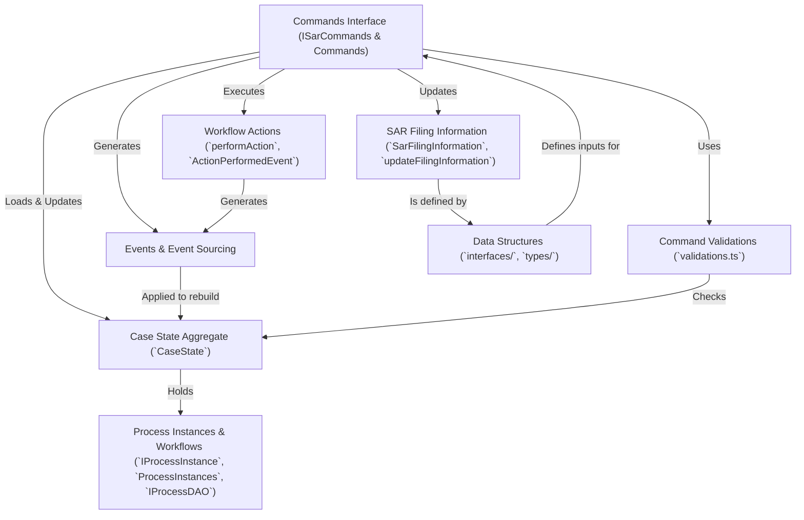

# Tutorial: sar-service-commands

This project manages the lifecycle of **Suspicious Activity Report (SAR)** cases.
Users interact through *Commands* (like creating a case or updating information) which trigger *Events*.
These events are stored and used to rebuild the current *Case State* whenever needed, including workflow status and SAR filing details.
It uses an *event sourcing* pattern to maintain a reliable history of all changes.

**Source Repository:** [None](None)

## Chapters

1. [Case State Aggregate (`CaseState`)
](01_case_state_aggregate___casestate___.md)
2. [Commands Interface (ISarCommands & Commands)
](02_commands_interface__isarcommands___commands__.md)
3. [Command Validations (`validations.ts`)
](03_command_validations___validations_ts___.md)
4. [Events & Event Sourcing
](04_events___event_sourcing_.md)
5. [Workflow Actions (`performAction`, `ActionPerformedEvent`)
](05_workflow_actions___performaction____actionperformedevent___.md)
6. [Process Instances & Workflows (`IProcessInstance`, `ProcessInstances`, `IProcessDAO`)
](06_process_instances___workflows___iprocessinstance____processinstances____iprocessdao___.md)
7. [SAR Filing Information (`SarFilingInformation`, `updateFilingInformation`)
](07_sar_filing_information___sarfilinginformation____updatefilinginformation___.md)
8. [Data Structures (`interfaces/`, `types/`)
](08_data_structures___interfaces_____types____.md)

---

Generated by [AI Codebase Knowledge Builder](https://github.com/The-Pocket/Tutorial-Codebase-Knowledge)