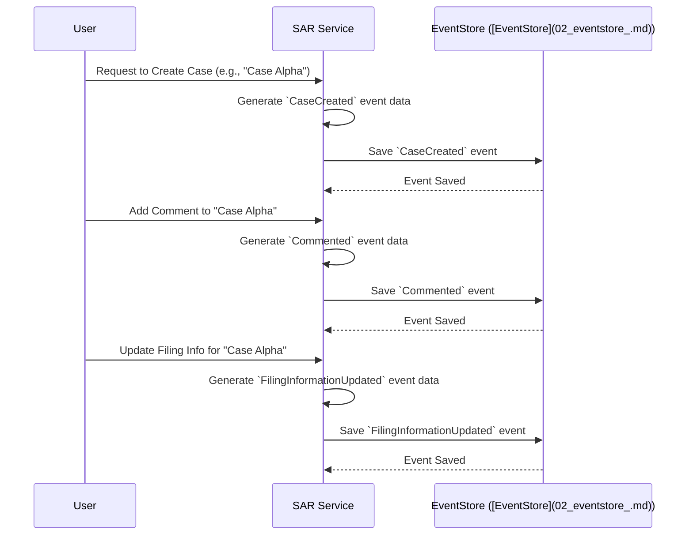

# Chapter 1: Case Events

Welcome to your first step in understanding the `sar-service-event-sourced` project! This project helps manage Suspicious Activity Report (SAR) cases. To do this effectively, we need a way to keep track of everything that happens to a case from its creation to its resolution.

Imagine you're a detective working on a case. You'd keep a detailed notebook, writing down every new piece of information, every action taken, and every decision made. Each entry in your notebook would be a "fact" about the case.

In our system, **Case Events** are like those entries in your detective's notebook.

## What's the Big Idea? Solving a Puzzle, One Piece at a Time

Let's consider a common scenario: managing a SAR case.
A SAR case might go through several stages:
1.  It's **created**.
2.  Someone **adds a comment** with new findings.
3.  An **action is performed**, like "escalate to manager."
4.  **Filing information is updated** before submitting the report.

How do we keep an accurate and reliable record of all these steps? How do we know the complete history of the case?

This is where **Case Events** come in. They are the solution to meticulously recording every significant occurrence in the lifecycle of a SAR case. Each event captures a single, specific fact or state change.

## What Exactly Are Case Events?

**Case Events** are specific data structures that represent the facts or state changes happening within a SAR case. Think of them as the individual, detailed entries in a financial ledger – each describing a single, atomic business action that occurred. "Atomic" here means it's the smallest, indivisible piece of information about something that happened.

Some examples of Case Events include:
*   `CaseCreated`: Records that a new SAR case has been started.
*   `ActionPerformed`: Records that a specific action was taken on the case.
*   `Commented`: Records that a user added a comment to the case.
*   `FilingInformationUpdated`: Records changes to the information needed for filing the SAR.

These events are the fundamental building blocks. They are:
*   Stored in the [EventStore](02_eventstore_.md) (which we'll cover in the next chapter).
*   Used by [Projections](03_projections_.md) to build up views of the current state of a case.
*   Processed by [Workers](04_workers_.md) to perform tasks based on what happened.

## The Anatomy of a Case Event

Every Case Event typically contains a few key pieces of information:
*   **`name`**: What kind of event is this? (e.g., `"CaseCreated"`, `"ActionPerformed"`).
*   **`aggregateId`**: Which specific SAR case does this event belong to? This is like the unique ID for the case.
*   **`data`**: The specific details of what happened. For a `CaseCreated` event, this might include who created it, when, and any initial details. For an `ActionPerformed` event, it would include what action was performed.
*   **`timestamp`**: When did this event occur?
*   **`userId`**: Which user caused this event to happen?

Let's look at how the *structure* (or blueprint) for an event might be defined in our code. The following snippet shows how we define the structure for a `CaseCreated` event.

```typescript
// Simplified from: src/projections/case-events.ts

// This import brings in the definition for CaseCreatedEvent's data
import type { CaseCreatedEvent } from "@lucinity/sar-service-commands";
// This import brings in a base structure for all events
import type { IEvent } from "@lucinity/pg-live-stream";

// This defines the 'shape' of a CaseCreated event
export interface CaseCreated extends IEvent {
  data: CaseCreatedEvent["data"];
}
```
In this code:
*   `export interface CaseCreated` declares a new "blueprint" named `CaseCreated`.
*   `extends IEvent` means it inherits some common properties from a base `IEvent` (like `aggregateId`, `timestamp`, etc.).
*   `data: CaseCreatedEvent["data"];` specifies that the `data` part of this event will have the structure defined by `CaseCreatedEvent["data"]` (which comes from another part of our system and contains fields specific to case creation).

So, an actual `CaseCreated` event object, once it happens, might look something like this in a simplified JSON format:

```json
{
  "name": "CaseCreated",
  "aggregateId": "case-123-abc",
  "timestamp": "2023-10-26T10:00:00Z",
  "userId": "user-jane-doe",
  "data": {
    "reason": "Unusual transaction pattern",
    "reportedEntityType": "Individual"
  }
}
```
This event tells us:
*   A case was created (`"name": "CaseCreated"`).
*   It's for case ID `case-123-abc`.
*   It happened at a specific time.
*   User `user-jane-doe` created it.
*   The specific details (`data`) include the reason and the type of entity reported.

Similarly, if Jane Doe later adds a comment, a `Commented` event might be generated:

```json
{
  "name": "Commented",
  "aggregateId": "case-123-abc",
  "timestamp": "2023-10-26T11:30:00Z",
  "userId": "user-jane-doe",
  "data": {
    "commentText": "Checked transaction history, looks suspicious.",
    "commentId": "comment-xyz-789"
  }
}
```

## How Are Case Events Used? A Quick Peek

These event objects aren't just defined; they are actively used and stored. When something happens in the system that needs to be recorded, an event object is created and then saved.

The [EventStore](02_eventstore_.md) is responsible for saving these events. Here's a highly simplified look at what its `save` function might expect:

```typescript
// Highly simplified from src/EventStore.ts
import type { CaseEvent } from "@lucinity/sar-service-commands";

export class EventStore {
  // ... other parts of the class ...

  public async save(events: CaseEvent[]): Promise<void> {
    // 'events' is an array of event objects like the ones we saw
    // This function would then take these events
    // and store them permanently, usually in a database.
    console.log(`Saving ${events.length} event(s)...`);
    // Actual database saving logic is more complex
  }
}
```
The key part here is `events: CaseEvent[]`. This tells us the `save` method accepts an array of `CaseEvent` objects. So, if a new case is created and a comment is immediately added, we might pass an array containing both the `CaseCreated` event and the `Commented` event to be saved together.

## The "Immutable Ledger"

An important concept with Case Events is that they are **immutable**. This means once an event is recorded, it cannot be changed or deleted. Just like in a financial ledger, you don't erase past transactions; if a mistake is made, you add a new transaction to correct it.

If, for example, `FilingInformationUpdated` was recorded with incorrect data, you wouldn't go back and change that event. Instead, another `FilingInformationUpdated` event would be recorded with the corrected information. This creates a full audit trail, showing exactly what happened and when.

## Visualizing the Flow of Events

Let's visualize how events are generated and stored for our SAR case example:


This diagram shows that for each user action:
1.  The `SAR Service` (our application) figures out what happened.
2.  It creates the appropriate **Case Event** data.
3.  It sends this event to the [EventStore](02_eventstore_.md) to be permanently recorded.

By looking at the sequence of these stored events (`CaseCreated`, then `Commented`, then `FilingInformationUpdated`), we can reconstruct the entire history of "Case Alpha."

## Conclusion

You've now learned about **Case Events** – the fundamental building blocks of our event-sourced system. They are:
*   **Facts**: Each event records a single, unchangeable fact about a SAR case.
*   **Detailed**: They contain specific data about what happened.
*   **Sequential**: They form a history, telling the story of a case over time.
*   **The Source of Truth**: Everything we know about a case is derived from its events.

These events are like the DNA of our SAR cases. They define what each case is and how it got to its current state.

Now that we understand what Case Events are, you might be wondering: where do all these events go? How are they stored and retrieved? That's exactly what we'll cover in the next chapter on the [EventStore](02_eventstore_.md).

---

Generated by [AI Codebase Knowledge Builder](https://github.com/The-Pocket/Tutorial-Codebase-Knowledge)