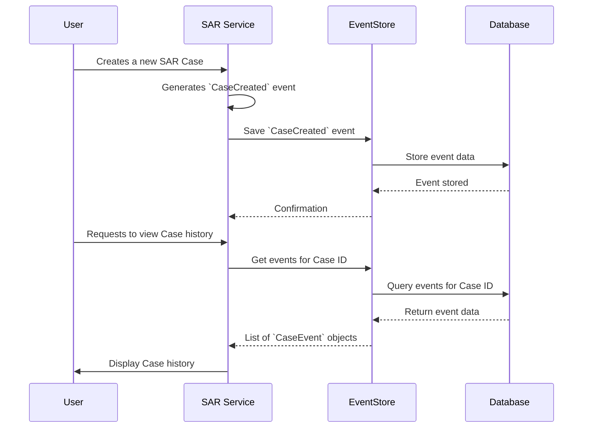

# Chapter 2: EventStore - Our System's Unchanging Memory

In [Chapter 1: Case Events](01_case_events_.md), we learned about **Case Events** – the individual, factual records of everything that happens to a SAR case, like entries in a detective's notebook. We saw how events like `CaseCreated` or `Commented` capture specific moments in a case's lifecycle.

But a collection of notes is only useful if you have a safe, organized place to keep them. If those notes get lost or jumbled, the history is gone! So, where do all these important Case Events go? How are they stored so we can trust them and look them up later?

This is where the **EventStore** comes into play.

## What's the Problem? Keeping a Perfect Record

Imagine you're building a system to track SAR cases. "Case Alpha" gets created. Then, a comment is added. Later, its status is updated.
*   How do we make sure every single one of these actions is permanently recorded?
*   How do we ensure the order of these actions is preserved? (It matters if a comment was added *before* or *after* a status change!)
*   If we need to know the full history of "Case Alpha" months later, how can we retrieve it accurately?

The **EventStore** is our solution to these challenges. It's the dedicated, super-reliable librarian for all our Case Events.

## What is the EventStore? The Official History Book

The **EventStore** is the central repository where all changes to our application's state (specifically, our SAR cases) are recorded as a sequence of immutable [Case Events](01_case_events_.md).

Think of it like this:
*   **A Bank's Ledger:** In a bank, every transaction (deposit, withdrawal) is recorded in a ledger. You don't erase old transactions; you add new ones. The ledger provides a complete history. The EventStore is like this ledger for our SAR cases.
*   **A Ship's Logbook:** A captain records all significant events during a voyage in a logbook – date, time, position, weather, incidents. It’s an unchangeable, chronological record.
*   **An Airplane's Black Box:** It records flight data and cockpit conversations, providing an exact history of what happened, especially if something goes wrong.

The crucial idea is that the EventStore **doesn't store the *current* state of a case directly**. Instead, it stores the **sequence of events** that *led* to the current state. If you want to know what a case looks like now, you "replay" its history of events.

Key characteristics of events in the EventStore:
1.  **Immutable**: Once an event is written to the EventStore, it can *never* be changed or deleted. Just like you can't use an eraser on a bank ledger. If a mistake is made (e.g., wrong information submitted), a *new* event is recorded to correct it.
2.  **Ordered**: Events for a specific case are stored and retrieved in the exact order they occurred. This chronological sequence is vital.
3.  **The Single Source of Truth**: The EventStore holds the definitive history. Everything we know about what happened to a case comes from its stream of events.

## How Does the EventStore Work? Saving and Retrieving History

At a high level, interacting with the EventStore involves two main operations:

1.  **Saving Events**:
    *   When something significant happens in a SAR case (e.g., a user creates a case, adds a comment), our application creates a [Case Event](01_case_events_.md) object describing that fact.
    *   The application then tells the EventStore: "Please save this event (or these events)."
    *   The EventStore takes the event(s) and carefully stores them, usually in a robust database, ensuring they are linked to the correct case and recorded in order.

2.  **Retrieving Events**:
    *   When we need to understand a case or reconstruct its state (e.g., "Show me everything that happened to Case X"), our application asks the EventStore: "Please give me all the events for Case X."
    *   The EventStore looks up all events associated with that specific case ID and returns them as an ordered list, from the oldest to the newest.

Let's see this in a diagram:


This diagram shows the EventStore acting as a middle-man, or an interface, to the actual database where events are physically stored.

## Using the EventStore in Our Code

Let's look at how our `sar-service-event-sourced` project might use the `EventStore`. The actual code in `src/EventStore.ts` is more complex, but we'll focus on the main ideas.

### Saving Events

Imagine a new SAR case is created. A `CaseCreated` event object is generated, as we saw in [Chapter 1: Case Events](01_case_events_.md). Our application would then use the EventStore's `save` method.

```typescript
// Simplified concept
import type { CaseEvent } from "@lucinity/sar-service-commands";
import { EventStore } from "./EventStore"; // Assuming EventStore class is here

// (Imagine this 'eventStore' object is already set up)
// const eventStore = new EventStore(...);

const newCaseEvent: CaseEvent = {
  name: "CaseCreated",
  aggregateId: "case-987-xyz", // The unique ID for this case
  // ... other event properties like timestamp, userId, data
  currentVersion: 1, // Version of this event for the aggregate
  data: { reason: "Suspicious wire transfer" },
  causationId: null, ipAddress: "127.0.0.1", userId: "analyst1"
};

async function handleCaseCreation() {
  // We put the event into an array, as 'save' can take multiple events
  await eventStore.save([newCaseEvent]);
  console.log(`Event ${newCaseEvent.name} for case ${newCaseEvent.aggregateId} saved!`);
}
```
**Input**: The `save` method takes an array of `CaseEvent` objects. In this example, it's an array containing our single `newCaseEvent`.
**What happens**:
1.  The `EventStore` receives this array.
2.  It will connect to a database (like PostgreSQL in our project).
3.  It will write the details of `newCaseEvent` into a database table designed to store events. This includes the `aggregateId` ("case-987-xyz"), the event `name` ("CaseCreated"), the `data`, `userId`, `timestamp`, etc.

The event is now permanently recorded!

### Retrieving Events (Getting the History of a Case)

Now, let's say we want to see the entire history of "case-987-xyz". We'd use the EventStore's `getEvents` method.

```typescript
// Simplified concept
// const eventStore = new EventStore(...); // EventStore instance

async function displayCaseHistory(caseId: string) {
  const eventsForCase: CaseEvent[] = await eventStore.getEvents(caseId);

  console.log(`History for case ${caseId}:`);
  for (const event of eventsForCase) {
    console.log(`- ${event.name} (at ${event.timestamp}): ${JSON.stringify(event.data)}`);
  }
}

// Example usage:
// displayCaseHistory("case-987-xyz");
```
**Input**: The `getEvents` method takes a `caseId` (which is the `aggregateId` we saw earlier, like "case-987-xyz").
**Output**: It returns a `Promise` that resolves to an array of `CaseEvent` objects. These are all the events that have ever been recorded for "case-987-xyz", sorted in the order they occurred.

If "case-987-xyz" was just created, the output might look like:
```
History for case case-987-xyz:
- CaseCreated (at 2023-10-27T10:00:00Z): {"reason":"Suspicious wire transfer"}
```
If later a comment was added, and then an action performed, calling `getEvents("case-987-xyz")` again would return *all three* events in order: `CaseCreated`, then `Commented`, then `ActionPerformed`. This gives us the complete story!

## Under the Hood: How Does It *Actually* Store Them?

The `EventStore` class in our project (`src/EventStore.ts`) primarily interacts with a PostgreSQL database.

### Saving Events: The `INSERT` Statement

When `eventStore.save([newEvent])` is called:
1.  The `EventStore` prepares the data from each event object.
2.  It constructs an SQL `INSERT` query to add new rows to a table, likely named `case_event`.
3.  It executes this query against the database.

Here's a highly simplified look at the kind of SQL involved, based on `src/EventStore.ts`:
```sql
-- Simplified SQL for inserting one event
INSERT INTO case_event (
  aggregate_id, current_version, data, name, user_id /*, ... other columns */
) VALUES (
  'case-987-xyz', 1, '{"reason":"Suspicious wire transfer"}', 'CaseCreated', 'analyst1' /*, ... other values */
);
```
The actual code in `src/EventStore.ts` uses a helper function called `placeholder` to efficiently insert *multiple* events at once, but the core idea is this `INSERT` operation. Each event becomes a new row in the `case_event` table.

The `save` method in `src/EventStore.ts` looks roughly like this (simplified):
```typescript
// Simplified from src/EventStore.ts
public async save(events: CaseEvent[]): Promise<void> {
  // 1. Map event objects to an array of values for the database
  const values = events.map((event) => [
    event.aggregateId, event.currentVersion, event.data,
    event.name, event.userId, /* ... more fields ... */
  ]);

  // 2. (Simplified) Construct the SQL INSERT statement
  // The actual code uses a 'placeholder' helper for this
  const sql = `
    INSERT INTO case_event (aggregate_id, current_version, data, name, user_id /*...*/)
    VALUES ...`; // Placeholder generates ($1, $2,...), ($3, $4,...)

  // 3. Execute the query with the flattened 'values' array
  // await this.pool.query(sql, values.flat());
  console.log(`Pretending to save ${events.length} events to database.`);
}
```
This snippet shows how the event properties are prepared to be inserted into the database table `case_event`.

### Retrieving Events: The `SELECT` Statement

When `eventStore.getEvents("case-987-xyz")` is called:
1.  The `EventStore` uses the provided `caseId`.
2.  It constructs an SQL `SELECT` query to fetch rows from the `case_event` table where the `aggregate_id` column matches the given `caseId`.
3.  Crucially, it orders the results by a column that represents the sequence of events (in our code, this is `offset`).
4.  It executes the query, and the database returns the matching rows.
5.  The `EventStore` then transforms these database rows back into `CaseEvent` objects.

A simplified SQL query for this would be:
```sql
-- Simplified SQL for getting events for a case
SELECT aggregate_id AS "aggregateId", name, data, timestamp, user_id /*, ... */
FROM case_event
WHERE aggregate_id = 'case-987-xyz' -- The specific case ID
ORDER BY "offset" ASC; -- "offset" ensures chronological order
```
The `getEvents` method in `src/EventStore.ts` (simplified):
```typescript
// Simplified from src/EventStore.ts
public async getEvents(caseId: string): Promise<CaseEvent[]> {
  const sql = `
    SELECT aggregate_id AS "aggregateId", name, data, timestamp, user_id /*...*/
      FROM case_event
     WHERE aggregate_id = $1 -- $1 is a placeholder for caseId
     ORDER BY "offset" ASC`;  // Ensures events are in order

  // const { rows } = await this.pool.query(sql, [caseId]);
  // return rows as CaseEvent[];
  console.log(`Pretending to fetch events for ${caseId} from database.`);
  return []; // In a real scenario, this would return actual events
}
```
This shows how it fetches rows for a specific `aggregate_id` and orders them to ensure we get the correct historical sequence.

## Why Not Just Update a Record? The Power of History

You might wonder, "Why go through all this trouble? Why not just have a `cases` table and update a row when a case changes?"

Storing events (Event Sourcing) offers powerful advantages:
*   **Full Audit Trail**: You have an undeniable record of every single change. This is often a requirement in regulated industries like finance (which SARs are part of!).
*   **Debugging and Analysis**: If a case is in an unexpected state, you can replay its events to see exactly how it got there. It's like having a time machine for your data.
*   **Rebuilding State**: As we'll see in the next chapter on [Projections](03_projections_.md), you can use this stream of events to build many different "views" or "read models" of your data. For example, one view for a summary list of cases, another for detailed case information.
*   **Temporal Queries**: You can ask "What did Case X look like last Tuesday?" by replaying events up to that point.

The EventStore, by preserving this complete history, is the foundation for these capabilities.

## Conclusion

You've now explored the **EventStore**, the heart of our event-sourced system's memory. It's the guardian of our [Case Events](01_case_events_.md), ensuring that:
*   Every event is **safely and permanently stored**.
*   Events are **immutable** – once written, they don't change.
*   The **chronological order** of events for each case is preserved.
*   We can retrieve the **complete history** of any SAR case by querying its stream of events.

The EventStore provides the raw historical data – the sequence of facts. But often, users and other parts of our system need to see the *current state* of a case, or summaries of cases. How do we get from a list of historical events to a useful, up-to-date view of a case?

That's where **Projections** come in, and we'll dive into them in [Chapter 3: Projections](03_projections_.md).

---

Generated by [AI Codebase Knowledge Builder](https://github.com/The-Pocket/Tutorial-Codebase-Knowledge)