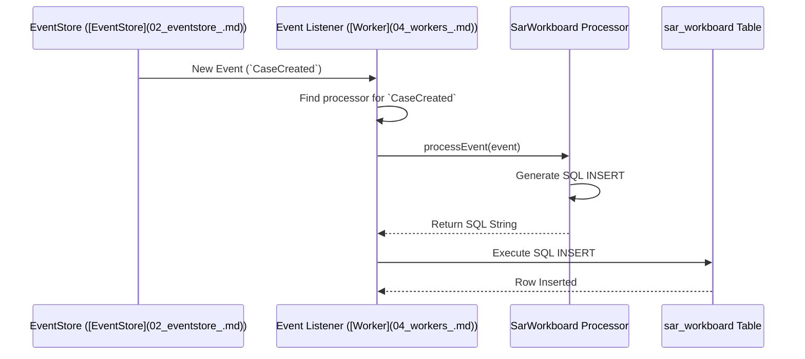

# Chapter 3: Projections - Creating Views from History

In [Chapter 2: EventStore](02_eventstore_.md), we learned about the `EventStore`, our system's reliable memory that stores every single [Case Event](01_case_events_.md) in the exact order it happened. This provides a perfect, unchangeable history of every SAR case.

But... having just a history log isn't always convenient. Imagine you want to see a simple list of all *currently* open SAR cases assigned to you. Reading the entire history of *every* case from the beginning and figuring out the current status each time would be very slow and inefficient!

How can we get quick, up-to-date snapshots or summaries of our cases without constantly re-reading the entire history?

This is the problem that **Projections** solve.

## What's the Big Idea? From Detailed Log to Useful Summaries

Think about an accountant. They have a detailed ledger (like our [EventStore](02_eventstore_.md)) recording every single financial transaction (like our [Case Events](01_case_events_.md)). If the CEO asks, "What's our current cash balance?" or "Show me a list of customers who owe us money," the accountant doesn't hand over the entire massive ledger!

Instead, the accountant *reads* the ledger and *projects* that information into specific, summarized reports: a balance sheet, an accounts receivable list, etc. Each report is designed for a specific purpose and is much easier to read than the raw transaction log.

**Projections** in our system work exactly like this accountant. They are components that:
1.  **Read** the stream of [Case Events](01_case_events_.md) from the [EventStore](02_eventstore_.md).
2.  **Process** these events.
3.  **Transform** the information into specific, easy-to-query "read models" or views.
4.  **Store** these read models, often in separate database tables.

Each projection creates a view tailored for a specific need, making it fast and easy to get the information required without replaying history every time.

## Creating a View: The SAR Workboard Example

Let's go back to our use case: displaying a list of SAR cases on a dashboard, maybe called the "SAR Workboard". This dashboard needs to show things like:
*   SAR ID
*   Current Status (New, In Progress, Closed)
*   Who it's Assigned To
*   Creation Date
*   Maybe the primary suspect (Focal Actor)

The raw events in the [EventStore](02_eventstore_.md) contain all this information, but spread across many events (`CaseCreated`, `ActionPerformed`, `ActorAdded`, etc.).

A specific **Projection**, let's call it the `SarWorkboardProjection`, is designed to build and maintain a dedicated `sar_workboard` database table. This table will have columns for `sar_id`, `status`, `assigned_to`, `creation_date`, `focal_actors_names`, etc. – exactly what the dashboard needs!

## How Does a Projection Work? Listening and Updating

The `SarWorkboardProjection` continuously listens for new [Case Events](01_case_events_.md) as they are saved to the [EventStore](02_eventstore_.md).

1.  **Event Occurs:** A user creates a new SAR case. A `CaseCreated` event is saved.
2.  **Projection Sees Event:** The `SarWorkboardProjection` notices this new `CaseCreated` event.
3.  **Projection Processes Event:** It looks at the event's data (like the case ID, creation time, initial details).
4.  **Projection Updates Read Model:** It generates an SQL `INSERT` statement to add a new row to the `sar_workboard` table with the initial information for this case.

Later...

1.  **Another Event Occurs:** A manager assigns the case to "Analyst Bob". An `ActionPerformed` event (with action="ASSIGN", assignedTo="Analyst Bob") is saved.
2.  **Projection Sees Event:** The `SarWorkboardProjection` sees this `ActionPerformed` event.
3.  **Projection Processes Event:** It identifies the case ID and the new assignee.
4.  **Projection Updates Read Model:** It generates an SQL `UPDATE` statement to change the `assigned_to` column for that specific SAR's row in the `sar_workboard` table to "Analyst Bob".

The `sar_workboard` table always reflects the *latest* state based on the events the projection has processed. When the dashboard needs data, it simply queries this table – which is fast!

## Processing Events: Code Examples

Let's look at how a projection might translate events into database operations. In our project, projections often contain "processor" functions, one for each type of event they care about. These functions typically take an event and return an SQL string.

*(Note: These are highly simplified examples based on `src/projections/sar_workboard/processors.ts`)*

### Handling `CaseCreated`

When a `CaseCreated` event arrives, the projection needs to add a new record to the `sar_workboard` table.

```typescript
// Simplified concept from src/projections/sar_workboard/processors.ts

import type { CaseCreated } from "../case-events";
import pgp from "pg-promise"; // A tool to help format SQL

// This processor handles 'CaseCreated' events
export const caseCreated = (event: CaseCreated): string => {
  // Only process SAR type cases for this projection
  if (event.data.type !== "SAR") return "";

  const caseId = event.aggregateId;
  const creationDate = event.timestamp;
  const sarName = event.data.sarName;
  // ... extract other needed data ...

  // Generate SQL to insert a new row
  return pgp.as.format(
    `INSERT INTO sar_workboard (sar_id, sar_name, creation_date, status, ...)
     VALUES ($1, $2, $3, 'NEW', ...);`,
    [caseId, sarName, creationDate /* ... other values ... */]
  );
};
```
**Input:** A `CaseCreated` event object.
**Output:** An SQL `INSERT` string ready to be executed against the `sar_workboard` database table.

### Handling `ActionPerformed` (e.g., Assignment)

When an `ActionPerformed` event signifies an assignment, the projection needs to update the existing record.

```typescript
// Simplified concept from src/projections/sar_workboard/processors.ts

import type { ActionPerformed } from "../case-events";
import pgp from "pg-promise";

// This processor handles 'ActionPerformed' events
export const actionPerformed = (event: ActionPerformed): string => {
  const caseId = event.aggregateId;
  const newStatus = event.data.status; // e.g., "IN_PROGRESS"
  const assignee = event.data.assignedToUserDisplayName; // e.g., "Analyst Bob"
  // ... extract other data like timestamp ...

  // Generate SQL to update the existing row
  return pgp.as.format(
    `UPDATE sar_workboard
     SET status = COALESCE($1, status), assigned_to = COALESCE($2, assigned_to), ...
     WHERE sar_id = $3;`,
    [newStatus, assignee, caseId /* ... other values ... */]
  );
  // COALESCE means: update if the value is provided, otherwise keep the old value
};
```
**Input:** An `ActionPerformed` event object.
**Output:** An SQL `UPDATE` string ready to be executed against the `sar_workboard` table.

## Under the Hood: The Projection Pipeline

How does an event actually get from the [EventStore](02_eventstore_.md) to the correct projection processor and update the read model table?

1.  **Event Saved:** An event is saved to the [EventStore](02_eventstore_.md) (and its underlying database table, e.g., `case_event`).
2.  **Event Notification:** The [EventStore](02_eventstore_.md) (or a related mechanism) notifies interested parties that new events are available.
3.  **Event Listener (Worker):** A background process (which we'll call a [Worker](04_workers_.md) in the next chapter) reads these new events.
4.  **Routing:** The listener checks the `name` of the event (e.g., `"CaseCreated"`).
5.  **Finding the Processor:** It looks up which projection processors are interested in this event type. For our `sar_workboard` projection, it would find the `caseCreated` processor function.
6.  **Executing the Processor:** It calls the processor function, passing in the event data.
7.  **Getting SQL:** The processor function returns the appropriate SQL string (`INSERT` or `UPDATE`).
8.  **Updating Read Model:** The listener executes this SQL string against the specific read model database (the `sar_workboard` table).

Here's a simplified view:



## Code Structure for Projections

In our project, the logic for different projections lives under `src/projections/`. Each projection typically has:
*   An `index.ts` file: This maps event names to the correct processor functions.
*   A `processors.ts` file: This contains the actual functions that take events and generate SQL.

Let's peek at a simplified `index.ts` for our `sar_workboard` projection:

```typescript
// Simplified from src/projections/sar_workboard/index.ts
import type { IEvent } from "@lucinity/pg-live-stream";
import { EventName } from "@lucinity/sar-service-commands"; // Defines event names
import { NOOP } from "../noop"; // A function that does nothing
import type { IEventToSQL, IEventToSQLs } from "../types"; // Types for handlers
import {
  actionPerformed,
  caseCreated,
  // ... import other processors ...
} from "./processors";

// Map event names to processor functions
const handlers: IEventToSQLs = {};
handlers[EventName.CASE_CREATED] = (event: IEvent): string =>
  caseCreated(event as CaseCreated); // Use the caseCreated processor
handlers[EventName.ACTION_PERFORMED] = (event: IEvent): string =>
  actionPerformed(event as ActionPerformed); // Use the actionPerformed processor
// ... other event handlers ...

// Function to find the right handler for an event
const findHandlerByEventName = (event: IEvent): IEventToSQL =>
  handlers[event.name] ?? NOOP; // If no handler, do nothing

// Main function called by the Event Listener
export const processEvent = (event: IEvent): string =>
  findHandlerByEventName(event)(event); // Find and call the handler
```
This code sets up a dictionary (`handlers`) where keys are event names (like `EventName.CASE_CREATED`) and values are the corresponding processor functions (like `caseCreated`) imported from `processors.ts`. The `processEvent` function is the main entry point that finds and executes the correct processor based on the incoming event's name.

## Why Use Projections?

*   **Read Efficiency:** Querying a tailored read model table is much faster than replaying events from the [EventStore](02_eventstore_.md) every time.
*   **Purpose-Built Views:** You can create many different projections from the *same* event stream, each optimized for a specific task or UI screen (e.g., one for the workboard, another for detailed case view, another for audit logs).
*   **Decoupling:** The way you query data (read models) is separated from the way you write data (events). You can change or add new read models without affecting how events are stored.

## Conclusion

You've now learned about **Projections** – the crucial components that bridge the gap between the historical log in the [EventStore](02_eventstore_.md) and the up-to-date views needed by users and other parts of the system. They act like accountants, constantly reading the event stream and updating specific reports (read models).

Key takeaways:
*   Projections **read** events.
*   They **transform** event data into specific views (read models).
*   Read models are typically stored in **separate database tables**.
*   They make **querying** the current state or specific summaries very efficient.
*   Each projection is **specialized** for a particular query need.

We saw how a projection like `SarWorkboardProjection` can build and maintain a `sar_workboard` table by processing events like `CaseCreated` and `ActionPerformed`.

But who actually *runs* these projections? What mechanism reads the new events from the [EventStore](02_eventstore_.md) and feeds them to the projection processors? That's the job of the **Workers**, which we'll explore in the next chapter.

Ready to see how events trigger these projections? Let's move on to [Chapter 4: Workers](04_workers_.md)!

---

Generated by [AI Codebase Knowledge Builder](https://github.com/The-Pocket/Tutorial-Codebase-Knowledge)