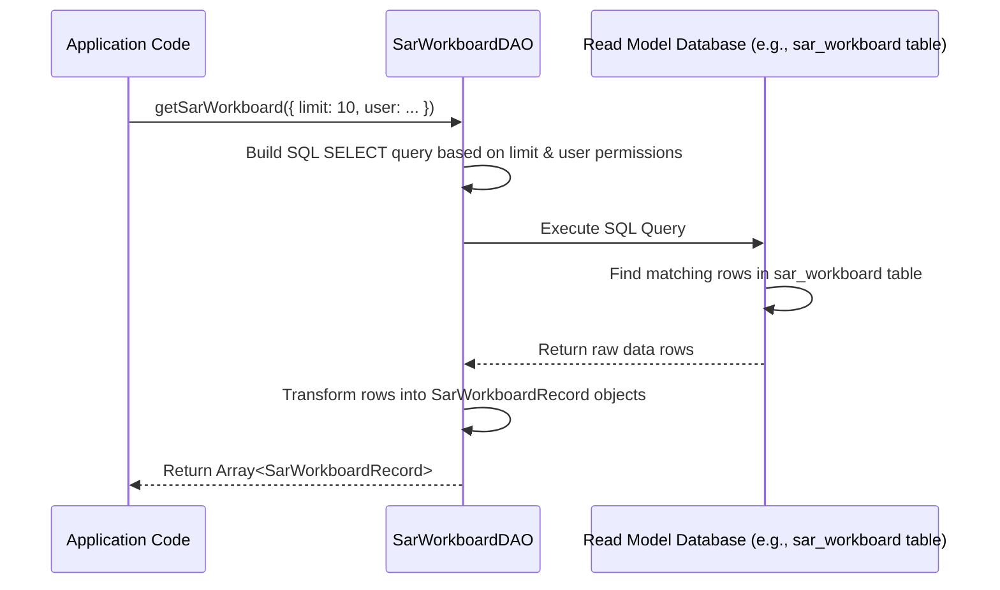

# Chapter 5: Data Access Objects (DAOs)

Welcome back! In [Chapter 4: Workers](04_workers_.md), we learned about the tireless **Workers** that run in the background. They listen to the stream of [Case Events](01_case_events_.md), use the logic defined in [Projections](03_projections_.md), and diligently update our "read model" database tables (like `sar_workboard`) to reflect the latest state of our SAR cases.

So, now we have these nicely prepared, up-to-date tables holding summarized information. Great! But how does the *rest* of our application actually *get* data *out* of these tables? For example, how do we fetch the list of cases to display on the SAR Workboard screen for an analyst?

This is where **Data Access Objects (DAOs)** step in.

## What's the Problem? Getting Data Neatly

Imagine our application needs to display a list of SAR cases on the workboard. The [Workers](04_workers_.md) have already done the hard work of processing events and putting the latest data into the `sar_workboard` table, which might look something like this (simplified):

**`sar_workboard` Table**

| sar_id     | sar_name        | status       | assigned_to   | creation_date | ... |
| :--------- | :-------------- | :----------- | :------------ | :------------ | :-- |
| sar-001    | Suspicious Wire | IN_PROGRESS  | Analyst Bob   | 2023-10-28    | ... |
| sar-002    | Odd Cash Deps   | NEW          | *(unassigned)*| 2023-10-29    | ... |
| sar-003    | Structuring Txn | IN_PROGRESS  | Analyst Alice | 2023-10-30    | ... |

Now, the part of our application that builds the user interface (UI) needs to fetch this data. How should it do it?
*   Should the UI code directly write SQL queries like `SELECT * FROM sar_workboard WHERE ...`? That could get messy and mix database logic with UI logic.
*   What if we need to add filtering (e.g., show only cases assigned to Bob) or pagination (show only 10 cases per page)? Writing complex SQL directly in multiple places is error-prone.

We need a clean, organized way to access the data in these read model tables. The **Data Access Object (DAO)** pattern provides this solution.

## What Are Data Access Objects (DAOs)? The Librarians for Our Data

**Data Access Objects (DAOs)** are classes specifically designed to handle communication with our read model database tables. They act like helpful librarians for our application's data.

Think of it this way:
*   The read model tables (like `sar_workboard`) are like special, pre-compiled reports or books in a library, constantly kept up-to-date by the [Workers](04_workers_.md).
*   The **DAO** (e.g., `SarWorkboardDAO`) is the librarian who knows exactly which report (`sar_workboard` table) to consult for specific information (like the list of SARs).
*   When another part of the application (like the code generating the UI) needs data, it doesn't go digging through the shelves (database tables) itself. Instead, it makes a simple request to the librarian (calls a method on the DAO).
*   The librarian (DAO) then finds the right report (`sar_workboard`), performs the necessary look-up (executes the correct SQL query), and returns the requested information in a neat, usable format (like a list of objects).

In essence, DAOs:
1.  **Encapsulate Data Access:** They hide the specific SQL queries needed to interact with a particular database table (or related tables).
2.  **Provide a Clean Interface:** They offer simple methods (like `getSarWorkboard()`, `getL3MatterById()`) for other parts of the application to use, without needing to know the underlying database details.
3.  **Focus on Read Models:** In our event-sourced system, DAOs primarily interact with the *projected* read model tables created by the [Projections](03_projections_.md) and updated by the [Workers](04_workers_.md). They are responsible for *reading* the current state derived from the history of events.

## How DAOs Help: Fetching the SAR Workboard

Let's revisit our use case: displaying the SAR workboard. Instead of writing SQL in the UI layer, we'll use a DAO.

1.  We create a class called `SarWorkboardDAO` (like the one in `src/dao/SarWorkboardDAO.ts`).
2.  This DAO class has methods like `getSarWorkboard()`.
3.  The part of our application handling the request for the workboard data simply calls this method.

```typescript
// Conceptual example of using the DAO

import { SarWorkboardDAO } from "./dao/SarWorkboardDAO";
// Assume 'dbClient' is our connection to the database
// const dbClient = getDatabaseClient();

const sarWorkboardDAO = new SarWorkboardDAO(dbClient);

async function displaySarWorkboard() {
  console.log("Fetching SAR workboard data...");
  // Call the DAO method to get the data
  const workboardItems = await sarWorkboardDAO.getSarWorkboard({
    limit: 10, // Ask for a maximum of 10 items
    // We could add other options like 'fromId' for pagination
    // or filters for status, assignee etc. (simplified here)
    sarAccessEntitlements: user.sarAccessEntitlements, // User permissions
    sarEntitlements: user.sarEntitlements, // User specific entitlements
  });

  console.log(`Found ${workboardItems.length} items:`);
  workboardItems.forEach(item => {
    console.log(`- ID: ${item.sarId}, Name: ${item.sarName}, Status: ${item.status}`);
  });
  // Now the UI can display these 'workboardItems'
}

// displaySarWorkboard();
```

**Explanation:**
*   We create an instance of `SarWorkboardDAO`, giving it a way to talk to the database (`dbClient`).
*   We call `sarWorkboardDAO.getSarWorkboard()`, passing options like the maximum number of items (`limit`) and user permission details. We don't need to write any SQL here!
*   **Input:** Options object (limit, user permissions, etc.).
*   **Output:** The DAO method returns a Promise that resolves to an array of `SarWorkboardRecord` objects, each representing a row from the `sar_workboard` table, ready to be used.

The DAO handles all the complexity of constructing the correct SQL query, executing it, and transforming the results.

## Under the Hood: How Does a DAO Work?

When you call a method on a DAO, like `sarWorkboardDAO.getSarWorkboard(...)`, several things happen behind the scenes:

1.  **Receive Request:** The DAO method receives the call with any parameters (like `limit`, `caseIds`, user permissions).
2.  **Build SQL Query:** Based on the parameters, the DAO constructs the appropriate SQL `SELECT` query. It might add `WHERE` clauses for filtering, `ORDER BY` for sorting, and `LIMIT` for pagination. It also includes logic to filter based on user permissions (`getAccessClassificationFilter`).
3.  **Execute Query:** The DAO uses the database connection (`dbClient`) to execute the generated SQL query against the database.
4.  **Receive Results:** The database runs the query on the target read model table (e.g., `sar_workboard`) and returns the matching rows.
5.  **Transform Results:** The DAO takes the raw database rows and transforms them into structured JavaScript/TypeScript objects (like `SarWorkboardRecord[]`) that are easy for the rest of the application to work with. Sometimes this involves formatting dates or parsing JSON data stored in columns.
6.  **Return Data:** The DAO returns the final list of objects.

Let's visualize this with a sequence diagram:



## Diving into the Code: `SarWorkboardDAO.ts`

Let's look at a simplified version of the `getSarWorkboard` method from `src/dao/SarWorkboardDAO.ts`:

```typescript
// Simplified from: src/dao/SarWorkboardDAO.ts
import SQL from "sql-template-strings"; // Helper for safe SQL
import type { PgQueryable } from "@lucinity/case-service-types";
import { getAccessClassificationFilter } from "@lucinity/case-service-utils"; // Permission helper
import { SarWorkboardRecord } from "../interfaces/SarWorkboardRecord";

export class SarWorkboardDAO {
  private readonly client: PgQueryable; // Database connection object

  constructor(client: PgQueryable) {
    this.client = client;
  }

  public async getSarWorkboard({
    limit,
    caseIds,
    sarAccessEntitlements, // User's general access rights
    sarEntitlements,       // User's specific SAR entitlements
  }: {
    limit: number; caseIds?: string[]; /*...*/
    sarAccessEntitlements: any; sarEntitlements: any;
  }): Promise<SarWorkboardRecord[]> {

    // 1. Start building the SQL query
    let sql = SQL`SELECT sar_id AS "sarId", sar_name AS "sarName", status, ...
                     FROM sar_workboard AS t WHERE `; // Select desired columns

    const values = []; // Array to hold values for SQL placeholders ($1, $2...)
    let index = 1; // Counter for placeholders

    // 2. Add filtering logic (e.g., by specific case IDs if provided)
    if (caseIds?.length) {
      sql.append(SQL` t.sar_id = ANY(${caseIds}::text[]) AND `);
      // Note: In real code, values are pushed to 'values' array,
      //       and placeholders ($1, $2...) are used. Simplified here.
    }

    // 3. Add permission filtering using a helper function
    const accessQuery = getAccessClassificationFilter({
      alias: "t", startIndex: index, column: "sar_access_classification",
      accessEntitlements: sarAccessEntitlements, sarEntitlements,
    });
    sql.append(accessQuery.where); // Append the permission WHERE clause
    // accessQuery.values would be added to the main 'values' array

    // 4. Add ordering and limit
    sql.append(SQL` ORDER BY t.sar_id LIMIT ${limit}`);

    // 5. Execute the query against the database
    console.log("Executing SQL:", sql.text); // Display the generated SQL (for learning)
    // const { rows } = await this.client.query(sql); // Actual execution
    const rows = []; // Dummy result for illustration

    // 6. Transform and return results (simplified)
    return rows as SarWorkboardRecord[];
  }
  // ... other methods like insert ...
}
```

**Explanation:**
1.  **Build SQL:** We start creating an SQL `SELECT` statement using `sql-template-strings` (the `SQL\`` syntax) which helps prevent security issues like SQL injection. We select the columns needed, renaming them (e.g., `sar_id AS "sarId"`) to match our `SarWorkboardRecord` interface.
2.  **Filtering:** We conditionally add `WHERE` clauses. For example, if a list of `caseIds` is provided, we add a condition to only select those IDs (`t.sar_id = ANY(...)`).
3.  **Permissions:** We use a helper `getAccessClassificationFilter` to generate the SQL `WHERE` clause needed to ensure the user only sees data they are allowed to access based on their permissions (`sarAccessEntitlements` and `sarEntitlements`). This is crucial for security.
4.  **Ordering & Limit:** We add `ORDER BY t.sar_id` to get consistent results and `LIMIT` to restrict the number of rows returned, based on the `limit` parameter.
5.  **Execute:** The `this.client.query(sql)` line sends the final SQL query and its parameter values to the database for execution.
6.  **Transform:** The database `rows` are returned. In the real code (omitted here for simplicity), there's often logic to format dates or parse JSON before returning the data as an array of `SarWorkboardRecord` objects.

This pattern is repeated in other DAO files like `L3WorkboardDAO.ts` (`src/dao/L3WorkboardDAO.ts`) or `L3MatterDAO.ts` (`src/dao/L3MatterDAO.ts`), each tailored to interact with its specific read model table(s).

## Why Use DAOs?

Using the Data Access Object pattern gives us several advantages:
*   **Separation of Concerns:** Database interaction logic (SQL queries) is kept separate from the business logic or UI logic of the application.
*   **Encapsulation:** The details of how data is stored and retrieved are hidden behind the DAO's methods. If we need to optimize a query or even change the underlying table structure slightly, we only need to modify the DAO, not all the places that use it.
*   **Reusability:** A single DAO method (like `getSarWorkboard`) can be called from multiple places in the application that need that specific data.
*   **Testability:** DAOs can be tested independently, ensuring the data access logic is correct without needing to run the entire application.
*   **Clarity:** The code that uses the DAO is cleaner and easier to understand, as it just calls simple methods like `getSarWorkboard()` instead of dealing with complex SQL.

## Conclusion

You've now learned about **Data Access Objects (DAOs)** – the librarians of our read model data. They provide a structured and clean way for our application to interact with the projected database tables that [Workers](04_workers_.md) maintain.

Key takeaways:
*   DAOs **encapsulate SQL queries** for accessing specific read model tables.
*   They provide a **clean interface** (methods) for the rest of the application.
*   They **separate data access logic** from other application concerns.
*   They query the **current state** as represented in the read models.
*   Example: `SarWorkboardDAO` provides methods like `getSarWorkboard` to fetch data from the `sar_workboard` table.

We've journeyed from raw [Case Events](01_case_events_.md) stored in the [EventStore](02_eventstore_.md), seen how [Projections](03_projections_.md) define views, how [Workers](04_workers_.md) build these views, and now how DAOs allow us to query these views.

The final piece of the puzzle is often how to make this data available to the outside world – perhaps to a front-end web application or other microservices. How do we expose the functionalities and data we've built? That's the role of **External Service APIs**, which we'll explore in the next chapter.

Ready to see how our service talks to the world? Let's move on to [Chapter 6: External Service APIs](06_external_service_apis_.md)!

---

Generated by [AI Codebase Knowledge Builder](https://github.com/The-Pocket/Tutorial-Codebase-Knowledge)