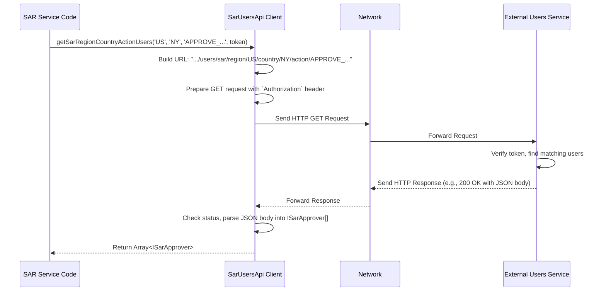

# Chapter 6: External Service APIs

Welcome to the final chapter of our tour through the `sar-service-event-sourced` project! In [Chapter 5: Data Access Objects (DAOs)](05_data_access_objects__daos__.md), we saw how **DAOs** act as librarians, providing a clean way for our application to *read* the nicely prepared summary data from our read model tables (like `sar_workboard`).

But our SAR service doesn't live in a vacuum! It's part of a larger ecosystem of microservices. Sometimes, it needs information that isn't stored within its own [EventStore](02_eventstore_.md) or read models. It needs to ask *other* services for help.

How does our service talk to these other services or external systems to get the data it needs?

## What's the Problem? Asking for Help from Outside

Imagine our SAR service is processing a case. At some point, a user wants to perform an action, maybe "Approve SAR for Filing". Before allowing this, our service needs to know:
1.  **Does this specific user *have permission* to approve SARs?**
2.  **If they do, which regulatory body should this SAR be filed with in their region?**

This kind of information – user permissions (entitlements), details about regulatory bodies – isn't typically stored directly within our SAR service's data. It often lives in separate, specialized microservices:
*   An "Entitlements Service" knows who can do what.
*   A "Filing Service" knows about different regulators.
*   A "User Service" might know details about specific users (like their display name).

How can our SAR service reliably ask these *other* services for the information it needs? How does it handle the communication details, like knowing the correct web address (URL) for the other service and how to format the request?

This is where **External Service APIs** come in. They are the solution for managing communication with the outside world.

## What Are External Service APIs? Our Service's Messengers

**External Service APIs** in our project are classes that act as dedicated clients, or "messengers," for interacting with other microservices or external systems. Each API client is specialized in talking to one specific external service (or a part of it).

Think of our SAR service as one department in a large company.
*   Other departments (like "Human Resources" for user details, "Compliance" for regulations, "Security" for permissions) hold specific information.
*   If our SAR department needs info from HR, it doesn't just shout down the hallway. It uses a specific contact person or phone number dedicated to HR requests.
*   **External Service APIs** are like these dedicated contact points. They know exactly *how* and *where* to send requests to other services (departments) and how to understand the replies.

Examples in our project include:
*   `SarEntitlementsApi` (`src/SarEntitlementsApi.ts`): Knows how to talk to the service managing user permissions (entitlements) for SARs.
*   `SarUsersApi` (`src/SarUsersApi.ts`): Knows how to talk to the service managing user information, especially for finding users with specific roles (like approvers).
*   `SarFilingApi` (`src/SarFilingApi.ts`): Knows how to talk to the service that provides information about regulatory bodies for filing.
*   `Apis` (`src/dao/Apis.ts`): Handles fetching details about Observations and Activities from other services.
*   `ActorApi` (`src/dao/ActorApi.ts`): Handles fetching details about Actors (entities involved in cases) from another service.

These API clients handle the nitty-gritty details of network communication:
*   Knowing the correct URL (the address) of the external service.
*   Formatting the request correctly (e.g., HTTP GET or POST).
*   Including necessary information like authentication tokens (like a security badge) in the request headers.
*   Parsing the response received from the external service.

## How to Use Them: Finding SAR Approvers

Let's go back to our use case: we need to find users who are allowed to approve SARs in a specific region and country (say, US/NY) for a specific action ('APPROVE_REJECT_LEVEL1_SAR_FILING_RECORD'). This information lives in the User service.

Our SAR service code won't talk directly over the network. Instead, it will use the `SarUsersApi` client.

1.  **Create an Instance:** First, we create an instance of the `SarUsersApi`, telling it the network address (`host`) of the external User service.

```typescript
// Conceptual: Setting up the API client
import { SarUsersApi } from "./SarUsersApi";

// The network address where the external User service lives
const userSvcHost = "http://user-service.internal.company.com";

// Create our messenger for the User service
const usersApi = new SarUsersApi({ host: userSvcHost });
```
This code creates the `usersApi` object, which now knows how to reach the User service.

2.  **Call the Method:** Now, the part of our code that needs the approvers calls a specific method on the `usersApi` object.

```typescript
// Conceptual: Using the API client to get data
async function findApprovers(userToken: string) {
  const region = "US";
  const country = "NY";
  // This action string likely matches a predefined permission
  const action = "APPROVE_REJECT_LEVEL1_SAR_FILING_RECORD";

  console.log(`Asking User service for approvers in ${region}/${country}...`);

  try {
    // Call the method on our messenger object
    const approvers = await usersApi.getSarRegionCountryActionUsers(
      region, country, action, userToken
    );

    console.log(`Found ${approvers.length} approver(s):`);
    approvers.forEach(app => console.log(`- ${app.displayName} (${app.kerberos})`));
    // Now we can use this list, maybe show it in a dropdown menu
    return approvers;
  } catch (error) {
    console.error("Failed to get approvers from User service:", error);
    return [];
  }
}

// Example call (assuming 'currentUserToken' holds the logged-in user's auth token)
// findApprovers(currentUserToken);
```
**Explanation:**
*   **Input:** We call `getSarRegionCountryActionUsers` with the `region`, `country`, `action` we're interested in, and crucially, a `userToken`. This token usually proves to the *external* User service that our SAR service (or the user triggering the request) is authorized to ask for this information.
*   **What Happens:** The `usersApi` object takes these inputs, builds a network request, sends it to the User service, waits for the reply, and processes it.
*   **Output:** If successful, the method returns a `Promise` that resolves to an array of `ISarApprover` objects (defined in `src/interfaces/ISarUsers.ts`), each containing details like the approver's `displayName` and `kerberos` ID.

We didn't have to write any complex network code ourselves! We just called a simple method on our `SarUsersApi` messenger.

## Under the Hood: How Does the Messenger Work?

When you call a method like `usersApi.getSarRegionCountryActionUsers(...)`, what does the API client actually do?

1.  **Construct URL:** It takes the `host` it was configured with and the parameters (`region`, `country`, `action`) to build the specific URL for the request. For our example, it might construct something like: `http://user-service.internal.company.com/users/sar/region/US/country/NY/action/APPROVE_REJECT_LEVEL1_SAR_FILING_RECORD`.
2.  **Prepare Request:** It figures out the correct HTTP method (likely `GET` in this case). It creates the necessary request headers, importantly including the `Authorization` header with the provided `userToken` (e.g., `Authorization: Bearer <the_token_value>`).
3.  **Send Request:** It uses an underlying HTTP client library (in our project, often `got`) to send this prepared request over the network to the constructed URL.
4.  **Wait for Response:** It waits for the external User service to process the request and send back a response.
5.  **Process Response:** When the response arrives, the API client checks if it was successful. If so, it typically parses the response body (which is often in JSON format) into JavaScript/TypeScript objects (like our `ISarApprover[]`).
6.  **Return Result:** It returns the parsed data (or throws an error if something went wrong).

Let's visualize this exchange:



## Diving into the Code: `SarUsersApi.ts`

Let's look at the actual implementation in `src/SarUsersApi.ts`.

First, the `constructor` simply stores the `host` address provided when the object is created:

```typescript
// Simplified from: src/SarUsersApi.ts
import got from "got"; // HTTP request library
import { ISarApprover, ISarUsersApi } from "./interfaces/ISarUsers";

export class SarUsersApi implements ISarUsersApi {
  private readonly host; // Stores the external service address

  constructor({ host }: { host: string }) {
    this.host = host; // Save the host for later use
  }
  // ... methods follow ...
}
```
This just sets up the messenger with the destination address.

Now, the `getSarRegionCountryActionUsers` method:

```typescript
// Simplified from: src/SarUsersApi.ts
  public async getSarRegionCountryActionUsers(
    region: string,
    country: string,
    action: string,
    token: string // Auth token
  ): Promise<ISarApprover[]> {

    // 1. Construct the specific URL path
    const urlPath = `/users/sar/region/${region}/country/${country}/action/${action}`;
    const fullUrl = `${this.host}${urlPath}`; // Combine host and path

    console.log(`Making GET request to: ${fullUrl}`);

    // 2. Make the HTTP GET request using 'got'
    const sarApprovers = (await got
      .get({
        url: fullUrl, // The target URL
        headers: {
          // 3. Add the authorization token to the headers
          Authorization: `Bearer ${token}`,
        },
      })
      // 4. Parse the response body as JSON
      .json()) as ISarApprover[];

    // 5. Return the parsed list of approvers (or empty array if null/undefined)
    return sarApprovers ?? [];
  }
```
**Explanation:**
1.  **URL Construction:** It pieces together the full URL using the stored `host` and the specific path incorporating the `region`, `country`, and `action`.
2.  **HTTP Request:** It uses `got.get(...)` to make the network call.
3.  **Headers:** Inside the options for `got.get`, it specifies the `headers`, including the `Authorization` header formatted as `Bearer <token>`. This is essential for secure communication.
4.  **JSON Parsing:** The `.json()` method attached to the `got` call tells it to automatically parse the response body, assuming it's valid JSON, into JavaScript objects matching the `ISarApprover` structure.
5.  **Return Value:** It returns the resulting array of approvers. The `?? []` ensures we return an empty array if the service unexpectedly sends back `null` or `undefined`.

Other API clients like `SarEntitlementsApi.ts` (using `got` to fetch user roles and actions) and `SarFilingApi.ts` (using `got` to fetch regulator info, potentially using an API key instead of a bearer token) follow very similar patterns. They encapsulate the specifics of talking to *their* respective external services.

## Why Use Dedicated API Clients?

Using these dedicated External Service API classes offers significant benefits:
*   **Abstraction:** They hide the messy details of network programming (URLs, headers, HTTP methods, error handling, retries) behind simple method calls.
*   **Centralization:** All the logic for talking to a specific external service (e.g., the User service) is contained within a single class (`SarUsersApi`).
*   **Reusability:** Any part of our SAR service that needs to talk to the User service can simply create and use an instance of `SarUsersApi`.
*   **Maintainability:** If the external User service changes its API (e.g., changes a URL path, requires a new header), we only need to update the `SarUsersApi` class. All the code *using* this class remains unchanged.
*   **Testability:** We can more easily test the parts of our code that *use* these clients by providing mock versions of the API clients during testing.

## Conclusion

You've now reached the end of our journey and learned about **External Service APIs** – the specialized messengers that allow our `sar-service-event-sourced` project to communicate effectively with other microservices and external systems.

Key takeaways:
*   They are client classes dedicated to talking to **specific external services**.
*   They **encapsulate the complexity** of network requests (URLs, headers, authentication).
*   They provide **simple methods** for other parts of our service to call (e.g., `getSarUserEntitlements`, `getRegulators`).
*   They enable our service to fetch necessary data (like permissions, user details, regulatory info) that **isn't stored locally**.
*   Examples include `SarEntitlementsApi`, `SarUsersApi`, and `SarFilingApi`.

Understanding these API clients completes the picture of how our event-sourced service operates:
*   [Case Events](01_case_events_.md) capture history.
*   The [EventStore](02_eventstore_.md) stores this history reliably.
*   [Projections](03_projections_.md) define how to create queryable views from history.
*   [Workers](04_workers_.md) continuously run projections to update read models.
*   [Data Access Objects (DAOs)](05_data_access_objects__daos__.md) provide clean access to read model data.
*   **External Service APIs** handle communication with other services.

We hope this tour has given you a clear, beginner-friendly understanding of the key architectural concepts within the `sar-service-event-sourced` project. Congratulations on completing the tutorial!

---

Generated by [AI Codebase Knowledge Builder](https://github.com/The-Pocket/Tutorial-Codebase-Knowledge)