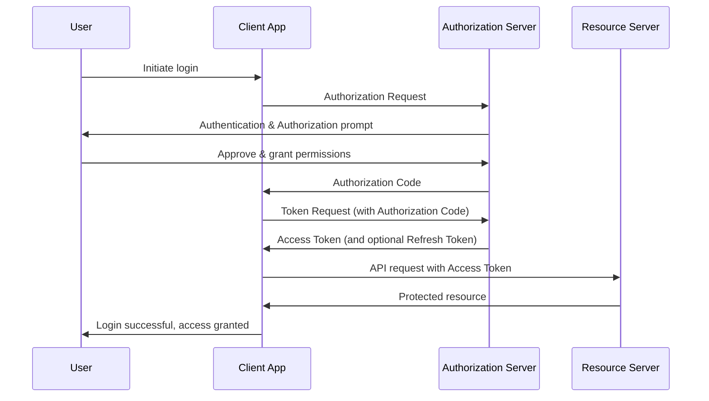

[OAuth 2](https://oauth.net/2/) is an ==[[authorization framework]]== that enables applications — such as Facebook, GitHub, and Digital Ocean — to obtain limited access to user accounts on an ==HTTP service==.
It works by ==delegating== user authentication to the ==service that hosts a user account== and ==authorizing third-party applications== to access that user account. OAuth 2 provides ==authorization flows== for web and desktop applications, as well as mobile devices.

## Introduction

![[Pasted image 20241002100258.png]]
- Third-party applications are required to store the resource owner's credentials for future use, typically a password in clear-text.
- Servers are required to support password authentication, despite the security weaknesses inherent in passwords.
- Third-party applications gain overly broad access to the resource owner's protected resources, leaving resource owners without any ability to restrict duration or access to a limited subset of resources.
- Resource owners cannot revoke access to an individual third party without revoking access to all third parties, and must do so by changing the third party's password.
- Compromise of any third-party application results in compromise of the end-user's password and all of the data protected by that password.
- 
![[Pasted image 20241002103448.png]]

## OAuth Roles

- **Resource Owner**: The resource owner is the _user_ who authorizes an _application_ to access their account. The application’s access to the user’s account is limited to the scope of the authorization granted (e.g. read or write access)
- **Client**: The client is the _application_ that wants to access the _user’s_ account. Before it may do so, it must be authorized by the user, and the authorization must be validated by the API.
- **Resource Server**: The resource server hosts the protected user accounts.
- **Authorization Server**: The authorization server verifies the identity of the _user_ then issues access tokens to the _application_.

## Abstract Protocol Flow
![[mediafolder/abstract_flow.png]]
1. The _application_ requests authorization to access service resources from the _user_
2. If the _user_ authorized the request, the _application_ receives an authorization grant
3. The _application_ requests an access token from the _authorization server_ (API) by presenting authentication of its own identity, and the authorization grant
4. If the application identity is authenticated and the authorization grant is valid, the _authorization server_ (API) issues an access token to the application. Authorization is complete.
5. The _application_ requests the resource from the _resource server_ (API) and presents the access token for authentication
6. If the access token is valid, the _resource server_ (API) serves the resource to the _application_

## Use case: Third party authentication

1. **User Initiates Login**: The user clicks a "Login with [Provider]" button in your application.
2. **Authorization Request**: Your app redirects the user to the authorization server (e.g., Google, Facebook) with a request that includes:
    - Client ID (your app's identifier)
    - Requested scope (what information/permissions you're asking for)
    - Redirect URI (where to send the user after authorization)
    - State (a random string to prevent CSRF attacks)
3. **Authentication & Authorization Prompt**: The authorization server presents a login page to the user (if not already logged in) and asks for permission to share the requested information with your app.
4. **User Grants Permission**: The user logs in (if necessary) and approves the permission request.
5. **Authorization Code Grant**: The authorization server redirects the user back to your app's specified redirect URI, including an authorization code and the state parameter.
6. **Token Request**: Your app sends a server-side request to the authorization server with:
    - The authorization code
    - Client ID and Client Secret (to authenticate your app)
    - Redirect URI (must match the original request)
7. **Access Token Issuance**: The authorization server verifies the request and responds with:
    - Access Token (used to make API calls)
    - Refresh Token (optional, used to get new access tokens)
    - Token expiration time
8. **API Request**: Your app can now make requests to the resource server (e.g., Google's APIs) using the access token for authentication.
9. **Protected Resource Access**: The resource server validates the token and responds with the requested data.
10. **User Logged In**: Your app now considers the user authenticated and can use the obtained information to create or update a user profile in your system.