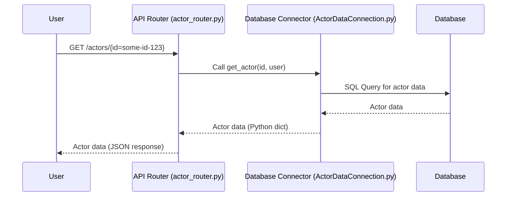

# Chapter 3: API Routers

Welcome back to the `actor-api` tutorial! In the previous chapters, we established the core building blocks of our system:
*   [Chapter 1: Actor Data Model](01_actor_data_model_.md) introduced how we structure and store information about Actors and related entities using Python models and database tables.
*   [Chapter 2: Business Logic Modules](02_business_logic_modules_.md) explained how we implement the application's "brains" – the logic that performs operations using the data model, like saving Actors, filtering lists, and coordinating tasks, often by delegating to Data Connectors and API Clients.

Now, how does the outside world actually *talk* to our `actor-api`? How do other services or users tell our system, "Hey, I need the details for Actor ID 'X'" or "Please save this new company"?

This is the job of **API Routers**.

## What are API Routers?

Imagine our `actor-api` service is like a company building. The [Business Logic Modules](02_business_logic_modules_.md) are the different departments inside that handle the actual work (like processing requests, managing data). The [Database Data Connectors](05_database_data_connectors_.md) are the filing clerks who fetch/save information in the archives (the database).

The **API Routers** are the building's **public receptionists**.

*   They are the *first* point of contact for incoming requests from outside the service.
*   They stand at the "entrances" of the service (which are specific URLs or **endpoints**).
*   They listen for different types of requests (like "get information", "send information", "delete something").
*   Based on the request's address (URL) and type (HTTP method), they figure out which internal "department" ([Business Logic Modules](02_business_logic_modules_.md) or sometimes [Database Data Connectors](05_database_data_connectors_.md) for simple tasks) should handle the request.
*   They receive the result back from the internal department and format it to send back to the client.

In the `actor-api`, API Routers are built using the **FastAPI** framework. They are Python modules located in the `src/router` directory. You'll find files like `actor_router.py`, `work_item_router.py`, and `worklist_router.py` there. Each file defines a set of related endpoints (e.g., all `/actors` endpoints are in `actor_router.py`).

## Our Use Case: Getting an Actor (from the API perspective)

Let's revisit the simple use case from Chapter 1: **Retrieving basic information about a specific Actor using their ID.**

From the perspective of someone using the API, this means making an HTTP `GET` request to a specific URL, like `/actors/{id}`.

For example, using a command-line tool like `curl`:

```bash
# Conceptual API call to get an actor by their ID
# Replace 'some-actor-id-123' with a real ID
curl http://localhost:8000/actors/some-actor-id-123
```

When this request arrives at the `actor-api` service, the API Router is the component that receives it and figures out what to do.

Here's a simplified flow focusing on the API Router's role for this specific, simple GET request (note: as seen in the provided code, very simple lookups might call the database connector directly, whereas more complex tasks always go through Business Logic):



Let's look at the code in `src/router/actor_router.py` that handles this specific endpoint.

```python
# From: src/router/actor_router.py (Simplified)
from fastapi import APIRouter, Depends
from common.entities import Actor # Import our Actor model
from common.fastapi import not_found_response, get_user
# Import objects that provide access to DB and Logic
from containers import DatabaseConnections # We'll use this to access DB connectors

# Create a router instance
router = APIRouter()
# Get a reference to the actor database connector
db = DatabaseConnections.actor_db_connection()

# ... other setup like startup/shutdown events ...

# Define the endpoint for GET requests to /actors/{id}
@router.get("/actors/{id}")
def get_actor(id: str, user: User = Depends(get_user)):
    # Call the database connector directly to get the actor data
    actor = db.get_actor(id, user)
    # If found, return it, otherwise return not found
    return Actor(**actor) if actor else not_found_response()

# ... other endpoints defined below ...
```

Let's break down this snippet:

1.  `from fastapi import APIRouter, Depends`: Imports necessary components from FastAPI. `APIRouter` is the class we use to create a router. `Depends` is used for dependency injection (more on this in [Chapter 8: Dependency Injection Container](08_dependency_injection_container_.md)), specifically here to get the authenticated user.
2.  `router = APIRouter()`: Creates an instance of the router.
3.  `db = DatabaseConnections.actor_db_connection()`: Gets an instance of the database connector for actors. This router will use this object to interact with the database for simple lookups.
4.  `@router.get("/actors/{id}")`: This is a **decorator**. It tells FastAPI that the function defined immediately below it should handle `GET` requests sent to the `/actors/{id}` path. The `{id}` part in the path means that whatever comes after `/actors/` in the URL will be captured and passed to the function.
5.  `def get_actor(id: str, user: User = Depends(get_user)):`: This defines the Python function that runs when the endpoint is called.
    *   `id: str`: This parameter matches the `{id}` in the URL path. FastAPI automatically extracts the value from the URL (like 'some-actor-id-123') and passes it here as a string.
    *   `user: User = Depends(get_user)`: This uses dependency injection to get the `User` object representing the authenticated user making the request. This is important for security and access control.
6.  `actor = db.get_actor(id, user)`: This is where the API Router delegates the actual data fetching. It calls the `get_actor` method on the `db` object (which is an instance of `ActorDataConnection`, our [Database Data Connectors](05_database_data_connectors_.md)), passing the `id` and the authenticated `user`.
7.  `return Actor(**actor) if actor else not_found_response()`: This line handles the response.
    *   If `db.get_actor` found an actor (`actor` is not None), the data returned (which is a dictionary) is used to create an instance of our `Actor` data model (`Actor(**actor)`). FastAPI automatically converts this Python object into a JSON response that's sent back to the client.
    *   If no actor was found (`actor` is None), it calls a helper function `not_found_response()` which creates a standard HTTP 404 Not Found response.

This shows the API Router receiving the request, extracting information from it (the `id`), delegating the core task (getting data from the database), and formatting the result to send back.

## Handling More Complex Tasks (Using Business Logic)

For tasks that involve more than a simple database lookup, API Routers delegate to the [Business Logic Modules](02_business_logic_modules_.md). This keeps the router code clean and ensures business rules are applied.

Let's look at the endpoint for saving a new Actor (`POST /actors`) from the same `actor_router.py`:

```python
# From: src/router/actor_router.py (Simplified)
from fastapi import APIRouter, Body, Header
# ... other imports like Actor, ActorRequest, LogicImplementation ...

router = APIRouter()
# Get a reference to the actor business logic module
actor_logic = LogicImplementation.actor_logic()

# ... setup and other endpoints ...

@router.post("/actors")
async def actors(
    actor_request: ActorRequest = Body(...),
    x_is_hashed_id: bool = Header(False),
):
    # Use the data model to convert the request body into an Actor object
    actor = Actor.from_request(actor_request)
    # Call the business logic to save the actor
    actor_response = await actor_logic.save_actor(actor, x_is_hashed_id)
    return actor_response

# ... other endpoints ...
```

Here's what's happening:

1.  `@router.post("/actors")`: This decorator maps `POST` requests to the `/actors` path to the `actors` function.
2.  `actor_request: ActorRequest = Body(...)`: This parameter tells FastAPI to expect a request body (the data being sent in the POST request). FastAPI automatically reads the JSON body, validates it against the `ActorRequest` data model (ensuring it has the expected fields and types), and provides it as a Python object.
3.  `x_is_hashed_id: bool = Header(False)`: This shows how routers can also read information from request headers.
4.  `actor = Actor.from_request(actor_request)`: Converts the incoming request data model (`ActorRequest`) into the internal `Actor` data model.
5.  `actor_response = await actor_logic.save_actor(actor, x_is_hashed_id)`: **Crucially**, the router calls `actor_logic.save_actor`. It passes the processed request data to the Business Logic layer. The API Router doesn't know *how* to save the actor (e.g., hashing IDs, saving to multiple tables, applying rules); it trusts the `actor_logic` module to handle all that complexity.
6.  `return actor_response`: The result from the business logic is returned. FastAPI converts it to JSON.

This demonstrates the more common pattern: API Router -> Business Logic -> (Data Connectors/API Clients/etc.).

You can see the same pattern in `src/router/worklist_router.py` which calls `worklist_logic` for filtering cases:

```python
# From: src/router/worklist_router.py (Simplified)
from fastapi import APIRouter, Depends
from common.entities import FilterRequest, User # Import data models
# Import object that provides access to Logic
from containers import LogicImplementation

router = APIRouter()
# Get a reference to the worklist business logic module
worklist_logic = LogicImplementation.worklist_logic()

# ... other endpoints ...

@router.post("/work-list/filter", tags=["Worklist"])
def get_cases(body: FilterRequest = None, user: User = Depends(get_user)):
    # The API Router receives the filter request...
    # ... and passes it directly to the Work List business logic
    return worklist_logic.get_case_ids_order(
        body.filters,
        body.ordering,
        body.paging,
        user,
    )

# ... other endpoints ...
```

Here, the router receives the `FilterRequest` in the body and passes the relevant parts (`filters`, `ordering`, `paging`) along with the `user` to the `worklist_logic` module's `get_case_ids_order` method. The router doesn't need to know the complex filtering or database querying details; that's the logic layer's job.

## Wiring Routers into the Main Application

Each file in `src/router/` (like `actor_router.py`, `work_item_router.py`, etc.) defines a separate `APIRouter` instance. How does the main application (`src/main.py`) know about all these endpoints?

The main application file imports each router and includes it using the `app.include_router()` method provided by FastAPI.

Look at `src/main.py`:

```python
# From: src/main.py (Simplified)
from fastapi import Depends

# ... imports for logging, config, container ...

# Import the individual routers
from router.actor_router import router as actor_router
from router.work_item_router import router as work_item_router
from router.worklist_router import router as worklist_router

# Import the main FastAPI application instance
from common.fastapi import app, validate_api_key

# Include each router into the main application instance
app.include_router(
    actor_router,
    tags=["Actors"], # Used for documentation
    responses={404: {"description": "Not found"}},
    dependencies=[Depends(validate_api_key)], # Apply API key validation to all endpoints in this router
)

app.include_router(
    worklist_router,
    tags=["Worklist"],
    responses={404: {"description": "Not found"}},
    dependencies=[Depends(validate_api_key)],
)

app.include_router(
    work_item_router,
    tags=["WorkItem"],
    responses={404: {"description": "Not found"}},
    dependencies=[Depends(validate_api_key)],
)

# ... other configuration ...
```

This snippet shows:

1.  `from router.actor_router import router as actor_router`: Imports the `router` instance defined in `actor_router.py` and gives it a local name `actor_router`.
2.  `app.include_router(actor_router, ...)`: Tells the main `app` instance to include all the endpoints defined in `actor_router`.
    *   `tags=["Actors"]`: Helps organize the auto-generated API documentation.
    *   `responses={...}`: Defines common responses for the endpoints.
    *   `dependencies=[Depends(validate_api_key)]`: Applies a dependency (`validate_api_key`) to *all* endpoints within this router, ensuring that every incoming request to an `/actors` endpoint first passes the API key validation.

By including all the individual routers, the main `app` instance becomes aware of all the defined endpoints (`/actors/...`, `/work-list/...`, `/workitems/...`, etc.) and can route incoming requests to the correct function within the corresponding router.

## Summary of API Router Responsibilities

API Routers are responsible for the external interface of the `actor-api`:

*   **Defining Endpoints:** Specifying the URLs and HTTP methods (GET, POST, DELETE, etc.) that clients can call.
*   **Mapping Requests to Functions:** Directing incoming requests to the appropriate Python function designed to handle that specific request.
*   **Extracting Request Data:** Reading information from the request path, query parameters, headers, and body.
*   **Request Validation:** Leveraging FastAPI and Pydantic to automatically validate the structure and types of incoming request data against defined data models (like `ActorRequest` or `FilterRequest`).
*   **Delegation:** Calling the relevant [Business Logic Module](02_business_logic_modules_.md) or, for very simple cases, a [Database Data Connector](05_database_data_connectors_.md) to perform the actual work.
*   **Formatting Responses:** Taking the result from the downstream layer and returning it in the correct format (usually JSON), often using the defined data models (like `Actor`) which FastAPI automatically serializes.
*   **Applying Global Dependencies:** Applying common logic like authentication (`Depends(validate_api_key)`) or user retrieval (`Depends(get_user)`) to endpoints.

API Routers should generally stay "thin". They handle the interaction with the outside world, but they delegate the core business logic and data access operations to other layers.

## Conclusion

In this chapter, we explored the concept of **API Routers**. We learned that they are the entry points for the `actor-api` service, acting like public receptionists that receive incoming HTTP requests. Using the FastAPI framework, they define endpoints and map them to specific functions. We saw how they extract data from requests and delegate the actual processing to either [Business Logic Modules](02_business_logic_modules_.md) (for complex tasks like saving or filtering) or, in some simple lookup cases seen in the code, directly to [Database Data Connectors](05_database_data_connectors_.md). Finally, we saw how these individual routers are collected and included in the main application.

Understanding API Routers is key to knowing how clients interact with the `actor-api` and how requests begin their journey through the system.

In the [next chapter](04_database_schema__flyway__.md), we'll step away from the Python code momentarily and dive into the [Database Schema (Flyway)](04_database_schema__flyway__.md), understanding how the structure of our data is managed and evolved directly in the database.

---

Generated by [AI Codebase Knowledge Builder](https://github.com/The-Pocket/Tutorial-Codebase-Knowledge)