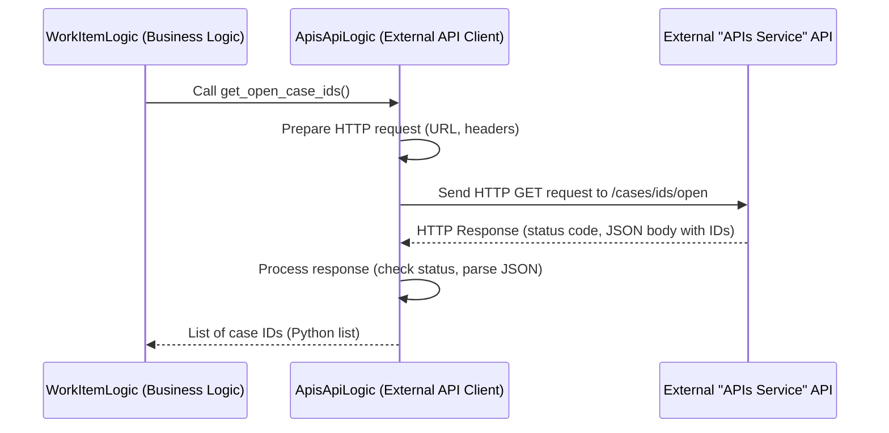

# Chapter 6: External API Clients

Welcome back to the `actor-api` tutorial! We've been building up our understanding of the core `actor-api` service:
*   [Chapter 1: Actor Data Model](01_actor_data_model_.md): Defining the structure of Actors and related data.
*   [Chapter 2: Business Logic Modules](02_business_logic_modules_.md): Implementing the application's operations and rules.
*   [Chapter 3: API Routers](03_api_routers_.md): Handling incoming requests from the outside world.
*   [Chapter 4: Database Schema (Flyway)](04_database_schema__flyway__.md): Managing the structure of our own database.
*   [Chapter 5: Database Data Connectors](05_database_data_connectors_.md): Encapsulating the logic for talking to *our* database.

So far, we've focused on what our `actor-api` does internally and how it interacts with its own database. But what happens when the `actor-api` needs information or needs to trigger an action in *another* service or an external system?

Imagine our `actor-api` needs data about cases, but that data is managed by a completely separate "Cases API" microservice. Or perhaps it needs to use a "Filtering Service" provided by another team to help process complex query criteria. Our service needs a way to securely and reliably communicate with these other systems over the network.

Just like we use [Database Data Connectors](05_database_data_connectors_.md) to hide the complexity of talking to our database, we need a similar abstraction to hide the complexity of talking to external APIs.

This is where **External API Clients** come in.

## What are External API Clients?

Think of our `actor-api` as a building. The [Business Logic Modules](02_business_logic_modules_.md) are departments inside that need information. Our database is the internal archive room, managed by [Database Data Connectors](05_database_data_connectors_.md) (the internal librarians).

External systems (like a "Cases API" or a "Filtering Service") are other buildings located elsewhere.

**External API Clients** are the **foreign language translators and liaisons**.

*   They know how to speak the "language" (HTTP requests, specific data formats like JSON) that the external API understands.
*   They handle the details of *how* to connect: knowing the external service's address (URL), adding necessary identification like API keys in headers, and handling the technical aspects of sending the request.
*   They receive the response from the external service and translate it back into a format our internal [Business Logic Modules](02_business_logic_modules_.md) can easily work with (like Python dictionaries or data model objects).

In the `actor-api`, External API Clients are typically implemented as Python classes located within the `src/logic` package (often alongside the Business Logic that uses them, or in a dedicated sub-package if there are many). You'll find classes like `ApisApiLogic.py` and `FilterApi.py` (used by `FilterLogic.py`). The `.py` suffix might seem confusing as they are technically API clients, but they reside in the `logic` package because they are often used *by* the logic layer and might perform minor data preparation before returning data. A clearer name might have been `ApisApiClient`, but the principle remains the same.

Their primary role is to provide a clean, method-based interface for other parts of our application (mainly [Business Logic Modules](02_business_logic_modules_.md)) to interact with a specific external API, without needing to know the low-level communication details.

## Our Use Case: Getting a List of Open Case IDs from an External API

Let's use a concrete example from the `actor-api` code. As we saw briefly in [Chapter 2: Business Logic Modules](02_business_logic_modules_.md), the `WorkItemLogic` module needs to find out which cases are currently "open" in an external system (let's call it the "APIs service"). It needs a list of IDs for these open cases.

This information doesn't live in the `actor-api`'s database; it lives in the external "APIs service".

The task for our `actor-api` is: **Ask the external "APIs service" for a list of all open case IDs.**

This is a perfect job for an External API Client. The client will know how to call the specific endpoint on the "APIs service" that provides this list.

The `ApisApiLogic` class in `src/logic/ApisApiLogic.py` is the client responsible for talking to this external "APIs service".

## Using the API Client: Requesting Open Case IDs

When the `WorkItemLogic` module needs the list of open case IDs, it doesn't make the raw HTTP call itself. It uses the `ApisApiLogic` client object that was provided to it.

Here's a simplified flow focusing on the API Client's role in our use case:



Let's look at how the `WorkItemLogic` calls the API client. From `src/logic/WorkItemLogic.py`:

```python
# From: src/logic/WorkItemLogic.py (Simplified!)
# ... imports and class definition ...

class WorkItemLogic:
    def __init__(self, database, work_list_database, apis_service):
        # ... data connector dependencies ...
        # The apis_service is the ApisApiLogic instance, provided via DI
        self.apis_service = apis_service

    def get_missing_case_work_items(self) -> List[WorkItemEntry]:
        # 1. Use the API Client to get data from an external service
        print("Calling external API for open case IDs...") # Added for clarity
        case_ids = self.apis_service.get_open_case_ids()
        print(f"Received {len(case_ids)} open case IDs from external API.")

        # 2. Use the Data Connector to check against our database (as seen in Chapter 5)
        missing_case_ids = self.db.get_missing_case_ids(case_ids)

        # 3. Process and return the result
        return [
            WorkItemEntry(id=case_id) for case_id in missing_case_ids
        ]

    # ... other methods ...
```

In this snippet, `WorkItemLogic` simply calls `self.apis_service.get_open_case_ids()`. It doesn't know *how* this call is made (which URL, which headers, which HTTP method). It just knows it needs the list of open case IDs, and the `apis_service` object is the translator that can get it. This keeps the `WorkItemLogic` focused on its core business task (finding *missing* work items by comparing external cases with internal ones), not on the technical details of API communication.

## Implementing the API Client: Talking to the External Service

Now, let's look inside the `ApisApiLogic` class (`src/logic/ApisApiLogic.py`) to see how it performs the actual communication with the external "APIs service".

```python
# From: src/logic/ApisApiLogic.py (Simplified!)
import requests # A popular Python library for making HTTP requests
import json
from typing import List
from config import API_KEY # Import our API key

class ApisApiLogic:
    def __init__(self, config):
        # Get the base URL for the external APIs service from configuration
        self.apis_api_url = config["apis_api_url"]
        print(f"ApisApiLogic initialized with URL: {self.apis_api_url}") # Added for clarity

    def get_open_case_ids(self) -> List[str]:
        """
        Makes a GET request to the external APIs service to get open case IDs.
        """
        # Construct the full URL for the specific endpoint
        url = f"{self.apis_api_url}/cases/ids/open"
        print(f"Making GET request to: {url}") # Added for clarity

        # Make the actual HTTP GET request using the 'requests' library
        resp = requests.get(
            url,
            headers=self.get_header(), # Include necessary headers (like API key)
        )
        print(f"Received response status code: {resp.status_code}") # Added for clarity

        # Check if the request was successful (status code 2xx).
        # If not, this raises an exception.
        resp.raise_for_status()

        # If successful, parse the JSON response body and return the Python data
        return resp.json()

    def get_header(self):
        """Helper to create headers, including the API key."""
        header = {}
        # Add the API key header required by the external service
        header["x-api-key"] = API_KEY
        return header

    # There are other methods here like get_cases_info, but simplified for tutorial.
    # def get_cases_info(self, case_ids: List[str]):
    #     resp = requests.post(
    #         f"{self.apis_api_url}/cases/info/getMany",
    #         data=json.dumps(case_ids),
    #         headers=self.get_header(),
    #     )
    #     resp.raise_for_status()
    #     return resp.json()
    # ...
```

Let's break down this simplified client code:

1.  `import requests`: This line imports the `requests` library, which is the tool commonly used in Python to make HTTP requests.
2.  `__init__(self, config)`: The constructor receives configuration, including the base URL for the external service. It stores this so other methods can use it.
3.  `get_open_case_ids(self) -> List[str]`: This is the public method that other parts of our application call. It encapsulates the entire process of getting open case IDs from the external API.
4.  `url = f"{self.apis_api_url}/cases/ids/open"`: Constructs the full URL for the specific endpoint on the external service.
5.  `headers=self.get_header()`: Calls a helper method to build the necessary HTTP headers for the request.
6.  `resp = requests.get(...)`: This is the core line that uses the `requests` library to send an HTTP `GET` request to the constructed `url`, including the defined `headers`.
7.  `resp.raise_for_status()`: This is important error handling. If the external service returns an HTTP status code indicating an error (like 400, 404, 500), this line will automatically raise a Python exception. This prevents our `WorkItemLogic` from trying to process an invalid response.
8.  `return resp.json()`: If the request was successful, the response body is assumed to be JSON. `resp.json()` parses this JSON into standard Python data structures (like dictionaries and lists), which are then returned to the calling code (`WorkItemLogic`).
9.  `get_header()`: A simple helper method to create the dictionary of headers, importantly including the `x-api-key` needed for authentication with the external service.

This code shows how `ApisApiLogic` handles the technical details of fetching data from the external "APIs service", acting as the necessary liaison.

## Other API Clients: The Filter API

Another example seen in the `containers.py` and `FilterLogic.py` code snippets is the `FilterApi` client (`src/common/logic/FilterApi.py`). This client is responsible for communicating with a separate external service (let's call it the "Filtering Service") that helps translate or validate complex filter definitions.

The `FilterLogic` module uses this `FilterApi` client:

```python
# From: src/common/logic/FilterLogic.py (Simplified!)
# ... imports ...
from common.logic import FilterApi # Import the client class

class FilterLogic:
    def __init__(self, filter_api):
        # Receives the FilterApi instance via DI
        self.filter_api = filter_api

    def map_filters(self, filters, user, context):
        """
        Uses the FilterApi client to map external filters.
        """
        # Call the method on the FilterApi client
        mapped_filters = self.filter_api.map_filters(filters, user, context)
        # Process results if needed...
        return mapped_filters

    # ... other methods ...
```

And the `FilterApi` client itself (`src/common/logic/FilterApi.py`) would contain the code to make the necessary HTTP call to the external "Filtering Service", similar to `ApisApiLogic`:

```python
# From: src/common/logic/FilterApi.py (Simplified!)
import requests
# ... imports ...
from common.entities import AdvancedFilter # Example data model for filters

class FilterApi:
    def __init__(self, config):
        # Get the URL for the external Filtering Service
        self.filter_api_url = config["filter_api_url"]

    def map_filters(self, filters, user, context):
        """
        Calls the external Filtering Service to map filters.
        """
        url = f"{self.filter_api_url}/map-filters"
        # Prepare request body (filters, user, context) and headers...
        payload = {
            "filters": [f.dict() for f in filters], # Convert models to dicts
            "user": user.dict(),
            "context": context.value,
        }
        headers = {"Content-Type": "application/json"} # Example header

        # Make the POST request
        resp = requests.post(url, data=json.dumps(payload), headers=headers)

        resp.raise_for_status() # Check for errors

        # Return the processed response
        return resp.json()

    # ... other methods ...
```

This illustrates the pattern: regardless of *which* external service it is, an API Client class encapsulates the communication logic for that specific service, providing clean methods for other parts of our application to use.

## How API Clients are Used (Dependency Injection)

Just like [Database Data Connectors](05_database_data_connectors_.md), instances of External API Client classes are provided to the [Business Logic Modules](02_business_logic_modules_.md) that need them via **Dependency Injection**. We briefly saw this in [Chapter 5](05_database_data_connectors_.md) and will cover it fully in [Chapter 8: Dependency Injection Container](08_dependency_injection_container_.md).

Recall the `src/containers.py` file:

```python
# From: src/containers.py (Simplified!)
from dependency_injector import containers, providers
from logic.ActorLogic import ActorLogic
from logic.ApisApiLogic import ApisApiLogic # Import the APIs client
from common.logic import FilterApi, FilterLogic # Import the Filter client and logic

# ... Config definition ...

class ApisApiImplementation(containers.DeclarativeContainer):
    # Defines how to create the ApisApiLogic instance
    service = providers.Factory(ApisApiLogic, config=Config.api_urls)

class FilterApiImplementation(containers.DeclarativeContainer):
    # Defines how to create the FilterApi instance
    service = providers.Factory(FilterApi, config=Config.api_urls)

class FilterLogicImplementation(containers.DeclarativeContainer):
    # Defines how to create the FilterLogic instance
    filter_logic = providers.Factory(
        FilterLogic,
        # FilterLogic receives the FilterApi client instance
        filter_api=FilterApiImplementation.service
    )

class LogicImplementation(containers.DeclarativeContainer):
    actor_logic = providers.Factory(
        ActorLogic,
        # ... other dependencies ...
        # ActorLogic receives the ApisApiLogic instance
        apis_service=ApisApiImplementation.service,
        # ... database dependencies ...
    )

    # ... WorklistLogic and WorkItemLogic definitions ...

    work_item_logic = providers.Factory(
        WorkItemLogic,
        # ... database dependencies ...
        # WorkItemLogic receives the ApisApiLogic instance
        apis_service=ApisApiImplementation.service,
    )
```

This shows how the `ApisApiImplementation` and `FilterApiImplementation` containers are set up to create instances of the respective API clients. Then, `LogicImplementation` is configured to pass these `service` instances (the API clients) to the `__init__` methods of `ActorLogic`, `FilterLogic`, and `WorkItemLogic` when they are created. This is how the Logic modules get the "translators" they need to talk to external services.

## Summary of External API Client Responsibilities

External API Clients are responsible for:

*   **Encapsulating External Communication:** Hiding the technical details of making HTTP requests (using libraries like `requests`).
*   **Knowing External Endpoint Details:** Storing the base URL and specific paths for the external service's endpoints.
*   **Handling Request Details:** Setting appropriate HTTP methods (GET, POST, etc.), adding headers (like API keys for authentication), and formatting request bodies (e.g., to JSON).
*   **Sending Requests:** Executing the actual request to the external service.
*   **Processing Responses:** Checking the response status code, handling errors (`raise_for_status`), and parsing the response body (e.g., from JSON).
*   **Abstracting External Service:** Providing a simple Python method interface so that [Business Logic Modules](02_business_logic_modules_.md) can request data or actions from the external service without needing to know the underlying API technicalities.

They are the layer that connects our `actor-api` to the wider ecosystem of microservices and external systems it needs to interact with.

## Conclusion

In this chapter, we've explored the concept of **External API Clients**. We learned that they are Python classes, often located in the `src/logic` package, that act as translators and liaisons, encapsulating the technical details of communicating with external APIs. We saw how a [Business Logic Module](02_business_logic_modules_.md) like `WorkItemLogic` uses an API Client (`ApisApiLogic`) to get data from an external "APIs service" without dealing with the low-level HTTP calls. We also saw simplified examples of the client code itself, demonstrating how it uses libraries like `requests` to make the actual requests, handle headers (like API keys), check for errors, and process responses. Finally, we touched upon how these clients, like [Database Data Connectors](05_database_data_connectors_.md), are provided to the modules that need them via Dependency Injection.

Understanding External API Clients is key to understanding how the `actor-api` integrates with other parts of the system landscape.

In the [next chapter](07_work_item_feature_.md), we'll combine several of the concepts we've learned to explore a specific feature of the `actor-api`: the [Work Item Feature](07_work_item_feature_.md).

---

Generated by [AI Codebase Knowledge Builder](https://github.com/The-Pocket/Tutorial-Codebase-Knowledge)