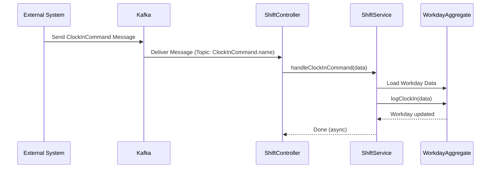

;# Chapter 1: Command Handling (Controllers & Commands)

Welcome to the `assignment.cmd.api` tutorial! This is the first chapter, and we'll start with the basics: how does our application know *what* it needs to do?

Imagine you're building an app for delivery drivers. A driver needs to tell the app, "Hey, I'm starting my shift now!" or "I just accepted this delivery assignment." How does the app receive and understand these instructions? That's where **Command Handling** comes in.

## What's the Goal? Receiving Instructions

Our application needs a way to react to requests that *change* something. These requests could be:

*   A driver clocking in.
*   A driver accepting an assignment.
*   An administrator creating a new workday schedule.

These actions all represent an *intent* to change the state of the system. In our project, we call these intentions **Commands**.

## Key Concepts: Commands and Controllers

Let's break down the main parts involved:

1.  **Commands:**
    *   Think of a Command as a specific, detailed instruction or request. It's like filling out an order form: it contains all the necessary information for one particular action.
    *   Examples: `ClockInCommand`, `AcceptAssignmentCommand`, `CreateWorkdayCommand`.
    *   Each command is a data package, often represented as a class or object.
    *   In our system, these commands travel as messages using a system called **Kafka**. Think of Kafka as a super-efficient postal service for our application messages.

2.  **Controllers:**
    *   Controllers act like specialized receptionists or mail sorters. Each controller is responsible for a specific area (like shifts or assignments).
    *   They listen on specific Kafka "channels" (called topics) for particular command messages.
    *   Examples: `ShiftController` listens for commands related to driver shifts (like `ClockInCommand`), while `AssignmentController` listens for commands about assignments (like `AcceptAssignmentCommand`).
    *   When a controller receives a command it's waiting for, it does a quick check (validation) and then passes the instruction to the correct department (the **Service**) to handle the actual work.

## How It Works: The Flow of a Command

Let's trace the journey of a `ClockInCommand` as an example:

1.  **Someone Sends the Command:** An external part of the system (like a driver's mobile app via another service) decides the driver needs to clock in. It packages the necessary details (driver ID, timestamp) into a `ClockInCommand` message.
2.  **Kafka Delivers:** This `ClockInCommand` message is sent to a specific Kafka topic (think of it as a dedicated mailbox named "ClockInCommand").
3.  **Controller Listens:** Our `assignment.cmd.api` application is running, and the `ShiftController` is actively listening to the "ClockInCommand" Kafka topic.
4.  **Controller Receives:** The `ShiftController` sees the new message. It knows this message type (`ClockInCommand`).
5.  **Controller Delegates:** The `ShiftController` takes the data from the command message and calls the appropriate function in the `ShiftService`, saying, "Please handle this clock-in request."
6.  **Service Orchestrates:** The `ShiftService` receives the command details. It knows that clocking in involves the [Workday/Shift Aggregate](03_workday_shift_aggregate_.md). It fetches the relevant Workday/Shift information.
7.  **Aggregate Executes:** The `ShiftService` tells the specific [Workday/Shift Aggregate](03_workday_shift_aggregate_.md) object, "Perform the clock-in action using these details." The Aggregate contains the core logic to actually update the driver's shift status. (We'll learn more about Aggregates soon!)

Here's a simplified view of that flow:



## Looking at the Code

Let's see how this looks in our actual project files. Don't worry if it looks complex at first; we'll focus on the key parts.

**1. Setting up Kafka Listening (`src/main.ts`)**

Before any controller can listen, the application needs to connect to Kafka.

```typescript
// src/main.ts
import { NestFactory } from '@nestjs/core';
import { MicroserviceOptions, Transport } from '@nestjs/microservices';
import { AppModule } from './app.module';
import config from 'src/config';

async function bootstrap() {
  const app = await NestFactory.create(AppModule);

  // Tell the app to also listen for Kafka messages
  app.connectMicroservice<MicroserviceOptions>({
    transport: Transport.KAFKA, // Use Kafka protocol
    options: config.kafkaSettings.server, // Connection details
  });

  // ... other setup ...

  await app.startAllMicroservicesAsync(); // Start listening to Kafka
  await app.listen(config.http.port); // Also start the regular web server part
}
bootstrap();
```

*   **Explanation:** This code tells our NestJS application (a framework for building apps like this) to connect to Kafka using the settings provided in `config`. The `startAllMicroservicesAsync()` call is what actually starts the listening process.

**2. The Controller Listening (`src/shift/shift.controller.ts`)**

This controller handles commands related to shifts.

```typescript
// src/shift/shift.controller.ts
import { Controller } from '@nestjs/common';
import { MessagePattern, Payload } from '@nestjs/microservices';
import { ClockInCommand } from '@haulapp/microservice.core/dist/assignment';
import { ShiftService } from './shift.service';
// ... other imports

@Controller() // Marks this class as a controller
export class ShiftController {
  constructor(private readonly shiftService: ShiftService) {} // Get access to ShiftService

  // Listen for messages named 'ClockInCommand' on Kafka
  @MessagePattern(ClockInCommand.name)
  onClockInCommand(@Payload() message: IKafkaMessage<ClockInCommand>) {
    // Extract the actual command data from the Kafka message
    const commandData = message.value;
    
    // Pass the command data to the service
    this.shiftService
      .handleClockInCommand(commandData)
      .catch(/* Basic error handling */); 
  }

  // ... methods for other commands like AddStopCommand, ClockOutCommand ...
}
```

*   **Explanation:**
    *   `@Controller()`: Basic NestJS setup, tells the framework this class handles incoming requests (in this case, Kafka messages).
    *   `@MessagePattern(ClockInCommand.name)`: This is the magic! It tells NestJS: "When a message arrives on the Kafka topic named `ClockInCommand`, run this `onClockInCommand` method."
    *   `@Payload()`: This extracts the content (the *payload*) of the Kafka message. Our `message` variable holds the full Kafka message wrapper, and `message.value` contains the actual `ClockInCommand` data we need.
    *   `this.shiftService.handleClockInCommand(commandData)`: The controller simply passes the relevant data (`commandData`) to the `ShiftService` to do the real work.

**3. The Service Handling the Command (`src/shift/shift.service.ts`)**

The service takes the command data and uses the domain logic (Aggregates) to execute it.

```typescript
// src/shift/shift.service.ts
import { Injectable } from '@nestjs/common';
import { ClockInCommand } from '@haulapp/microservice.core/dist/assignment';
import { WorkdayRepository } from './repositories';
// ... other imports

@Injectable() // Marks this class as a service
export class ShiftService {
  constructor(
    private readonly workDayRepository: WorkdayRepository, // Get access to data storage
  ) {}

  async handleClockInCommand(command: ClockInCommand) {
    // Generate a unique ID if needed (details depend on command)
    const id = /* ... generate or get ID ... */; 

    // Load the relevant 'Workday' object using its repository
    const workDay = await this.workDayRepository.rehydrate(id); 

    // Tell the Workday object to perform the 'clock in' action
    workDay.logClockIn(command);

    // Save the changes (we'll cover this in Chapter 5)
    workDay.commit();
  }

  // ... methods for handling other commands ...
}
```

*   **Explanation:**
    *   `@Injectable()`: Standard NestJS way to say this class can be "injected" (provided automatically) where needed, like in the `ShiftController`.
    *   `constructor(private readonly workDayRepository: WorkdayRepository)`: The service gets access to the `WorkdayRepository`, which is responsible for loading and saving `Workday` data (more on this in [Event Sourcing & Repositories](05_event_sourcing___repositories_.md)).
    *   `workDayRepository.rehydrate(id)`: This fetches the current state of the specific `Workday` we need to modify.
    *   `workDay.logClockIn(command)`: This is where the core logic happens! The service tells the `Workday` object (which represents the actual shift data and rules – our [Workday/Shift Aggregate](03_workday_shift_aggregate_.md)) to execute the clock-in operation using the data from the `command`.
    *   `workDay.commit()`: This saves the changes made to the `Workday` object.

## Conclusion

You've just learned the fundamentals of how our `assignment.cmd.api` application receives and starts processing instructions!

*   **Commands** are specific requests to change something (like `ClockInCommand`).
*   They arrive as **Kafka** messages.
*   **Controllers** (`ShiftController`, `AssignmentController`) act as receptionists, listening on Kafka topics for specific commands.
*   Controllers validate and pass the command data to **Services** (`ShiftService`, `AssignmentService`).
*   Services orchestrate the process, using **Aggregates** (like `WorkdayAggregate` or `AssignmentAggregate`) to perform the actual state changes.

This Command -> Controller -> Service -> Aggregate pattern is central to how this application works.

In the next chapter, we'll dive deeper into one of the core components that actually *does* the work: the [Assignment Aggregate](02_assignment_aggregate_.md).

---

Generated by [AI Codebase Knowledge Builder](https://github.com/The-Pocket/Tutorial-Codebase-Knowledge)