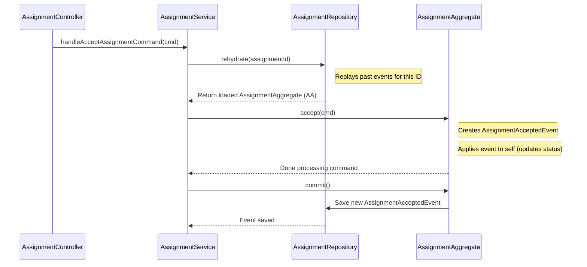

# Chapter 2: Assignment Aggregate

Welcome back! In [Chapter 1: Command Handling (Controllers & Commands)](01_command_handling__controllers___commands__.md), we saw how our application receives instructions (Commands) like `AcceptAssignmentCommand` and passes them to a Service (`AssignmentService`). But what actually *manages* the details and history of a specific driver assignment? That's the job of the **Assignment Aggregate**.

## What's the Goal? Tracking a Single Assignment's Story

Imagine a single delivery job assigned to a driver. This job goes through various stages:

1.  It's **requested** (maybe by an automated system).
2.  The driver **accepts** it.
3.  Maybe an **interview** is scheduled (if it's a complex job).
4.  It gets **approved** by an admin.
5.  Eventually, it's completed or maybe **canceled**.

We need a way to keep track of *all* the information and the *entire history* for this *one specific assignment*. We don't want the details of Assignment #123 getting mixed up with Assignment #456.

This is where the **Assignment Aggregate** comes in. Think of it like a dedicated digital folder for one single assignment.

## Key Concepts: Aggregates and Event Sourcing

Let's break down what makes the Assignment Aggregate special:

1.  **Aggregate:**
    *   An Aggregate is a cluster of related objects treated as a single unit. In our case, the `AssignmentAggregate` represents *everything* about one assignment – its ID, driver ID, order ID, current status (e.g., 'ACCEPTED'), payment details, schedule, etc.
    *   **Analogy:** It's like a physical folder for a specific project. Everything related to that project (notes, forms, approvals) goes inside that *one* folder. You handle the folder as a whole.
    *   It ensures consistency. Changes to the assignment happen *through* the Aggregate, making sure all related information stays correct and follows the rules (e.g., you can't 'approve' an assignment that was already 'canceled').

2.  **Event Sourcing:**
    *   This is how the Aggregate remembers its history and determines its current state. Instead of just storing the *final* status (like a file showing 'Status: Approved'), it stores a *list of things that happened* over time.
    *   These "things that happened" are called **Events**. Examples: `AssignmentRequestedEvent`, `AssignmentAcceptedEvent`, `AssignmentApprovedEvent`, `AssignmentCanceledEvent`.
    *   **Analogy:** Think about baking a cake. Instead of just having a photo of the finished cake (the final state), Event Sourcing is like keeping the *entire recipe* (the sequence of events): "1. Mixed ingredients (event). 2. Poured into pan (event). 3. Baked for 30 mins (event). 4. Cake ready (event)." To know the cake is ready, you "replay" the recipe steps.
    *   **Benefit:** This gives us a perfect audit trail! We know exactly *how* an assignment reached its current state, step-by-step.

So, the `AssignmentAggregate` is a "digital folder" for one assignment, and it uses "recipe steps" (Events) to track its history and figure out its current status.

## How It Works: Changing an Assignment's State

Let's revisit the flow from Chapter 1, focusing on what happens *after* the `AssignmentService` receives a command, for example, `AcceptAssignmentCommand`:

1.  **Command Received:** The `AssignmentController` gets an `AcceptAssignmentCommand` via Kafka and passes it to the `AssignmentService`.
2.  **Service Loads the Aggregate:** The `AssignmentService` needs the specific "digital folder" (the `AssignmentAggregate`) for the assignment being accepted. It asks the [Event Sourcing & Repositories](05_event_sourcing___repositories_.md) system (specifically, `AssignmentRepository`) to load it using the assignment's unique ID. The repository rebuilds the aggregate's current state by replaying its past events.
3.  **Service Tells Aggregate to Act:** The `AssignmentService` calls a method on the loaded `AssignmentAggregate` object, like `assignment.accept(commandData)`.
4.  **Aggregate Creates an Event:** Inside the `accept` method, the `AssignmentAggregate` checks if accepting is valid (e.g., is the assignment already canceled?). If valid, it creates a *new* event, like `AssignmentAcceptedEvent`, containing the details of the acceptance (who accepted it, when, etc.).
5.  **Aggregate Updates Itself:** The Aggregate immediately uses this new event to update its own state (e.g., sets its `status` property to `ACCEPTED`). This happens internally by calling a method like `onAssignmentAcceptedEvent`.
6.  **Service Saves the Changes:** The `AssignmentService` tells the Aggregate to `commit()` its changes. This signals the [Event Sourcing & Repositories](05_event_sourcing___repositories_.md) system (`AssignmentRepository`) to save the *new event* (`AssignmentAcceptedEvent`) to the database (the event store). The Aggregate's state itself isn't saved directly; only the event is added to the history.

Here's a simplified view:



## Looking at the Code

Let's peek at the relevant parts.

**1. Service Using the Aggregate (`src/assignment/assignment.service.ts`)**

This service method handles the `AcceptAssignmentCommand`.

```typescript
// src/assignment/assignment.service.ts
import { AssignmentRepository } from './repositories';
import { AssignmentAggregate } from './models';
import { AcceptAssignmentCommand } from '@...'; // Shortened import

@Injectable()
export class AssignmentService {
  constructor(
    private readonly assignmentRepository: AssignmentRepository,
    // ... other dependencies
  ) {}

  async handleAcceptAssignmentCommand(command: AcceptAssignmentCommand) {
    // 1. Load the specific AssignmentAggregate
    const assignment = await this.assignmentRepository.rehydrate(command.id);
    if (!assignment) {
      throw new Error('Assignment not found!'); // Handle error
    }

    // 2. Tell the Aggregate to perform the action
    assignment.accept(command); // Pass the command details

    // 3. Save the new event(s) generated by the Aggregate
    assignment.commit();
  }
  // ... other command handlers
}
```

*   **Explanation:**
    *   `assignmentRepository.rehydrate(command.id)`: Loads the `AssignmentAggregate` by its ID. This uses [Event Sourcing & Repositories](05_event_sourcing___repositories_.md) behind the scenes.
    *   `assignment.accept(command)`: Calls the `accept` method *on the aggregate object itself*. This is where the core logic and rule checks happen.
    *   `assignment.commit()`: Tells the repository to save any new [Events](04_event_handling__events___handlers__.md) that were generated inside the `accept` method.

**2. Aggregate Handling the Action (`src/assignment/models/assignment.model.ts`)**

This is inside the `AssignmentAggregate` class.

```typescript
// src/assignment/models/assignment.model.ts
import { StorableAggregateRoot } from '@haulapp/event-sourcing';
import { AssignmentAcceptedEvent } from '@...'; // Shortened import
import { AcceptAssignmentCommand } from '@...'; // Shortened import

export class AssignmentAggregate extends StorableAggregateRoot /* ... */ {
  // ... properties like id, status, driverId ...

  // Method called by the Service
  accept(command: AcceptAssignmentCommand): AssignmentAggregate {
    // Maybe add checks here: Is the status currently 'REQUESTED'?
    // ...

    // 1. Create the Event describing what happened
    const event = new AssignmentAcceptedEvent(
      this.id,
      command.status, // e.g., 'ACCEPTED'
      command.paymentType,
      // ... other details from the command ...
      command.updatedAt,
      command.updatedBy,
      command.note,
    );

    // 2. Record the event internally (triggers state change)
    this.apply(event);

    return this; // Return self for chaining if needed
  }

  // Internal handler that updates state based on the event
  onAssignmentAcceptedEvent(event: AssignmentAcceptedEvent) {
    this.status = event.status; // Update the status property
    this.paymentType = event.paymentType;
    this.rate = event.rate;
    // ... update other relevant properties ...
    this.updatedAt = event.updatedAt;
    this.updatedBy = event.updatedBy;
    this.note = event.note;
  }

  // ... other methods like request(), cancel(), approve() ...
  // ... other event handlers like onAssignmentCanceledEvent() ...
}
```

*   **Explanation:**
    *   `accept(command)`: This method takes the `AcceptAssignmentCommand` data. It's responsible for the business logic (e.g., checking if the assignment *can* be accepted).
    *   `new AssignmentAcceptedEvent(...)`: It creates a new event object containing all the relevant details about *this specific* acceptance action.
    *   `this.apply(event)`: This is the crucial part for Event Sourcing. It does two things:
        1.  It adds the `event` to a temporary list of "new events" that need to be saved (`commit()` later saves these).
        2.  It calls the corresponding internal handler method (based on naming convention: `on` + EventName), in this case `onAssignmentAcceptedEvent(event)`.
    *   `onAssignmentAcceptedEvent(event)`: This method *actually changes* the aggregate's current state in memory (like setting `this.status`). It only uses information from the `event` object.

## Conclusion

You've now learned about the **Assignment Aggregate**, a core concept in our system!

*   It acts like a **digital folder** for a single assignment, keeping all its details together.
*   It enforces **rules** and **consistency** for that assignment.
*   It uses **Event Sourcing**: its state is determined by replaying a history of **Events** (`AssignmentRequestedEvent`, `AssignmentAcceptedEvent`, etc.). This provides a full **audit trail**.
*   Services (like `AssignmentService`) load the Aggregate, tell it to perform actions (like `accept()`), and then `commit()` the resulting new Events.

The `AssignmentAggregate` focuses purely on driver assignments for orders. What about tracking a driver's general work time, like when they clock in or out for the day? That's handled by a different aggregate.

In the next chapter, we'll explore its counterpart: the [Workday/Shift Aggregate](03_workday_shift_aggregate_.md).

---

Generated by [AI Codebase Knowledge Builder](https://github.com/The-Pocket/Tutorial-Codebase-Knowledge)