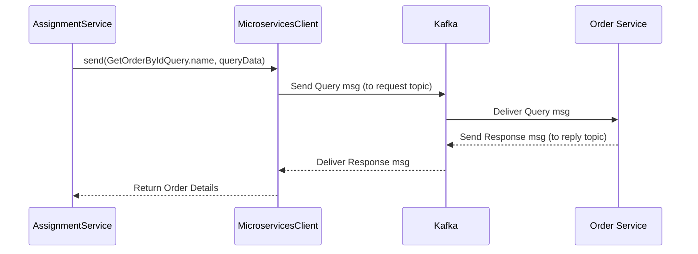
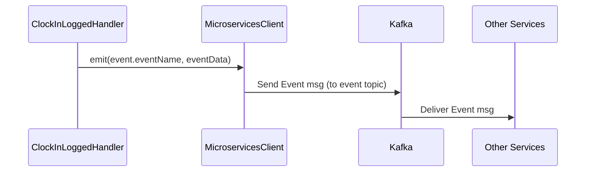

# Chapter 6: Kafka Client (MicroservicesClient)

In the previous chapter, [Event Sourcing & Repositories](05_event_sourcing___repositories_.md), we learned how our application saves the history of Assignments and Workdays by storing events. We also saw in [Event Handling (Events & Handlers)](04_event_handling__events___handlers__.md) that sometimes, after an event happens, we need to tell *other* parts of our larger system about it.

But how does our `assignment.cmd.api` service actually talk to these *other* services? For example, when a driver accepts an assignment, we might need information about the associated Order, which is managed by a completely different service (like an `order` service). Or, when a driver clocks in, we might need to announce this `ClockInLoggedEvent` so other services (like a dashboard or payroll service) can react.

This is where the **Kafka Client (MicroservicesClient)** comes in. It's our application's dedicated tool for sending messages *out* to other services using **Kafka**.

## What's the Goal? Talking to Other Services

Think of our whole application landscape as a company with different departments (microservices). `assignment.cmd.api` is one department, handling driver assignments and shifts. The `order` service is another department, handling order details.

Sometimes, our `assignment.cmd.api` department needs to:

1.  **Ask for Information:** "Hey, Order Department, can you give me the details for Order #XYZ?" (This is like sending a **Query**).
2.  **Send an Announcement:** "Hey everyone, just letting you know Driver Sarah clocked in!" (This is like publishing an **Event**).

The `MicroservicesClient` is like our department's specialized **outbound mailroom**. It knows how to package these requests or announcements and send them through the company's internal postal system (Kafka) to the right destination.

## Key Concepts: Our Outbound Mailroom

1.  **Kafka:** As we've seen before, Kafka is the high-speed messaging system, like a reliable postal service, that connects our different microservices. Messages are sent to specific "addresses" called **topics**.

2.  **MicroservicesClient:**
    *   This is a specific component within `assignment.cmd.api` that simplifies sending messages *out* via Kafka.
    *   It hides the complicated details of connecting to Kafka, formatting messages correctly, and sometimes waiting for replies.
    *   **Analogy:** Instead of figuring out postage, addressing, and delivery tracking yourself, you just give your message to the mailroom (`MicroservicesClient`), tell them where it's going (the Kafka topic/message name), and they handle the rest.

3.  **Two Main Ways to Send:**
    *   **`send()` (Request/Response):** Use this when you need to ask another service for specific information and *wait for an answer*. You send a message (often a **Query**, like `GetOrderByIdQuery`) and expect a response message back with the data.
        *   **Analogy:** Sending a registered letter that requires a signed receipt (the response).
    *   **`emit()` (Fire-and-Forget):** Use this when you just need to announce that something happened (an **Event**, like `ClockInLoggedEvent`) and you *don't need a direct reply*. You send the message out, and whoever is interested can listen.
        *   **Analogy:** Sending out a company-wide memo or announcement. You don't expect everyone to reply back to you directly.

## How It Works: Asking for Order Details

Let's say our `AssignmentService` is handling a `RequestAssignmentCommand`. To do its job properly, it needs details about the order associated with the assignment. These details live in the separate `order` service.

1.  **Need Information:** The `AssignmentService` realizes it needs data for `orderId`.
2.  **Prepare Query:** It creates a `GetOrderByIdQuery` message, containing the `orderId`.
3.  **Use the Client:** It uses the `MicroservicesClient`'s `send()` method, giving it the query message and specifying the "address" (the message name, `GetOrderByIdQuery.name`, which corresponds to a Kafka topic).
4.  **Client Sends & Waits:** The `MicroservicesClient` sends the query message to the appropriate Kafka topic that the `order` service is listening on. It then waits for a response message to come back on a specific reply topic.
5.  **Order Service Responds:** The `order` service receives the query, fetches the order details, and sends a response message back via Kafka.
6.  **Client Receives & Returns:** The `MicroservicesClient` receives the response and gives the order details back to the `AssignmentService`.



## How It Works: Announcing a Clock-In

Now, let's look at the `ClockInLoggedHandler` from [Chapter 4: Event Handling (Events & Handlers)](04_event_handling__events___handlers__.md). After saving a snapshot, it needs to tell other services about the `ClockInLoggedEvent`.

1.  **Event Occurs:** The handler receives the `ClockInLoggedEvent`.
2.  **Use the Client:** It uses the `MicroservicesClient`'s `emit()` method, giving it the event object and its name (`event.eventName`) as the topic.
3.  **Client Sends:** The `MicroservicesClient` sends the `ClockInLoggedEvent` message to the corresponding Kafka topic. It *doesn't* wait for any reply.
4.  **Others Listen:** Any other microservices interested in driver clock-ins (like dashboards, payroll) are listening to that Kafka topic and will receive the message.



## Looking at the Code: The Client Itself

Let's peek inside the `MicroservicesClient`. Don't worry about the details; focus on the main parts.

**`src/kafka-clients/microservices/microservices-client.service.ts`**

```typescript
import { Client, ClientKafka, Transport } from '@nestjs/microservices';
import { Injectable, OnModuleInit } from '@nestjs/common';
// ... other imports ...
import config from '../../config'; // Where Kafka settings are stored

@Injectable()
export class MicroservicesClient implements OnModuleInit /* ... */ {
  // Decorator sets up the connection to Kafka using config settings
  @Client({
    transport: Transport.KAFKA,
    options: config.kafkaSettings.client,
  })
  client: ClientKafka; // The actual Kafka client object

  async onModuleInit() {
    // For 'send()', tell Kafka which topics we expect replies on
    const queries = [ GetOrderByIdQuery.name, /* ... other queries */ ];
    queries.forEach((query: string) =>
      this.client.subscribeToResponseOf(query),
    );
    await this.client.connect(); // Connect when the app starts
  }

  // Method for Request/Response (Query)
  send<R>(pattern: string, data: any): Promise<R> {
    // 'pattern' is the message name / topic
    // 'data' is the message payload (e.g., the Query object)
    return this.client.send(pattern, data).toPromise(); // Send and wait for reply
  }

  // Method for Fire-and-Forget (Event)
  emit(pattern: string, data: any) /* ... */ {
    // 'pattern' is the event name / topic
    // 'data' is the event payload
    return this.client.emit(pattern, data); // Send and don't wait
  }
}
```

*   **Explanation:**
    *   `@Client`: Sets up the connection using settings from our [Configuration Management](07_configuration_management_.md).
    *   `onModuleInit`: When the application starts, it connects to Kafka and subscribes to *response* topics for any queries it might send using `send()`. This is how it knows where to listen for the answers.
    *   `send(pattern, data)`: Takes the message name (`pattern`) and data, uses the underlying Kafka client's `send` method, and converts the result (which is initially an Observable) into a Promise, making it easier to `await` the response.
    *   `emit(pattern, data)`: Takes the event name (`pattern`) and data, and uses the underlying Kafka client's `emit` method. This just sends the message out.

## Looking at the Code: Using the Client

Now let's see how other parts of the code use this client.

**1. Using `send()` in `AssignmentService`**

```typescript
// src/assignment/assignment.service.ts
// ... imports ...
import { MicroservicesClient } from '../kafka-clients';
import { GetOrderByIdQuery, FleetOrder } from '@...';

@Injectable()
export class AssignmentService {
  constructor(
    // ... other dependencies ...
    // Client is injected, might be named based on purpose
    private readonly orderQueryApiClient: MicroservicesClient,
  ) {}

  async handleRequestAssignmentCommand(command: RequestAssignmentCommand) {
    // ... other logic ...
    // Ask the order service for order details using send()
    const order = await this.orderQueryApiClient.send<FleetOrder>(
      GetOrderByIdQuery.name, // Message name (topic)
      new GetOrderByIdQuery(command.orderId) // Query data
    );
    // Now 'order' contains the FleetOrder details or null/error

    if (!order) { /* ... handle error ... */ }
    // ... use the order details ...
    assignment.request(command, /* ... paymentInfo from order ... */).commit();
  }
  // ... other methods ...
}
```

*   **Explanation:** The `AssignmentService` gets the `MicroservicesClient` injected (here named `orderQueryApiClient` for clarity). It calls `send()`, passing the query name and the query object. It uses `await` to pause until the response (`FleetOrder` details) comes back from the other service via Kafka.

**2. Using `emit()` in `ClockInLoggedHandler`**

```typescript
// src/shift/events/clock-In-logged.handler.ts
import { EventsHandler, IEventHandler } from '@nestjs/cqrs';
import { ClockInLoggedEvent } from '@...';
import { MicroservicesClient } from '../../kafka-clients';
// ... other imports ...

@EventsHandler(ClockInLoggedEvent)
export class ClockInLoggedHandler implements IEventHandler<ClockInLoggedEvent> {
  constructor(
    private readonly microservicesClient: MicroservicesClient,
    // ... other dependencies ...
  ) {}

  async handle(event: ClockInLoggedEvent) {
    // ... first, maybe store snapshot ...
    await this.workdayRepository.storeSnapshot(event.id);

    // Announce the event to other services using emit()
    this.microservicesClient.emit(
      event.eventName, // Event name (topic)
      event // Event data
    );
    // No 'await' needed, we don't wait for a reply
  }
}
```

*   **Explanation:** The `ClockInLoggedHandler` also gets the `MicroservicesClient` injected. It calls `emit()`, passing the event name and the event object. This sends the event out via Kafka for any interested listeners. The handler doesn't wait; it continues immediately after emitting.

## Conclusion

You've now learned about the **Kafka Client (`MicroservicesClient`)**, our application's tool for outbound communication!

*   It acts as the **outbound mailroom**, handling communication *to* other microservices via **Kafka**.
*   It simplifies sending messages, hiding Kafka connection details.
*   Use `send()` for **request/response** interactions (like Queries) where you need an answer back.
*   Use `emit()` for **fire-and-forget** announcements (like Events) where you don't need a direct reply.
*   Services (like `AssignmentService`) and Event Handlers (like `ClockInLoggedHandler`) use this client to integrate `assignment.cmd.api` with the wider system.

We mentioned that the Kafka connection details (like server addresses) come from `config`. How does our application manage settings like these?

In the next chapter, we'll explore [Configuration Management](07_configuration_management_.md) to see how the application loads and uses its settings.

---

Generated by [AI Codebase Knowledge Builder](https://github.com/The-Pocket/Tutorial-Codebase-Knowledge)