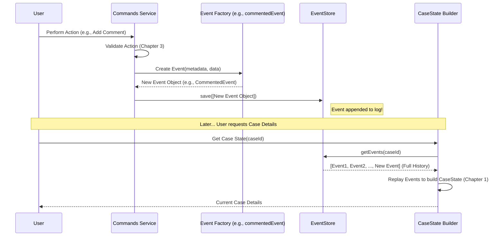

# Chapter 4: Events & Event Sourcing

In the [previous chapter](03_command_validations___validations_ts___.md), we saw how `validations.ts` acts like a security guard, stopping invalid actions *before* they can cause problems. But what happens when an action *is* valid? How does the system remember that something actually occurred?

Imagine trying to understand the history of a complex SAR case – why was a specific decision made? Who added that comment? When was this actor linked? If we only stored the *current* state, answering these questions would be difficult, maybe even impossible!

**Events and Event Sourcing solve the problem of needing a reliable, complete history of everything significant that has ever happened to a case.** It ensures we never lose information about the past.

## What's an "Event"? A Fact That Happened

Think of an **Event** as a small, unchangeable record describing something important that occurred in the system at a specific point in time. It's like an entry in a ship's logbook or a transaction in a financial ledger.

*   **Fact:** It represents something that *definitely* happened.
*   **Immutable:** Once an event is recorded, it *cannot be changed or deleted*. It's history.
*   **Specific:** Events describe distinct occurrences, like:
    *   `CaseCreatedEvent`: A new SAR case was officially opened.
    *   `CommentedEvent`: A user added a comment.
    *   `ActorAddedEvent`: An actor (person/entity) was linked to the case.
    *   `ActionPerformedEvent`: A user completed a step in the investigation workflow.
    *   `NarrativeUpdatedEvent`: A summary text (like the detection narrative) was changed.

Each event contains:
1.  **Name:** What kind of event was it? (e.g., `EventName.COMMENTED`)
2.  **Data:** What were the specific details? (e.g., the text of the comment, who added it, which part of the case it refers to)
3.  **Metadata:** Contextual information like the case ID (`aggregateId`), who performed the action (`userId`), when it happened (`timestamp`), the user's IP address, etc.

Here’s a simplified idea of what an event looks like in code:

```typescript
// Simplified concept from src/interfaces/IEvent.ts
interface IEvent {
  // Metadata
  aggregateId: string; // Which case does this belong to?
  userId?: string;    // Who caused this event?
  timestamp?: Date;   // When did it happen?
  causationId: string; // Unique ID for the operation causing this

  // Event Details
  name: string; // e.g., "COMMENTED", "ACTOR_ADDED" (from EventName enum)
  data: object; // Specific details for this event type
  currentVersion?: number; // Sequence number for this case
}
```
This structure helps ensure every recorded event has the necessary context and details.

## What's "Event Sourcing"? History IS the Data!

**Event Sourcing** is the core idea behind how we use these events. Instead of storing the *current state* of a case directly in a database table that gets updated, we **only store the sequence of events** that have happened to that case.

Think about your bank account:
*   **Traditional way (not Event Sourcing):** The bank database has a single row for your account with your *current balance*. When you deposit money, the database *updates* that balance value. The history might be stored somewhere else, or maybe not at all.
*   **Event Sourcing way:** The bank database *only stores transactions* (events): "Deposit $100", "Withdraw $20", "Deposit $50". Your current balance isn't stored directly; it's *calculated* by starting at zero and applying every single transaction in order.

In `sar-service-commands`:
*   We don't have a big database table representing the *current* `CaseState`.
*   Instead, we have the **`EventStore`**: a specialized storage (like a database table acting as a log) that just records every single event (`CaseCreatedEvent`, `CommentedEvent`, etc.) in the order they happened for each case.
*   When we need the current state ([Case State Aggregate (`CaseState`)](01_case_state_aggregate___casestate___.md)), we read *all* the events for that case from the `EventStore` and "replay" them one by one to build the state in memory (as we saw in [Chapter 1](01_case_state_aggregate___casestate___.md)).

## How It Works: From Command to Saved Event

Let's follow the journey of adding a comment again, focusing on the event part:

1.  **Command Received:** A user action triggers the `addComment` method in the [Commands Interface (ISarCommands & Commands)](02_commands_interface__isarcommands___commands__.md).
2.  **Validation:** The command runs checks using [Command Validations (`validations.ts`)](03_command_validations___validations_ts___.md). Let's assume they pass.
3.  **Event Creation:** The `addComment` command now needs to record what happened. It uses a helper function (often called a factory function) to create a new `CommentedEvent` object.

    ```typescript
    // Simplified from src/commands/index.ts (inside addComment)

    // Prepare standard metadata (who, when, where)
    const meta = this.unpack(args.caseId);

    // Create the specific event object using a factory
    const newCommentEvent: CommentedEvent = commentedEvent(meta, args.data);
    // newCommentEvent now holds all info about this specific comment action
    ```
    The `commentedEvent` factory function bundles the metadata and the comment details (`args.data`) into a properly structured `CommentedEvent` object.

4.  **Apply (In Memory):** The new event is first applied to the in-memory [Case State Aggregate (`CaseState`)](01_case_state_aggregate___casestate___.md) object to keep it up-to-date for any further actions in the same operation. `CaseState` also remembers this new event as "uncommitted".

    ```typescript
    // Simplified from src/commands/index.ts (inside addComment)
    // (client is a database connection, 'true' means it's a new event)
    await caseState.apply(client, newCommentEvent, true);
    ```

5.  **Save to EventStore:** The final step is to make the event permanent. The command retrieves the uncommitted event(s) from `CaseState` and tells the `EventStore` to save them.

    ```typescript
    // Simplified from src/commands/index.ts (inside addComment)

    // Get the new event(s) that were just applied
    const uncommittedEvents = caseState.getUncommittedEvents();

    // Save them permanently to the official log
    await this.eventStore.save(uncommittedEvents);
    // The comment is now officially part of the case history!
    ```
    The `EventStore` takes care of adding this event to the end of the sequence for that specific `caseId`.

## The EventStore: The Official Logbook

The `EventStore` is the component responsible for persisting and retrieving the ordered sequence of events for each case. Think of it as the official, tamper-proof logbook.

*   **Append-Only:** New events are always added to the end of the list for a given case. Old events are never changed or deleted.
*   **Ordering:** It guarantees that events are stored and retrieved in the order they occurred. This is crucial for correctly rebuilding the state.
*   **Persistence:** It uses the database to make sure events are safely stored and not lost.

While the internal details can be complex, its job is simple: `save(events)` and `getEvents(caseId)`.

## Why Use Events? The Benefits

This might seem like more work than just updating a record, but it offers huge advantages, especially for complex systems like SAR investigations:

1.  **Full Audit Trail:** You have a 100% complete, unchangeable history of every significant action. You can always answer "Who did what, when, and why?".
2.  **"Time Travel":** Because the state is built from events, you can theoretically rebuild the state of a case as it was at *any point in the past* by simply replaying events up to that time.
3.  **Debugging:** If a case is in an unexpected state, you can examine the sequence of events that led to it, making it much easier to find the cause of the problem.
4.  **Flexibility:** If you need a new way to view case data in the future, you can often create it just by processing the existing event history differently, without changing the source data.

## Diving Deeper: Event Structure and Factories

Events aren't just generic blobs of data. They have specific types and structures defined in the `src/events/` directory.

*   **`EventName` Enum:** Defines all possible event type names.
    ```typescript
    // File: src/events/EventName.ts (Excerpt)
    export const enum EventName {
      CASE_CREATED = "CASE_CREATED",
      COMMENTED = "COMMENTED",
      ACTOR_ADDED = "ACTOR_ADDED",
      NARRATIVE_UPDATED = "NARRATIVE_UPDATED",
      ACTION_PERFORMED = "ACTION_PERFORMED",
      // ... many other types
    }
    ```
*   **Specific Event Interfaces:** Each event type has its own interface defining its specific `data` payload.
    ```typescript
    // File: src/events/NarrativeUpdatedEvent.ts (Simplified)
    import type { EventMetadata, IEvent } from "../interfaces/IEvent";
    import { EventName } from "./EventName";

    export interface NarrativeUpdatedEvent extends IEvent {
      name: EventName.NARRATIVE_UPDATED; // Fixed type
      data: { // Data specific to updating a narrative
        type: NarrativeType; // e.g., "DETECTION", "DISPOSITION"
        text: string;        // The new narrative content
      };
    }
    ```
*   **Factory Functions:** For each event type, there's usually a helper function to make creating the event object easier and more consistent.
    ```typescript
    // File: src/events/NarrativeUpdatedEvent.ts (Simplified)

    // Factory function for NarrativeUpdatedEvent
    export const narrativeUpdatedEvent = (
      metadata: EventMetadata, // Common info (who, when, caseId)
      data: NarrativeUpdatedEvent["data"] // Specific info (type, text)
    ): NarrativeUpdatedEvent => ({
      ...metadata,
      name: EventName.NARRATIVE_UPDATED,
      data,
    });
    ```
    The [Commands Interface (ISarCommands & Commands)](02_commands_interface__isarcommands___commands__.md) uses these factories (like `narrativeUpdatedEvent`, `commentedEvent`, `caseCreatedEvent`) to construct the correct event objects before saving them.

## Visualizing the Flow

Here's a diagram summarizing how events are created, stored, and used:



This shows the two main paths:
1.  A command creates and saves a *new* event to the `EventStore`.
2.  Later, the `CaseState` is built by reading *all historical* events from the `EventStore`.

## Conclusion

**Events** are immutable records of significant occurrences, and **Event Sourcing** is the practice of using the sequence of these events as the primary source of truth, rather than directly storing mutable state. This approach provides a robust audit trail, allows for historical state reconstruction, and aids in debugging.

In `sar-service-commands`:
*   Commands generate events after successful validation.
*   The `EventStore` permanently stores these events in order.
*   The [Case State Aggregate (`CaseState`)](01_case_state_aggregate___casestate___.md) is built by replaying these historical events.

You've now learned:
*   What Events are and why they are immutable facts.
*   The core principle of Event Sourcing: history is the data.
*   How commands create events and save them via the `EventStore`.
*   How `CaseState` relies on replaying events from the `EventStore`.
*   The benefits of using this pattern.

Events are the fundamental way changes are recorded. One particularly important type of event is the `ActionPerformedEvent`, which signals progress or decisions within the case investigation workflow. In the next chapter, we'll look specifically at how these workflow actions are handled: [Workflow Actions (`performAction`, `ActionPerformedEvent`)](05_workflow_actions___performaction____actionperformedevent___.md).

---

Generated by [AI Codebase Knowledge Builder](https://github.com/The-Pocket/Tutorial-Codebase-Knowledge)