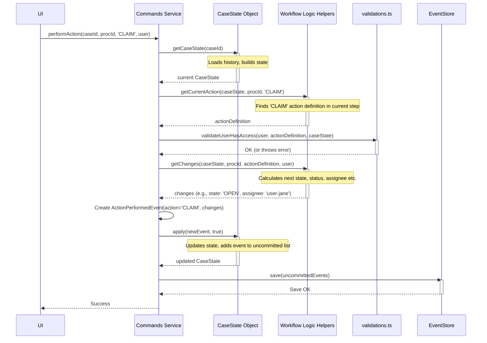

# Chapter 5: Workflow Actions (`performAction`, `ActionPerformedEvent`)

In the [previous chapter](04_events___event_sourcing_.md), we learned how every significant change in a case is recorded as an unchangeable **Event**, forming a complete history. Events like `CommentedEvent` or `ActorAddedEvent` capture specific data updates.

But how do we manage the overall *progress* of an investigation? Cases move through different stages – maybe from 'New' to 'Under Review', then 'Pending QA', and finally 'Closed'. How does the system handle moving a case from one stage to the next?

This is where **Workflow Actions** come in. They represent the specific operations a user can trigger to advance a case through its predefined investigation process.

## The Problem: Moving the Case Along the Assembly Line

Imagine a car factory assembly line. Each car moves from one station to the next. At each station, a worker performs a specific task (like installing the engine or painting the body) using specific controls (buttons, levers) before sending the car onward.

A SAR case investigation is similar. It follows a path:
1.  A new case arrives.
2.  Someone needs to claim it to start working.
3.  They investigate and gather information.
4.  They might submit it for review or quality assurance (QA).
5.  A decision is made (e.g., file a SAR, close the case).

We need a way to:
*   Define these steps (the stations on the assembly line).
*   Define the specific actions allowed at each step (the buttons/levers).
*   Ensure only authorized users can perform these actions.
*   Record when an action is taken and the case moves to the next step.

**Workflow Actions solve the problem of managing the structured progression of a case through its lifecycle, ensuring rules are followed and progress is tracked.**

## The Solution: `performAction` and `ActionPerformedEvent`

Our system uses two key pieces to manage workflow progression:

1.  **The `performAction` Command:** This is a specific command within our [Commands Interface (ISarCommands & Commands)](02_commands_interface__isarcommands___commands__.md). Think of it as the *master control button* for the workflow. When a user clicks "Claim Case", "Submit for QA", or "Close Case" in the user interface, the UI typically calls the `performAction` command behind the scenes.
    *   It takes details like the `caseId`, the specific `action` being requested (e.g., 'CLAIM', 'CLOSE'), and who is performing it (`currentUser`).
    *   It checks if the action is valid for the case's *current* workflow step.
    *   It checks if the `currentUser` has the *permissions* to perform that action.
    *   It figures out what the *next* workflow step should be based on the action taken.

2.  **The `ActionPerformedEvent`:** If `performAction` determines the action is valid, it doesn't just *do* the action; it *records* that the action was done by creating a special type of [Event & Event Sourcing](04_events___event_sourcing_.md) called `ActionPerformedEvent`.
    *   This event acts as the official log entry saying, "User X performed action Y on this case at this time, moving it to state Z."
    *   It contains details like the `action` name ('CLAIM'), the `processInstanceId` (identifying which workflow process is being updated), and any resulting changes (like the new `workflowStepId`, `state`, `status`, or who the case is now `assignedToUserId`).
    *   Like all events, it's saved permanently in the `EventStore`.

**Analogy Recap:**
*   **Workflow Steps:** Stations on the assembly line (New, Reviewing, QA, Closed).
*   **Actions:** Buttons/levers at each station (Claim, Submit, Approve, Close).
*   **`performAction`:** The system that reads which button was pressed, checks rules, and activates the next step.
*   **`ActionPerformedEvent`:** The log entry recording "Button X was pressed, item moved to Station Y".

## Use Case: Claiming a Case

Let's say a new SAR case (`case-123`) has been created. It's currently in the 'NEW' step and assigned to the "Fraud Investigations Team" queue. Investigator Jane wants to take ownership and start working on it.

1.  **Jane Clicks "Claim":** In the UI, Jane sees the case and clicks the "Claim" button.
2.  **UI Calls `performAction`:** The UI sends a request to the backend, calling the `performAction` command.

    ```typescript
    // Conceptual call from UI or another service
    // const commands = new Commands(/* dependencies */);
    // await commands.performAction({
    //   caseId: "case-123",
    //   processInstanceId: "proc-abc", // The ID of the main case review workflow
    //   action: "CLAIM",               // The specific action Jane wants to take
    //   currentUser: { id: "user-jane", /* ... */ }, // Who is doing it
    //   // 'data' might be empty or contain extra info if needed by the action
    // });
    ```
    *   `caseId`: Identifies the case.
    *   `processInstanceId`: Specifies *which* workflow process instance on the case we're interacting with (a case might potentially have multiple workflows, like the main review and a separate QA review). We'll learn more about this in the [next chapter](06_process_instances___workflows___iprocessinstance____processinstances____iprocessdao___.md).
    *   `action`: The key piece – tells `performAction` what Jane wants to do.

3.  **`performAction` Does its Magic:**
    *   It loads the current [Case State Aggregate (`CaseState`)](01_case_state_aggregate___casestate___.md) for `case-123`.
    *   It checks the workflow state for `proc-abc`: Is it currently in a step where 'CLAIM' is an allowed action? (Let's assume yes).
    *   It validates: Does Jane have permission to claim cases? (Let's assume yes).
    *   It determines the outcome: The workflow definition says that after 'CLAIM', the state should become 'OPEN', the status 'UNDER_REVIEW', and the case should be assigned to the user who claimed it.
    *   It creates an `ActionPerformedEvent`.

4.  **`ActionPerformedEvent` is Created and Saved:**
    The event might look something like this (simplified):

    ```json
    {
      "name": "ACTION_PERFORMED",
      "aggregateId": "case-123",
      "userId": "user-jane",
      "timestamp": "2023-10-27T10:00:00Z",
      "data": {
        "action": "CLAIM",
        "processInstanceId": "proc-abc",
        "state": "OPEN", // Changed from previous state
        "status": "UNDER_REVIEW", // Changed from previous status
        "assignedToUserId": "user-jane", // Now assigned to Jane
        "workflowStepId": "INVESTIGATOR_REVIEW" // Moved to the next step ID
      }
    }
    ```
    This event is then saved to the `EventStore`.

5.  **Outcome:** The case `case-123` is now officially assigned to Jane and has moved to the 'INVESTIGATOR_REVIEW' step in its workflow. Anyone looking at the case state (which is rebuilt from events, including this new one) will see the updated status and assignment.

## Under the Hood: How `performAction` Works

Let's trace the process inside the `performAction` command.

**High-Level Steps:**

1.  **Load State:** Get the current [Case State Aggregate (`CaseState`)](01_case_state_aggregate___casestate___.md) by replaying events.
2.  **Find Workflow:** Locate the specific `processInstance` mentioned in the arguments.
3.  **Check Action Availability:** Look at the *current* workflow step definition for that process instance. Does its list of `availableActions` include the one requested (e.g., 'CLAIM')? (Uses `getCurrentAction`).
4.  **Validate Permissions:** Check if the `currentUser` has the necessary roles and entitlements ([Command Validations (`validations.ts`)](03_command_validations___validations_ts___.md), e.g., `validateUserHasAccess`).
5.  **Determine Changes:** Based on the current action's definition (found in step 3), figure out what the resulting `state`, `status`, `assignedToUserId`, and `workflowStepId` should be. (Uses `getChanges`).
6.  **Create Event:** Use a factory function (`actionPerformedEvent` helper) to build the `ActionPerformedEvent` object, populating its `data` field with the action name and the changes calculated in step 5.
7.  **Apply Event (In-Memory):** Apply the new event to the loaded `CaseState` object using `caseState.apply(..., newEvent=true)`.
8.  **Save Event:** Persist the new `ActionPerformedEvent` (retrieved via `caseState.getUncommittedEvents()`) to the `EventStore`.

**Sequence Diagram:**



**Code Glimpses:**

*   **The Main Entry Point (`performAction`)**
    This function orchestrates the process. It calls helpers for validation and event creation.

    ```typescript
    // Simplified from: src/commands/performAction/index.ts
    export const performAction = async ({
      // ... dependencies like accessUtil, DAOs, eventStore ...
      args, // Contains caseId, processInstanceId, action, currentUser, data
      caseState, // The loaded CaseState
      meta, // Standard event metadata (userId, ipAddress etc.)
      client, // Database connection
    }): Promise<CaseEvent[]> => {
      const { action, caseId, currentUser, processInstanceId } = args;

      // 1. Basic Validations (simplified)
      validateCaseExists(caseState, caseId);
      validateProcessInstanceExists(caseState, processInstanceId);
      validateUserHasAccess({ /* ... */ }); // Chapter 3 style validation

      // 2. Create the event (using a helper)
      const event = await actionPerformedEvent({ /* uses args, caseState, meta */ });

      // 3. Apply the event to our in-memory state
      await caseState.apply(client, event);

      // 4. Handle specific side-effects (e.g., starting QA, creating SAR case)
      if (action === "INITIATE_QA") { /* ... call initiateQa helper ... */ }
      if (action === "CLOSE") { /* ... call close helper ... */ }
      if (action === "LOG_DECISION") { /* ... maybe create a SAR case ... */ }
      // ... potentially more complex logic based on action type ...

      // 5. Return all newly created events (ready to be saved by Commands class)
      return caseState.getUncommittedEvents();
    };
    ```
    Notice how the main `performAction` function relies on helper functions like `actionPerformedEvent` to figure out the details.

*   **Finding the Action (`getCurrentAction`)**
    This helper looks up the definition of the requested action within the current workflow step.

    ```typescript
    // Simplified from: src/commands/performAction/getCurrentAction.ts
    export const getCurrentAction = (
      caseState: CaseState,
      processInstanceId: string,
      action: string // e.g., "CLAIM"
    ): IAction => { // IAction is the type for an action definition
      // Find the specific process instance (e.g., the main case review)
      const pi = caseState.getProcessInstanceById(processInstanceId);
      // Find the definition of the *current* step in the workflow
      const workflowStep = pi.process.workflow.find(
        (step) => step.id === pi.workflowStepId
      );
      // Find the requested action within that step's available actions
      const foundAction = workflowStep?.availableActions.find(
         (act) => act.action === action
      );
      if (!foundAction) {
        throw new Error(`Action "${action}" not available in step "${pi.workflowStepId}"`);
      }
      return foundAction; // Returns the definition { action: "CLAIM", nextStatusId: "...", ... }
    };
    ```

*   **Calculating the Result (`getChanges`)**
    This helper takes the action definition and figures out the resulting changes to state, status, assignment, etc.

    ```typescript
    // Simplified from: src/commands/performAction/getChanges.ts
    export const getChanges = async ({
      // ... dependencies like accessUtil, userLogic ...
      caseState,
      currentAction, // The action definition found by getCurrentAction
      currentUser,
      data, // Optional data from the performAction arguments
      processInstanceId,
    }: { /* ... */ }): Promise<IChanges> => { // IChanges holds potential updates
      const pi = caseState.getProcessInstanceById(processInstanceId);
      // Find the definition of the *next* workflow step based on currentAction.nextStatusId
      const nextWorkflowStep = pi.process.workflow.find(
        (step) => step.id === currentAction.nextStatusId
      );
      // Determine the new assigned user (e.g., currentUser if action is 'CLAIM')
      const assignedToUserId = await getAssignedToUserId({ /* ... */ });

      // Calculate changes by comparing current step with next step
      const newState = nextWorkflowStep?.state !== pi.state ? nextWorkflowStep?.state : undefined;
      const newStatus = nextWorkflowStep?.status !== pi.status ? nextWorkflowStep?.status : undefined;
      const newWorkflowStepId = currentAction.nextStatusId !== pi.workflowStepId ? currentAction.nextStatusId : undefined;

      return { // Return only the properties that actually change
        assignedToUserId,
        state: newState,
        status: newStatus,
        workflowStepId: newWorkflowStepId,
        // ... other potential changes like resolution, comment, filingDecision ...
      };
    };
    ```

*   **Creating the Event (`actionPerformedEvent` helper)**
    This helper uses the results from `getChanges` to build the final `ActionPerformedEvent` object.

    ```typescript
    // Simplified from: src/commands/performAction/actionPerformedEvent.ts
    import { actionPerformedEvent as createActionPerformedEvent } from "../../events/ActionPerformedEvent";

    export const actionPerformedEvent = async ({
      args, meta, caseState, /* ... dependencies ... */
    }: { /* ... */ }): Promise<ActionPerformedEvent> => {
      const { action, processInstanceId } = args;
      // 1. Find the definition of the current action being performed
      const currentAction = getCurrentAction(caseState, processInstanceId, action);
      // 2. Calculate the resulting changes
      const changes = await getChanges({ /* uses args, caseState, currentAction */ });

      // 3. Create the event object using the factory from src/events/
      return createActionPerformedEvent(meta, { // meta has userId, timestamp etc.
        action,                           // The action name ('CLAIM')
        processInstanceId,                // Which workflow instance
        ...changes,                       // Spread the calculated changes (state, status, etc.)
      });
    };
    ```

*   **The Event Definition (`ActionPerformedEvent`)**
    This defines the structure of the event itself.

    ```typescript
    // Simplified from: src/events/ActionPerformedEvent.ts
    import { EventName } from "./EventName";
    import type { IEvent, EventMetadata } from "../interfaces/IEvent";

    export interface ActionPerformedEvent extends IEvent {
      name: EventName.ACTION_PERFORMED; // Fixed event type name
      data: {
        action: string; // e.g., "CLAIM", "CLOSE", "LOG_DECISION"
        processInstanceId: string; // Which workflow was affected
        // Optional fields based on what changed:
        assignedToUserId?: string;
        state?: string;           // e.g., "OPEN", "CLOSED"
        status?: string;          // e.g., "UNDER_REVIEW", "QA_DONE"
        workflowStepId?: string; // The ID of the new step
        resolution?: string;      // e.g., "Filed", "Not Suspicious"
        comment?: string;
        // ... other action-specific data like filingDecision ...
      };
    }

    // Factory function used by the command helpers
    export const actionPerformedEvent = (
      metadata: EventMetadata,
      data: ActionPerformedEvent["data"]
    ): ActionPerformedEvent => ({ /* ... creates the event object ... */ });
    ```

## Conclusion

Workflow Actions are the mechanism for moving a SAR case through its defined lifecycle steps.

*   The **`performAction` command** is the central engine that handles requests to perform actions like 'CLAIM', 'ASSIGN', 'CLOSE', or 'LOG_DECISION'.
*   It validates permissions and checks if the action is allowed in the current workflow state.
*   It determines the resulting state transition based on predefined workflow rules.
*   It generates an **`ActionPerformedEvent`** to permanently record the action taken and the resulting changes (new step, status, assignee, etc.).

This ensures that case progression is structured, follows business rules, and leaves a clear audit trail in the form of events. You've learned how users trigger these actions and how the system processes them to update the case's workflow status.

But where do these "workflow steps" and "available actions" actually come from? How are they defined? We'll explore that in the next chapter: [Process Instances & Workflows (`IProcessInstance`, `ProcessInstances`, `IProcessDAO`)](06_process_instances___workflows___iprocessinstance____processinstances____iprocessdao___.md).

---

Generated by [AI Codebase Knowledge Builder](https://github.com/The-Pocket/Tutorial-Codebase-Knowledge)