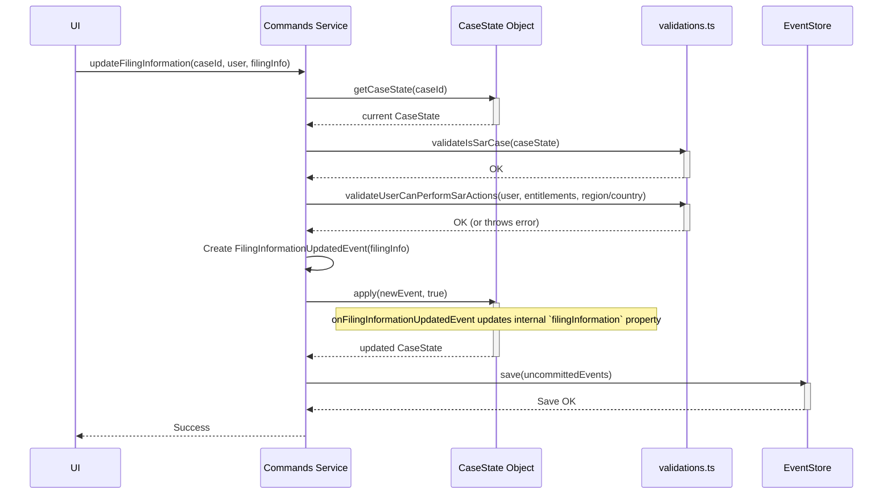

# Chapter 7: SAR Filing Information (`SarFilingInformation`, `updateFilingInformation`)

Welcome to Chapter 7! In the [previous chapter](06_process_instances___workflows___iprocessinstance____processinstances____iprocessdao___.md), we learned how the system defines the investigation roadmap using Processes and tracks each case's progress with Process Instances. Now, let's focus on a crucial part of resolving many SAR cases: gathering the detailed information needed for the official regulatory filing.

## What's the Problem? Filling Out the Official Paperwork

Imagine your investigation concludes that a Suspicious Activity Report (SAR) *must* be filed with a regulatory body (like FinCEN in the US). Filing this report isn't just clicking a "File" button. It requires submitting a highly detailed, structured form containing specific information:

*   Which regulator are you filing with?
*   What specific suspicious activity codes apply?
*   Who were the primary subjects (focal actors) of the investigation?
*   Which business units or legal entities were involved?
*   What financial products were implicated?
*   A detailed narrative explaining the suspicion.
*   And much, much more...

Trying to manage all these specific pieces of data scattered across different notes or comments would be chaotic and error-prone.

**SAR Filing Information solves the problem of needing a single, dedicated place to store all the complex, structured details required to generate an official SAR filing.**

Think of it like:
*   **The Official Regulatory Form:** A multi-page document with many specific fields that must be filled out accurately.
*   **A Dedicated Folder:** A specific section within the case file specifically for collecting and organizing all SAR-related data points.

## Key Concepts: The Form and How to Update It

1.  **`SarFilingInformation` (The Form Data Structure):**
    *   This is a complex **data structure** (an object type defined in our code, likely in `src/interfaces/SarFilingInformation.ts`).
    *   It acts as the container for *all* the details needed for the SAR filing: regulator info, activity codes, involved parties, narratives, product types, dates, etc.
    *   This structure mirrors the fields required by the actual regulatory form.
    *   It's stored as part of the [Case State Aggregate (`CaseState`)](01_case_state_aggregate___casestate___.md), specifically in the `filingInformation` property.

2.  **`updateFilingInformation` (The Command to Fill the Form):**
    *   This is a specific command available through the [Commands Interface (ISarCommands & Commands)](02_commands_interface__isarcommands___commands__.md).
    *   Its job is to take new or updated SAR filing details (provided as a `SarFilingInformation` object) and update the information stored within the `CaseState`.
    *   It's the *only* way to officially modify this specific set of data.

3.  **`FilingInformationUpdatedEvent` (The Log Entry):**
    *   When `updateFilingInformation` successfully runs, it creates a `FilingInformationUpdatedEvent`.
    *   This [Event & Event Sourcing](04_events___event_sourcing_.md) permanently records that the SAR details were updated at a specific time, by a specific user, with the new data.
    *   The `CaseState` listens for this event to update its internal `filingInformation` property.

## Use Case: Adding Regulator and Activity Details

An investigator, Jane, is working on a SAR case (`case-456`). Based on her findings, she needs to specify that the SAR will be filed with the 'FIN_REG_US' regulator and involves suspicious activity code 'SA101_STRUCTURING'.

1.  **Jane Enters Details in UI:** Jane uses the case management interface, finds the SAR Filing section, selects 'FIN_REG_US' from a dropdown, and adds 'SA101_STRUCTURING'.
2.  **UI Calls `updateFilingInformation`:** When Jane saves these changes, the UI gathers all the current SAR filing data (including her new additions) into a `SarFilingInformation` object and calls the `updateFilingInformation` command.

    ```typescript
    // Conceptual call from UI or another service
    // const commands = new Commands(/* dependencies */);

    // Construct the payload with ALL current SAR filing details
    const filingDetails: SarFilingInformation = {
      type: CaseType.SAR,
      regulator: { id: "FIN_REG_US", title: "US Financial Regulator" },
      suspiciousActivity: [
        { id: "SA101_STRUCTURING", title: "Structuring Transactions", activities: [] }
      ],
      // ... ALL other required fields like decisionDate, region, narrative, etc.
      // (even if they haven't changed in this specific update)
      decisionDate: "2023-10-28",
      region: "NA",
      country: "US",
      narrative: "Existing narrative text...",
      // ... many more fields
    };

    await commands.updateFilingInformation({
      caseId: "case-456",
      currentUser: { id: "user-jane", /* ... sarEntitlements ... */ },
      ipAddress: "192.168.1.101",
      filingInformation: filingDetails // Pass the complete structure
    });
    ```
    *   Note: The command expects the *entire* `SarFilingInformation` structure, not just the changed fields.

3.  **Command Processes the Update:** The `updateFilingInformation` command runs, performs validations, creates a `FilingInformationUpdatedEvent` containing the `filingDetails`, applies it to the `CaseState` (updating `caseState.filingInformation`), and saves the event.

4.  **Outcome:** The official record for `case-456` now includes the specified regulator and suspicious activity code as part of its SAR filing details.

## Under the Hood: How `updateFilingInformation` Works

Let's trace the internal steps when `updateFilingInformation` is called.

**High-Level Steps:**

1.  **Receive Arguments:** The command gets the `caseId`, `currentUser`, `ipAddress`, and the complete `filingInformation` payload.
2.  **Load State:** The system fetches the current [Case State Aggregate (`CaseState`)](01_case_state_aggregate___casestate___.md) for the given `caseId`.
3.  **Validate:** Crucial checks are performed using [Command Validations (`validations.ts`)](03_command_validations___validations_ts___.md):
    *   Is the case actually a `SAR` type case? (This command isn't for L1/L3 cases).
    *   Does the `currentUser` have the necessary SAR entitlements (permissions) to edit SAR records for the specific region/country involved? (e.g., `validateUserCanPerformSarActions` checking for `CREATE_EDIT_SAR_RECORD` and potentially `DRAFT_SAR_NARRATIVE` if the narrative changed).
4.  **Create Event:** If validations pass, create a `FilingInformationUpdatedEvent`. The `data` payload of this event is the *entire* `filingInformation` object received in the arguments.
5.  **Apply Event (In-Memory):** Apply this new event to the loaded `CaseState` using `caseState.apply(..., newEvent=true)`. This triggers the `caseState.onFilingInformationUpdatedEvent` handler.
6.  **Update `CaseState`:** The `onFilingInformationUpdatedEvent` handler inside `CaseState` takes the data from the event and overwrites the `caseState.filingInformation` property with this new, complete structure.
7.  **Save Event:** Persist the `FilingInformationUpdatedEvent` (retrieved via `caseState.getUncommittedEvents()`) to the `EventStore`.

**Sequence Diagram:**



**Code Glimpses:**

*   **The Command Logic (`updateFilingInformation.ts`)**
    This function coordinates the validation and event creation.

    ```typescript
    // Simplified from: src/commands/updateFilingInformation.ts
    import { filingInformationUpdatedEvent } from "../events/FilingInformationUpdatedEvent";
    import type { IUpdateFilingInformationArguments } from "../interfaces/ICommands";
    import { CaseState } from "./CaseState";
    import { validateUserCanPerformSarActions } from "./validations";
    // ... other imports

    export const updateFilingInformation = async (
      client: PgQueryable, // DB connection
      caseState: CaseState, // The loaded CaseState
      args: IUpdateFilingInformationArguments // Command arguments
    ): Promise<void> => {
      // 1. Validate Case Type
      if (caseState.caseType !== CaseType.SAR) {
        throw new Error("Updating filing info only allowed on SAR cases");
      }

      // 2. Validate Permissions (Simplified check)
      validateUserCanPerformSarActions(
        [UserSarActions.CREATE_EDIT_SAR_RECORD /*, other relevant actions */],
        UserSarRoleType.READ_WRITE,
        caseState.getSarRegionCountrySelected(), // Get region/country from case
        args.currentUser.sarEntitlements // User's permissions list
      );

      // 3. Prepare event metadata
      const meta = { /* aggregateId, causationId, userId, ipAddress */ };

      // 4. Create the event with the full payload
      const event = filingInformationUpdatedEvent(meta, args.filingInformation);

      // 5. Apply the event to CaseState (will trigger internal update)
      await caseState.apply(client, event);
      // (The Commands class wrapper will save the event later)
    };
    ```
    This shows the core flow: check type, check permissions, create event, apply event.

*   **The Event Definition (`FilingInformationUpdatedEvent.ts`)**
    Defines the structure of the event and its data payload.

    ```typescript
    // Simplified from: src/events/FilingInformationUpdatedEvent.ts
    import { EventName } from "./EventName";
    import type { SarFilingInformation } from "../interfaces/SarFilingInformation";
    import type { EventMetadata, IEvent } from "../interfaces/IEvent";

    export interface FilingInformationUpdatedEvent extends IEvent {
      name: EventName.FILING_INFORMATION_UPDATED; // Fixed type name
      // The 'data' is the complete SarFilingInformation structure
      data: SarFilingInformation;
    }

    // Factory function used by the command
    export const filingInformationUpdatedEvent = (
      metadata: EventMetadata,
      data: SarFilingInformation
    ): FilingInformationUpdatedEvent => ({
      ...metadata,
      name: EventName.FILING_INFORMATION_UPDATED,
      data, // Attach the full filing info payload
    });
    ```
    This highlights that the event carries the entire `SarFilingInformation` object.

*   **The `CaseState` Handler**
    This method within `CaseState` is triggered when the event is applied.

    ```typescript
    // Simplified from: src/commands/CaseState.ts
    export class CaseState {
      // ... other properties ...
      public filingInformation?: SarFilingInformation; // Where the data is stored

      // ... other methods ...

      // Handler called by 'apply' when event name matches
      private onFilingInformationUpdatedEvent(
        event: FilingInformationUpdatedEvent
      ): void {
        // Simply overwrite the existing filing information
        // with the complete data from the event.
        this.filingInformation = event.data;
      }
    }
    ```
    This shows how `CaseState` updates its internal `filingInformation` property whenever a `FilingInformationUpdatedEvent` occurs (during replay or when a new one is applied).

## Conclusion

The **`SarFilingInformation`** structure is the dedicated container for all the detailed data needed to generate an official SAR filing, mirroring the complexity of the regulatory form.

*   It's managed as part of the [Case State Aggregate (`CaseState`)](01_case_state_aggregate___casestate___.md).
*   The **`updateFilingInformation`** command is used to modify this data, requiring the *entire* updated structure as input.
*   This command performs crucial validations, especially regarding user permissions (`sarEntitlements`) for the specific SAR region/country.
*   Successful updates result in a **`FilingInformationUpdatedEvent`**, ensuring a complete audit trail of changes to these critical details.

You've now learned how the system handles the specific data required for SAR filings. This relies on various underlying data structures like `SarFilingInformation` itself.

In the final chapter, we'll take a broader look at where many of these important data structures (interfaces and types) are defined within the project: [Data Structures (`interfaces/`, `types/`)](08_data_structures___interfaces_____types____.md).

---

Generated by [AI Codebase Knowledge Builder](https://github.com/The-Pocket/Tutorial-Codebase-Knowledge)