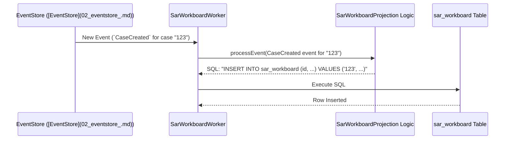
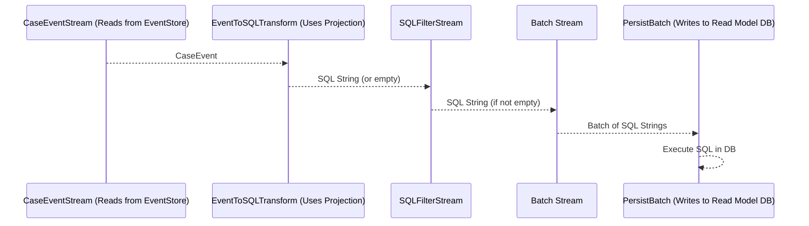

# Chapter 4: Workers - The Diligent Clerks of Our System

In [Chapter 3: Projections](03_projections_.md), we saw how **Projections** are like recipes that define how to turn a history of [Case Events](01_case_events_.md) into useful, up-to-date summaries (read models), like a `sar_workboard` table. We learned that a projection contains processor functions that decide what SQL to generate when a specific event like `CaseCreated` occurs.

But a recipe is just instructions. Who actually *reads* the new events as they come in, picks up the correct recipe (the Projection), follows its instructions to generate the SQL, and then *runs* that SQL to update our summary tables?

This is where **Workers** come in! They are the tireless background engines that make our Projections come alive.

## What's the Problem? Bringing Projections to Life

Imagine our [EventStore](02_eventstore_.md) is like a constantly updating news ticker tape, with new [Case Events](01_case_events_.md) appearing all the time. Our [Projections](03_projections_.md) are like instruction manuals telling us how to react to each type of news item to keep our summary reports (read models) current.

*   If we just have the ticker tape (events) and the instruction manuals (projections), how do the summary reports actually get updated?
*   Who is constantly watching the tape, grabbing new items, and applying the instructions?

**Workers** are the solution. They are the automated, diligent clerks who bridge this gap.

## What Are Workers? The Automated Clerks

**Workers** are background processes in our `sar-service-event-sourced` project. Their main job is to:
1.  **Consume Events:** Continuously watch the stream of [Case Events](01_case_events_.md) coming from the [EventStore](02_eventstore_.md).
2.  **Apply Projection Logic:** For each event they see, they use the rules defined in a specific [Projection](03_projections_.md) to figure out what to do.
3.  **Update Read Models:** They take the output from the projection (usually an SQL command) and execute it to update the relevant read model database table.

Think of them as automated clerks assigned to different tasks:
*   The `EventStore` is like a central newsroom where a ticker tape (the event stream) continuously prints out new facts ([Case Events](01_case_events_.md)).
*   Each **Worker** is like a specialized clerk watching this ticker tape. For example, one clerk might be in charge of updating the "SAR Workboard" summary report.
*   When a new event appears on the tape (e.g., `CaseCreated`), the relevant Worker (e.g., `SarWorkboardWorker`) picks it up.
*   The Worker consults its instruction manual (the `SarWorkboardProjection`'s logic) to understand what this event means for the SAR Workboard.
*   The manual tells the Worker, "Okay, for a `CaseCreated` event, you need to add a new row to the `sar_workboard` table."
*   The Worker then makes that update to the `sar_workboard` table.

This happens continuously, ensuring our read models are always kept up-to-date as new events occur.

## How Workers Function: The Big Picture

For each of our [Projections](03_projections_.md) (like `SarWorkboardProjection` or `AuditLogProjection`), we typically have a corresponding **Worker**.

1.  **Event Arrives:** A new [Case Event](01_case_events_.md), say `CaseCreated`, is saved to the [EventStore](02_eventstore_.md).
2.  **Worker Notified:** The `SarWorkboardWorker` (which is specifically interested in events that affect the SAR workboard) sees this new `CaseCreated` event.
3.  **Worker Consults Projection:** The `SarWorkboardWorker` uses the `processEvent` function from the `SarWorkboardProjection` (which we saw in [Chapter 3: Projections](03_projections_.md)).
4.  **Projection Generates SQL:** The `SarWorkboardProjection`'s `caseCreated` processor logic runs and returns an SQL `INSERT` statement.
5.  **Worker Updates Database:** The `SarWorkboardWorker` takes this SQL statement and executes it against the `sar_workboard` database table, adding the new case.

Let's visualize this:


This diagram shows the `SarWorkboardWorker` acting as the intermediary, taking an event, getting instructions (SQL) from the projection, and applying the update.

## Meet the Workers in Our Code

Our project has a general `Worker` class (`src/workers/Worker.ts`) that provides the common machinery for all workers. Then, we have specific workers like `SarWorkboardWorker.ts` that are tailored for particular projections.

### The Generic `Worker` Class

The `Worker` class in `src/workers/Worker.ts` is the blueprint. Let's look at a very simplified version of its constructor:

```typescript
// Simplified from: src/workers/Worker.ts
import type { Pool } from "pg"; // For database connections
import type { IEventToSQL } from "../projections/types"; // Type for projection's processor

export class Worker {
  private readonly pool: Pool;
  public readonly eventToSql: IEventToSQL; // The projection's logic
  private tableName: string; // Read model table name (e.g., "sar_workboard")

  public constructor(
    pool: Pool,
    eventToSql: IEventToSQL, // Function from the Projection
    projectionTableName: string
    // ... other config
  ) {
    this.pool = pool;
    this.eventToSql = eventToSql; // Stores the projection's processing function
    this.tableName = projectionTableName;
    // ...
  }

  public async run(): Promise<void> {
    // Complex logic to set up a stream pipeline:
    // 1. Get events from CaseEventStream
    // 2. Transform events to SQL using 'this.eventToSql'
    // 3. Filter out empty SQL
    // 4. Batch SQL commands
    // 5. Execute SQL batch in the database
    console.log(`Worker for ${this.tableName} starting...`);
    // Actual stream pipeline setup is more involved
  }
  // ... other methods like stop()
}
```
**Explanation:**
*   The `constructor` takes:
    *   `pool`: A connection pool for talking to the database.
    *   `eventToSql`: This is the crucial part! It's the `processEvent` function from a specific [Projection](03_projections_.md) (like the one we saw in `src/projections/sar_workboard/index.ts`). This tells the Worker *how* to convert events into SQL for its assigned read model.
    *   `projectionTableName`: The name of the database table this worker is responsible for updating (e.g., "sar_workboard"). This is also used to track which events have already been processed for this projection.
*   The `run()` method (highly simplified here) is responsible for starting the continuous process of fetching events and applying the `eventToSql` logic.

### Specific Workers: `SarWorkboardWorker`

Now, let's see how a specific worker, like `SarWorkboardWorker` from `src/workers/SarWorkboard.ts`, uses this generic `Worker`.

```typescript
// Simplified from: src/workers/SarWorkboard.ts
import type { Pool } from "pg";
// Import the projection's logic and table name
import { processEvent, TABLE_NAME } from "../projections/sar_workboard";
import { Worker } from "./Worker"; // The generic Worker class
// import type { IWorkerConfig } from "./Worker"; (config type)

export class SarWorkboardWorker extends Worker { // Extends the base Worker
  public constructor(pool: Pool /*, config: IWorkerConfig */) {
    // Call the base Worker's constructor, passing in:
    // 1. The database pool
    // 2. The 'processEvent' function from the SarWorkboardProjection
    // 3. The TABLE_NAME ("sar_workboard") for this projection
    super(pool, processEvent, TABLE_NAME /*, config */);
  }
}
```
**Explanation:**
*   `SarWorkboardWorker` *extends* the generic `Worker`.
*   Its `constructor` is very simple: it calls the `super` (the base `Worker`'s) constructor.
*   Crucially, it passes:
    *   `processEvent` (imported from `../projections/sar_workboard`): This is the specific "instruction manual" (the `eventToSql` function) for the SAR workboard.
    *   `TABLE_NAME` (also from `../projections/sar_workboard`, which is "sar_workboard"): This tells the base `Worker` which read model table to manage and where to track its progress.

So, the `SarWorkboardWorker` is essentially a specialized version of the generic `Worker`, pre-configured with the logic and table name for the `SarWorkboardProjection`. We have similar workers like `AuditLogWorker.ts` and `L3WorkboardWorker.ts` for other projections.

## Under the Hood: The Worker's Event Processing Pipeline

When a `Worker`'s `run()` method is executed, it sets up an efficient pipeline using Node.js Streams to process events. This might sound complex, but think of it as an assembly line for handling events:

1.  **Get Events (`CaseEventStream`)**: The pipeline starts with a `CaseEventStream` (from `src/streams/CaseEventStream.ts`). This stream connects to our [EventStore](02_eventstore_.md)'s database (the `case_event` table) and starts emitting [Case Events](01_case_events_.md) as they are recorded. It's smart enough to remember where it left off, so it only fetches new events.

2.  **Transform Event to SQL (`EventToSQLTransform`)**: Each event then flows into an `EventToSQLTransform` stream (from `src/streams/EventToSQLTransform.ts`). This transformer uses the `eventToSql` function (which the Worker got from its [Projection](03_projections_.md)) to convert the raw event object into an SQL string.
    ```typescript
    // Inside EventToSQLTransform.ts, simplified _transform method:
    // this.eventToSql is the projection's processEvent function
    // this.push(this.eventToSql(chunk)); // chunk is the event
    ```
    So, if a `CaseCreated` event comes in, and the `eventToSql` is from `SarWorkboardProjection`, an SQL `INSERT` string is produced.

3.  **Filter SQL (`SQLFilterStream`)**: Sometimes, a projection might decide an event isn't relevant and return an empty SQL string. The `SQLFilterStream` (from `src/streams/SQLFilterStream.ts`) removes these empty strings so we don't try to execute them.
    ```typescript
    // Inside SQLFilterStream.ts, simplified _transform method:
    // if (chunk.length > 0) { // chunk is the SQL string
    //   this.push(chunk);
    // }
    ```

4.  **Batch SQL Commands (`batch`)**: To avoid overwhelming the database with many small updates, the SQL commands are grouped together into batches (e.g., process up to 100 SQL commands or wait for 1 second, whichever comes first). This is done using a `batch` utility.

5.  **Execute SQL Batch (`PersistBatch`)**: Finally, the batch of SQL commands flows into a `PersistBatch` stream. This stream takes the batch and executes all the SQL commands against the read model database in a single transaction. This updates our summary tables like `sar_workboard`.

Here's a diagram of this pipeline:


This entire pipeline runs continuously in the background for each active Worker, ensuring that our read models are efficiently updated as new events occur. The `Worker.ts` file orchestrates this pipeline setup in its `run` method.

## Starting the Workers

In a real application, when the `sar-service-event-sourced` service starts up, it would create instances of all the necessary workers (e.g., `SarWorkboardWorker`, `AuditLogWorker`) and call their `run()` methods. This kicks off their individual event processing pipelines.

```typescript
// Conceptual: How workers might be started in the main application
// const dbPool = new Pool(/* ... db config ... */);
// const sarWorkboardWorker = new SarWorkboardWorker(dbPool /*, config */);
// const auditLogWorker = new AuditLogWorker(dbPool /*, config */);

// sarWorkboardWorker.run();
// auditLogWorker.run();
// console.log("Workers started!");
```
Each worker then runs independently, processing events relevant to its projection.

## Why This Approach?

Using these specialized Workers to run projections offers several benefits:
*   **Decoupling:** The logic for generating events, defining projections, and executing projection updates are all separate. This makes the system easier to understand, maintain, and modify.
*   **Resilience:** The `CaseEventStream` is designed to pick up from where it last left off for each projection. If a worker stops unexpectedly, it can be restarted and will automatically catch up on any missed events without losing data or processing events twice.
*   **Efficiency:** Batching SQL commands makes database updates more efficient than writing one command at a time.
*   **Specialization:** Each worker focuses on one specific read model, keeping its task simple and targeted.

## Conclusion

You've now learned about **Workers**, the active components that bring our [Projections](03_projections_.md) to life. They are the diligent background "clerks" that:
*   Continuously **monitor** the stream of [Case Events](01_case_events_.md).
*   Use the logic from a specific [Projection](03_projections_.md) to **transform** these events into SQL commands.
*   **Execute** these SQL commands to keep our read model database tables (like `sar_workboard`) up-to-date.

Workers are crucial for maintaining the "query side" of our event-sourced system. They ensure that the data views we need for our application are readily available and reflect the latest information from the event stream.

So far, we've seen how events are created, stored in the [EventStore](02_eventstore_.md), processed by [Projections](03_projections_.md), and applied to read models by Workers. But how does our application actually *read* this data from the read models to display it to users or use it in other operations? That's where **Data Access Objects (DAOs)** come in.

Let's explore them in the next chapter: [Data Access Objects (DAOs)](05_data_access_objects__daos__.md).

---

Generated by [AI Codebase Knowledge Builder](https://github.com/The-Pocket/Tutorial-Codebase-Knowledge)