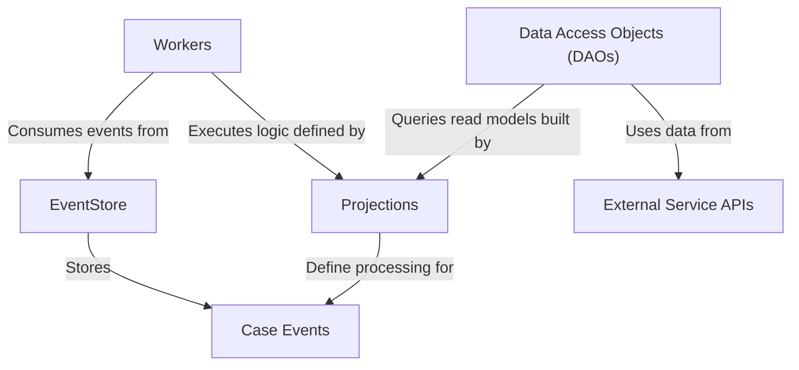

# Tutorial: sar-service-event-sourced

This project implements a service for managing *Suspicious Activity Report (SAR)* cases using an **event sourcing** pattern.
Instead of storing the current state of a SAR case directly, it records every change as an immutable **event** in an *EventStore*.
**Projections** read these events to build specific, queryable views (read models) of the data, which are kept up-to-date by background **Workers**.
**Data Access Objects (DAOs)** provide a way to query these read models, and the service interacts with **External Service APIs** for additional information like user permissions.

**Source Repository:** [None](None)

## Chapters

1. [Case Events
](01_case_events_.md)
2. [EventStore
](02_eventstore_.md)
3. [Projections
](03_projections_.md)
4. [Workers
](04_workers_.md)
5. [Data Access Objects (DAOs)
](05_data_access_objects__daos__.md)
6. [External Service APIs
](06_external_service_apis_.md)

---

Generated by [AI Codebase Knowledge Builder](https://github.com/The-Pocket/Tutorial-Codebase-Knowledge)